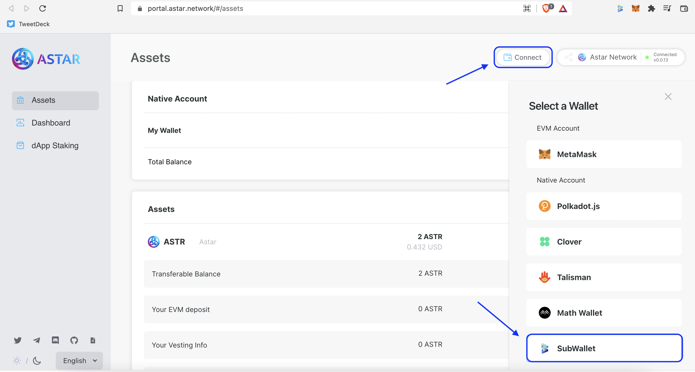
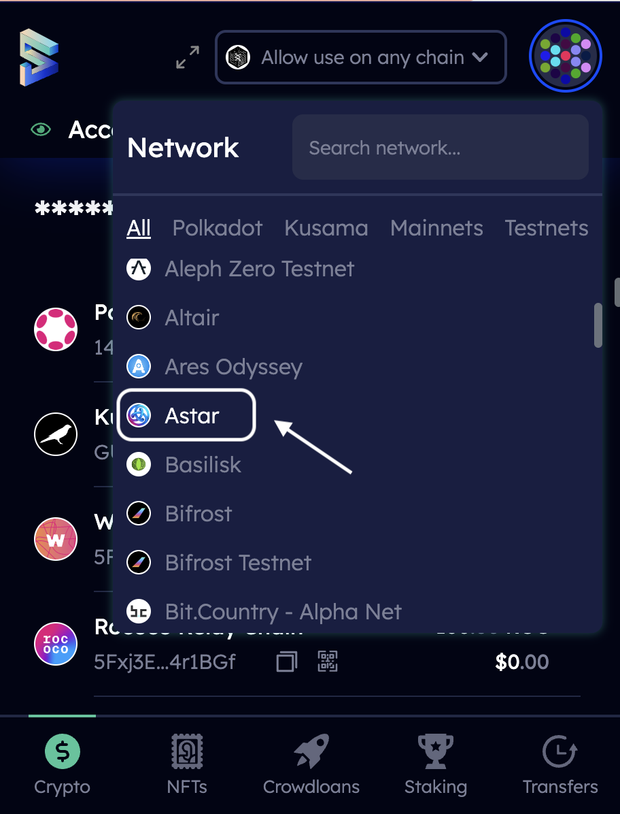
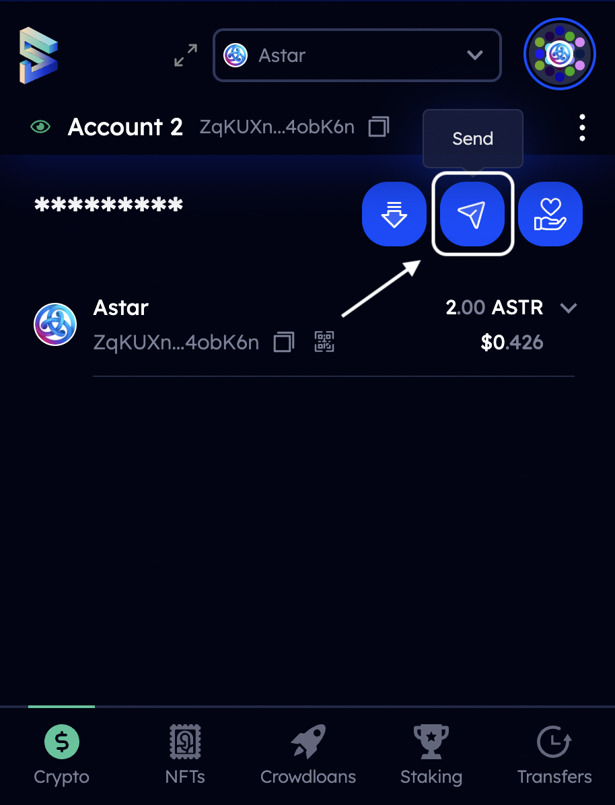
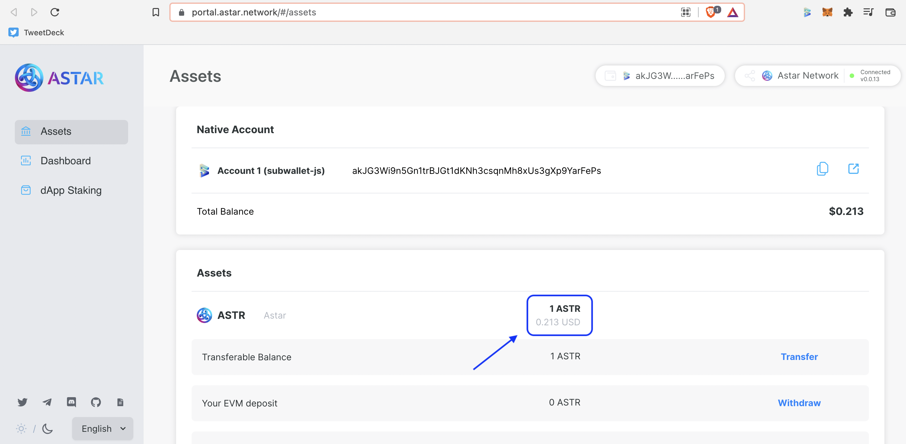
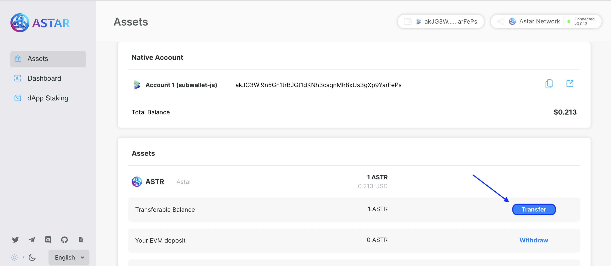
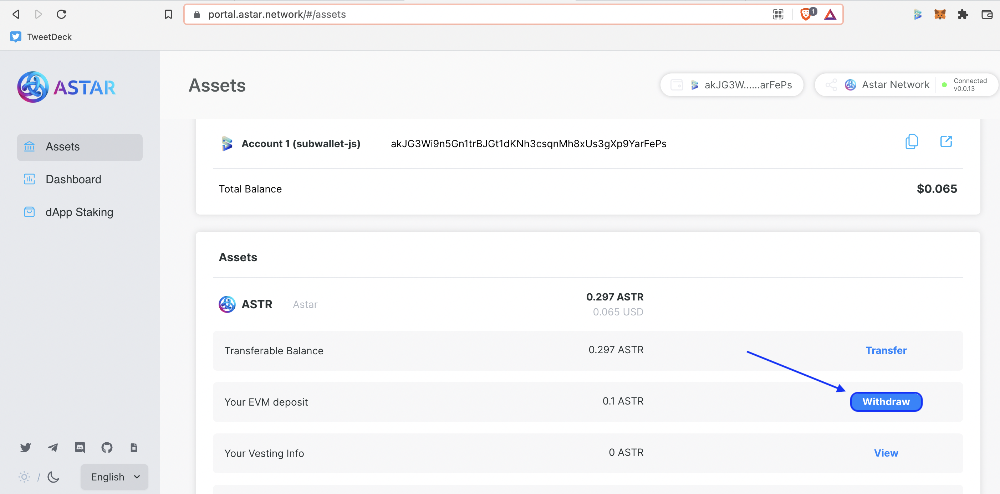

# Astar Portal


For instructions on creating an **Astar** account with SubWallet, please visit [create-an-account.md](../user-guide/create-an-account.md "mention")&#x20;



If you want to import your accounts from Metamask into SubWallet, go to [import-an-account-using-private-key-from-metamask.md](../user-guide/import-and-restore-an-account/import-an-account-using-private-key-from-metamask.md "mention")


## Connect SubWallet to Astar Portal



**Step 1**: Log into [Astar Portal](https://portal.astar.network/#/assets). The extension automatically opens a pop-up to allow you to connect to Astar Network. Choose as many accounts as you like then click **Connect**.

**Step 2**: On the top right corner, select **Connect** and choose **SubWallet**. Select your desired account and hit **Connect**.

## Transfer $ASTR between Substrate Accounts



**Step 1**: On the **** SubWallet extension, select Astar from the drop-down menu at the top. Then click the **Send** icon.&#x20;

 

**Step 2**: Choose the recipient address from the drop-down menu or key in the address manually. You can either enter the amount you want to send or choose **Transfer the full account balance, reap the sender** to transfer all of your balance. Hit **Make Transfer**. Key in your password. If you do not wish to tip the block author, choose **Do not include a tip for the block author**. Then click on **Sign and Submit**.

 .png>)

**Step 3**: After your transfer has been processed successfully, click on **View Your Transaction** to view it on SubScan. You can also view your account balance on Astar Portal.

## Transfer $ASTR between Substrate and EVM Accounts&#x20;



**Step 1**: On Astar Portal, click on **Transfer**. Key in the Metamask address as recipient address. Enter the amount you want to transfer and hit **Confirm**.&#x20;

**Step 2**: The extension opens a pop-up window where you key in your password and hit **Approve**.&#x20;

## Withdraw EVM Deposit

**Step 1**: If you send funds from your Metamask account to your SubWallet account, the funds will be available as EVM deposit on Astar Portal. To withdraw the funds, hit **Withdraw,** then click on **Confirm** in the pop-up box. ****&#x20;

**Step 2**: Enter your password and click **Approve**. The transfer is reflected in your account balance on Astar Portal.&#x20;

