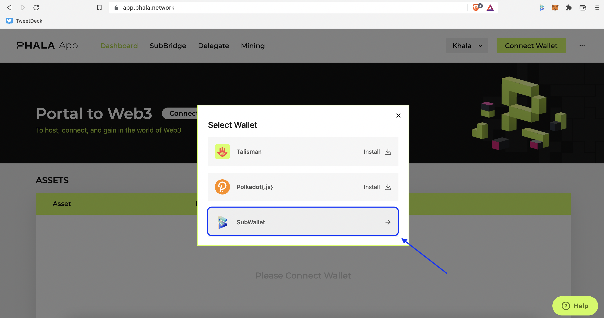
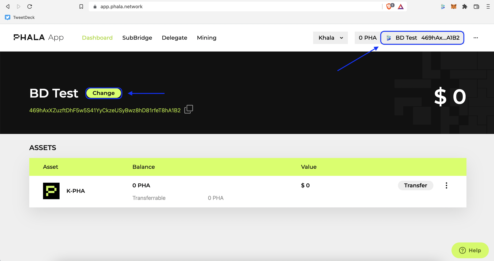
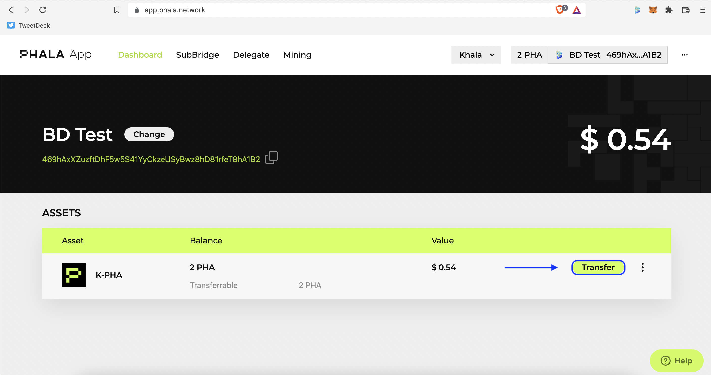
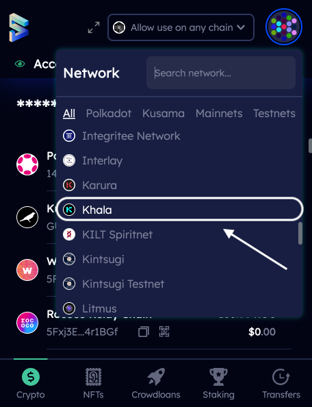
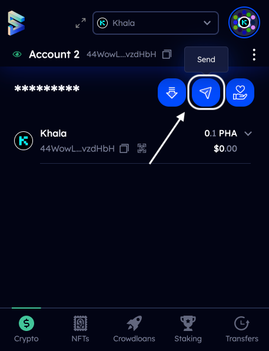
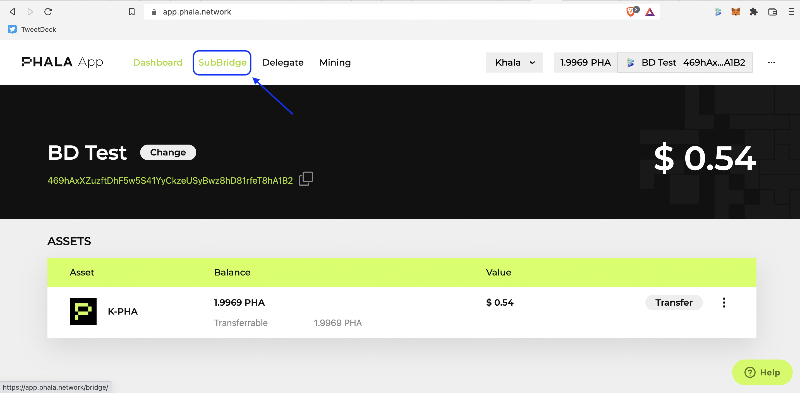

# Phala Network

## Connect SubWallet to Phala App


For instructions on creating a **** account with SubWallet, please visit [create-an-account](../user-guide/create-an-account/ "mention") page.


Log into [Phala App](https://app.phala.network/), then click on **Connect Wallet** on the top right corner. Choose **SubWallet** and select the account(s) you want to connect.&#x20;


If you want to change your account, simply click on your current one (the same button as **Connect Wallet** previously) or hit the **Change** button next to your account name and choose another account.


## Transfer PHA

### On Phala App

**Step 1**: On your dashboard page, click on **Transfer**. Enter the recipient address and the amount you want to send. You can also choose to send all of your funds by pressing **Max**. Then hit **Confirm**.&#x20;

**Step 2**: In SubWallet's pop-up window, key in your password and hit **Approve**.

### In SubWallet Extension

**Step 1**: Open SubWallet extension and choose Khala from the drop-down network list. Hit the **Send** icon.

 

**Step 2**: Enter the recipient address and the amount you want to transfer. If you want to send all of your funds, click **Transfer the full account balance, reap the sender**. Then hit **Make Transfer**. Key in your password and select **Sign and Submit**. Your transfer is successful.&#x20;

 .png>) 

## Bridge PHA

**Step 1**: On the toolbar in Phala App, choose **SubBridge**. Select the network that you want to send from and to, as well as enter the amount and addresses of both the sender and recipient.&#x20;

**Step 2**: After hitting **Submit**, the system will generate a pop-up box that summarizes your transaction for you to confirm.

**Step 3**: Hit **Submit** again. In SubWallet's pop-up window, enter your password and hit **Approve**. You can check on your recipient's SubWallet extension to see the available funds after the transaction.

 

## Stake PHA

### Delegate PHA to a Stakepool&#x20;

**Step 1**: On the toolbar in Phala App, select **Delegate**. Choose the stakepool you want to delegate $PHA and click on the ellipsis button. Hit **Delegate**.&#x20;

.png>)

**Step 2**: Enter the amount you want to delegate and hit **Confirm**. Enter your password in SubWallet's pop-up window and select **Approve**.&#x20;

**Step 3**: After submitting your transaction, you should be able to view and manage your delegation on Phala App within 20 minutes. Go to **My Delegate** on the top right corner.

.png>)

### Withdraw Your Delegation

**Step 1**: On the **Delegate** tab, click on the ellipsis button next to the delegation you want to withdraw. Enter the amount or hit **Max** to withdraw all your delegated PHA.

.png>)

**Step 2**: Hit **Confirm**. Enter your password in SubWallet's pop-up window and select **Approve**. After submitting your transaction, you should be able to see your account balance change on Phala App and SubWallet extension within 20 minutes.

.png>)

&#x20;
