# RMRK - Singular App

## Connect SubWallet to Singular


For instructions on creating a **RMRK** account with SubWallet, please visit [create-an-account](../user-guide/create-an-account/ "mention") page.


**Step 1**: On Singular, hit **Connect**, choose **SubWallet** and click on the account you want to use.

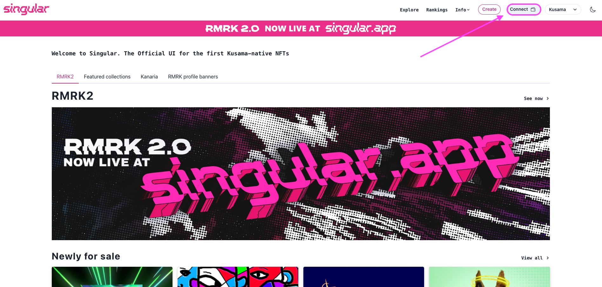

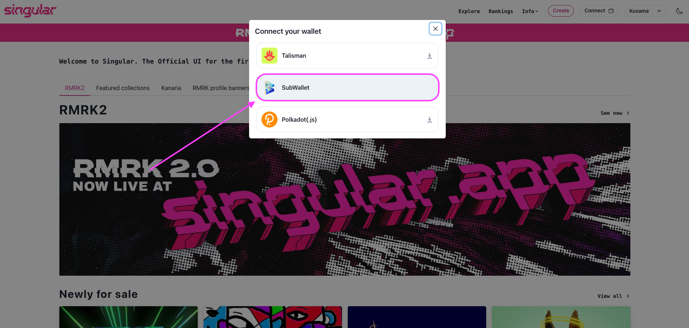

**Step 2**: You can change accounts by clicking on the account name on the top right corner and then hitting **Select account** from the drop-down list.&#x20;

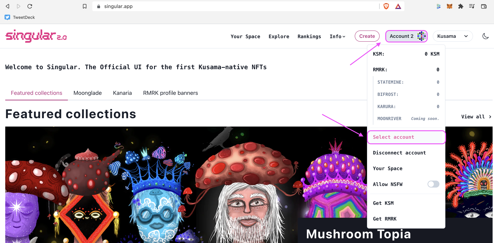

## Mint an NFT

**Step 1**: On the top right corner, hit **Create**, then select your desired network. For example, here we choose **Kusama**. Then select **NFT**.

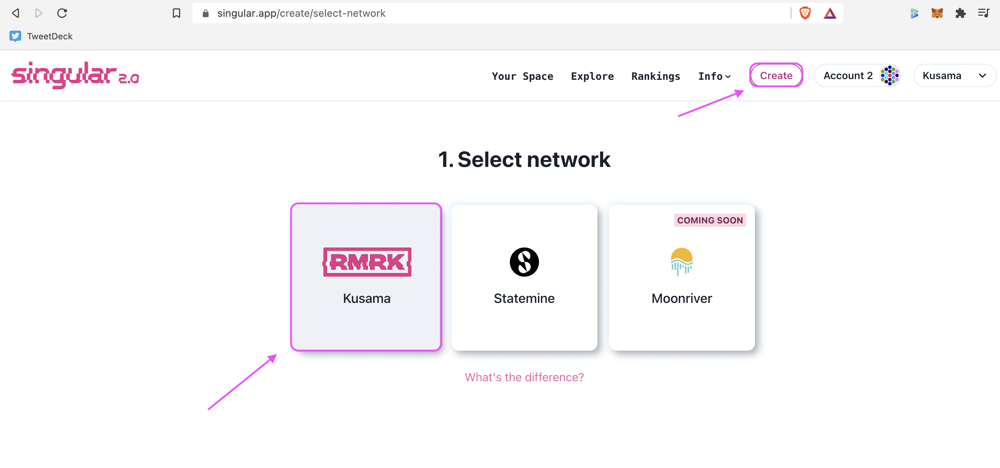

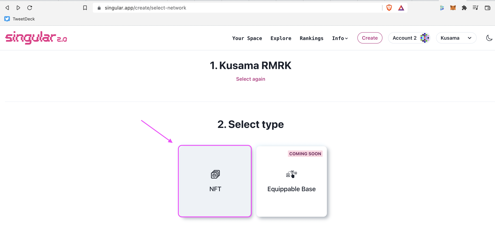

**Step 2**: You can choose an existing collection or create a new one. To create a new one, hit **Create a collection** and fill in the information required. Then click on **Create**, enter your password on the pop-up window and hit **Approve**.&#x20;

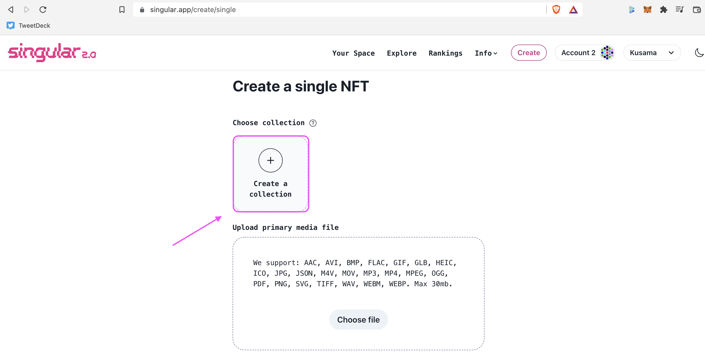

**Step 3**: After having a collection, click on **Choose file** to upload your media file. Click **Add thumbnail** if you would like to have a thumbnail. Fill in the information and hit **Create**. Key in your password and click on **Approve**. Your NFT has been minted.

## Buy an NFT&#x20;



**Step 1**: After deciding which NFT you want to collect, hit **Buy now**. On the pop-up box, tick **I Consent** and click **Buy now**.

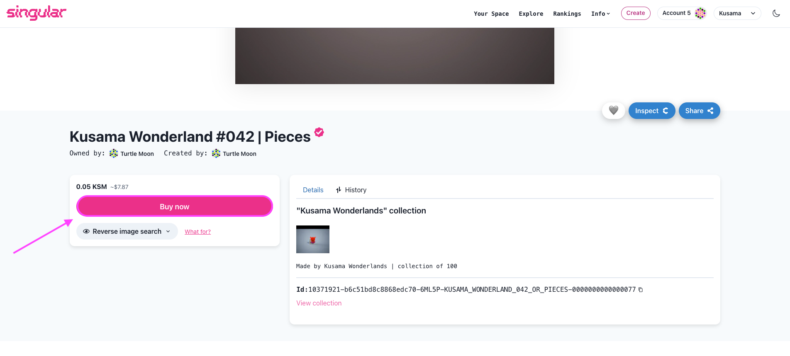

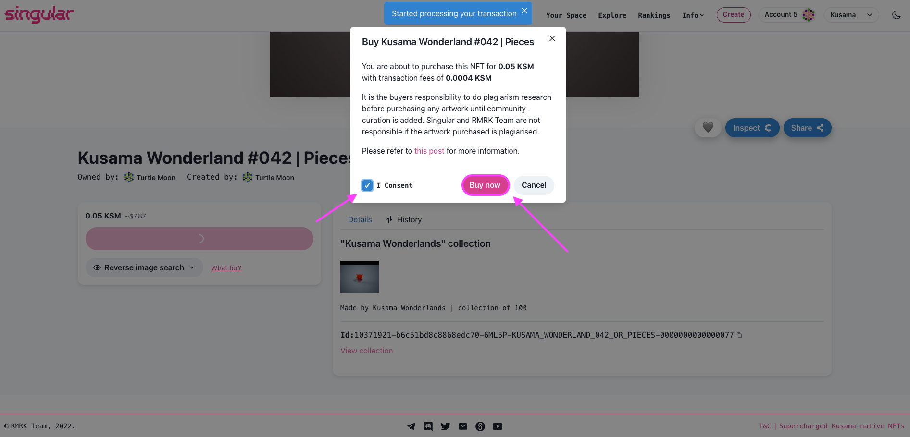

**Step 2**: You will be taken to SubWallet pop-up window to sign the transaction. Enter your password and hit **Approve**.

**Step 3**: Open SubWallet extension and click on **NFTs** tab. You will see the NFT you have just collected there, as well as the option **List for sale** on Singular.&#x20;

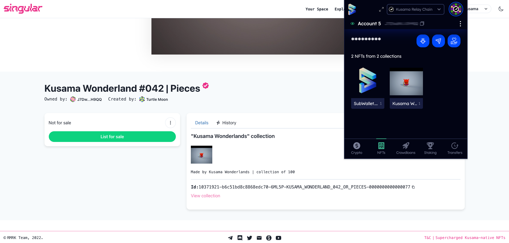

## List an NFT for Sale

**Step 1**: On the toolbar, click **Your Space** and choose the NFT you want to list for sale. Then scroll down and hit **List for sale**.&#x20;

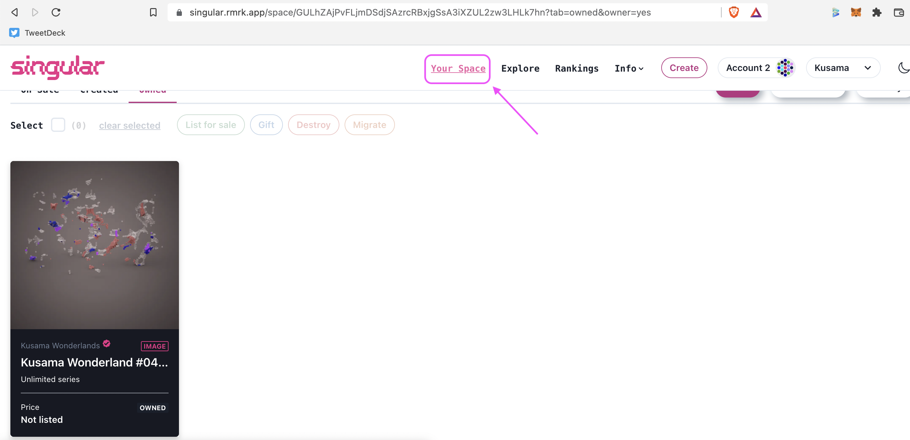

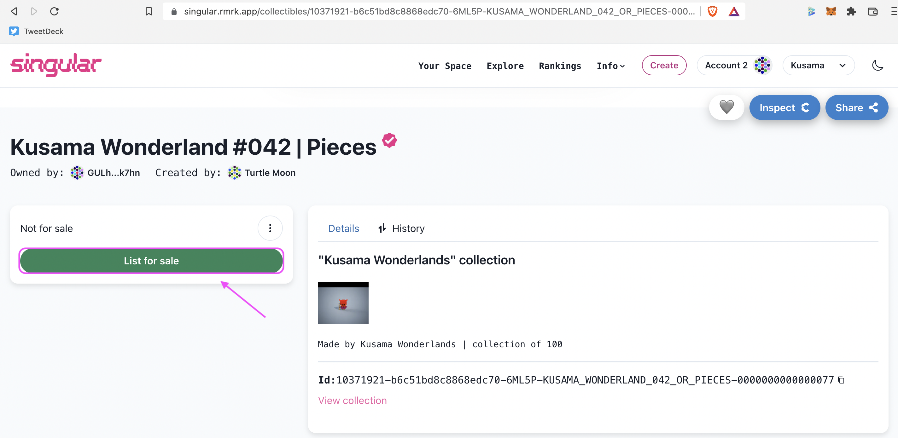

**Step 2**: Enter the amount you want to sell for, and click on **List for sale**. Key in your password and hit **Approve**. Your NFT is listed.

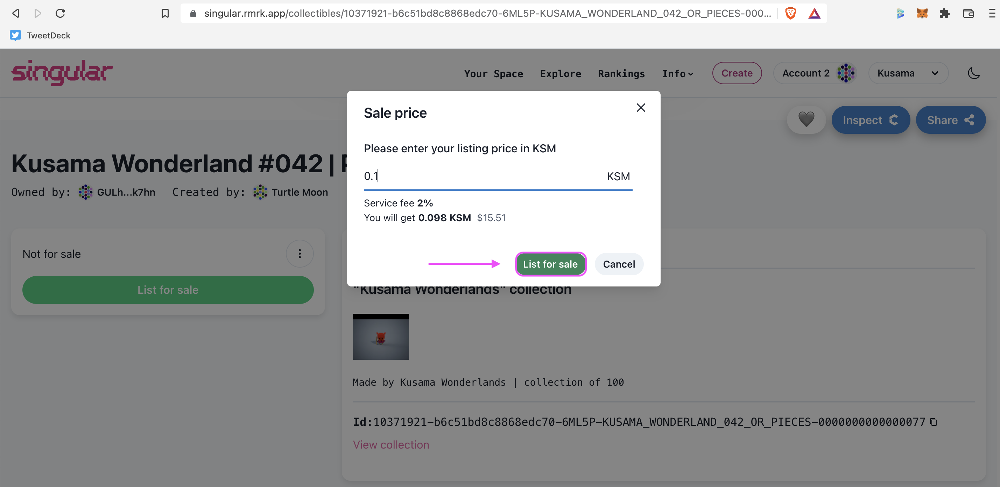

**Step 3**: If you want to change price or cancel sell, click on the respective buttons, then enter your password and hit **Approve** to complete the transaction.&#x20;

