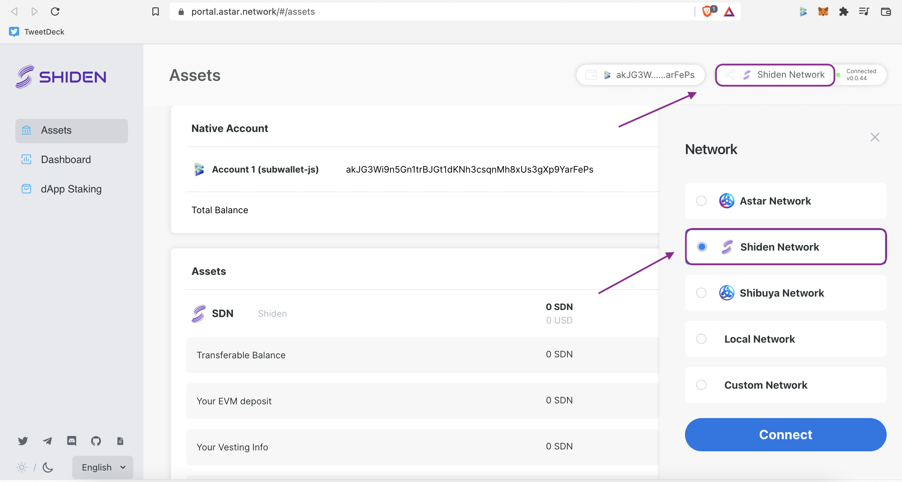

# Shiden Portal


For instructions on creating an **Shiden** account with SubWallet, please visit&#x20;



[create-an-account.md](../user-guide/create-an-account.md)



If you want to import your accounts from Metamask into SubWallet, go to



[import-an-account-using-private-key-from-metamask.md](../user-guide/import-and-restore-an-account/import-an-account-using-private-key-from-metamask.md)


## Connect SubWallet to Shiden Portal

**Step 1**: Log into [Astar Portal](https://portal.astar.network/#/assets). The extension automatically opens a pop-up to allow you to connect to Astar Network. Choose as many accounts as you like then click **Connect**.

**Step 2**: On the top right corner, click on **Astar Network**. On the slide-in Network box, choose **Shiden Network**. Hit **Connect**.


For Instructions on $SDN Transfer, EVM Deposit Withdrawal and Staking Management, please visit:&#x20;



[astar-portal.md](astar-portal.md)

