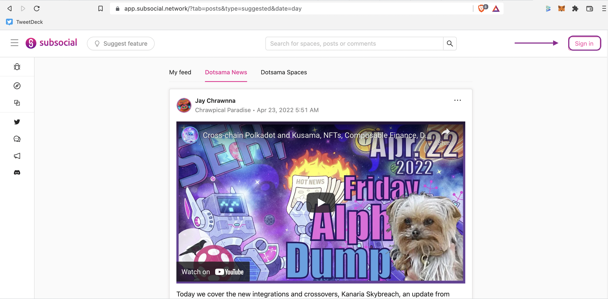
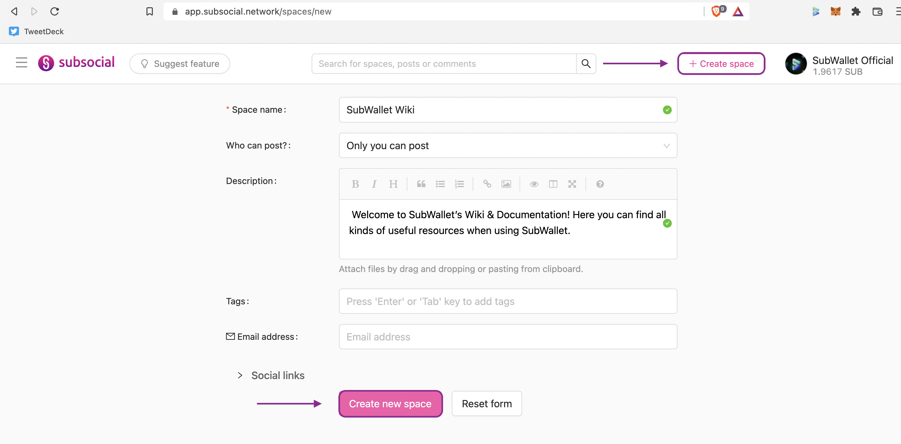
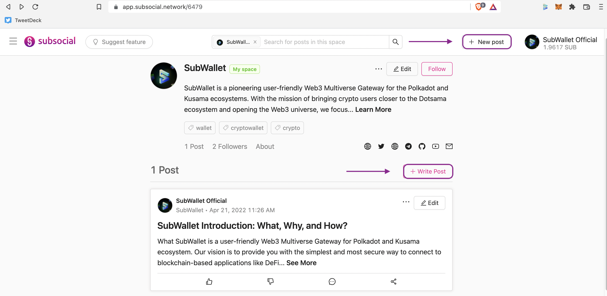
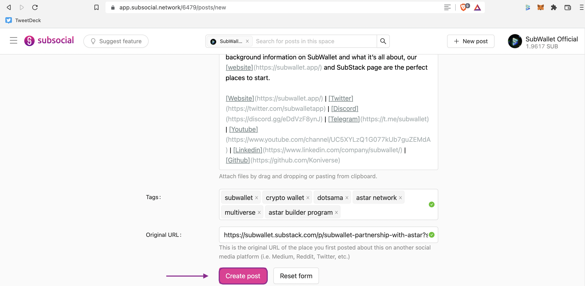
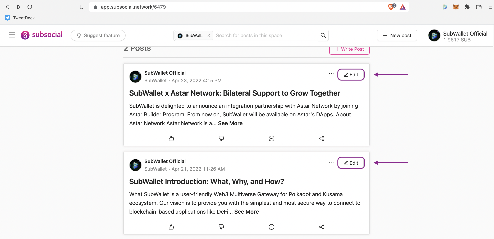
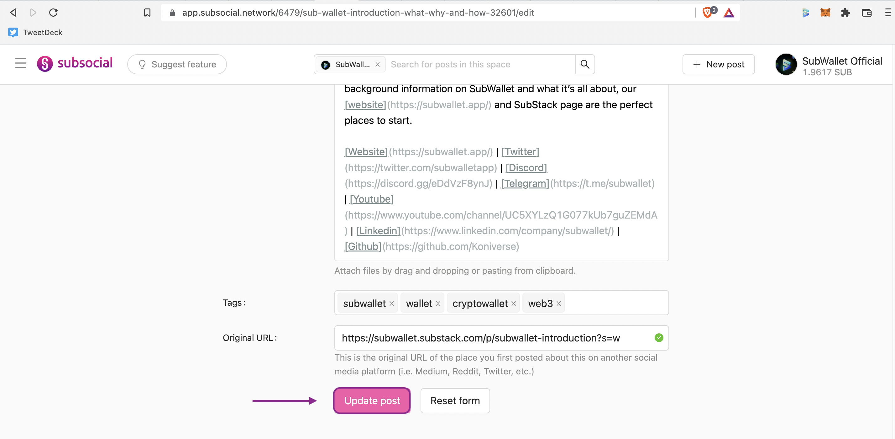
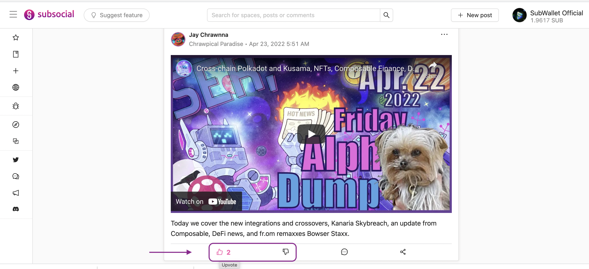
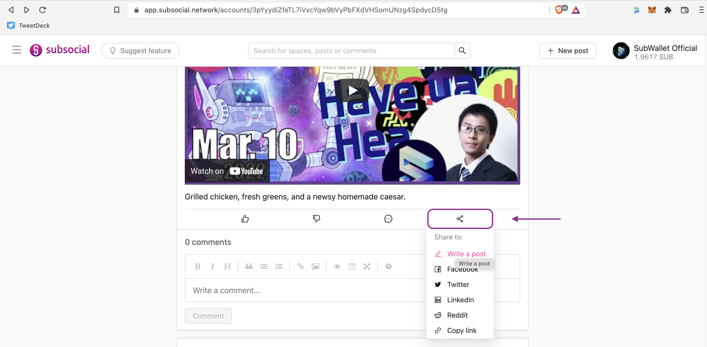
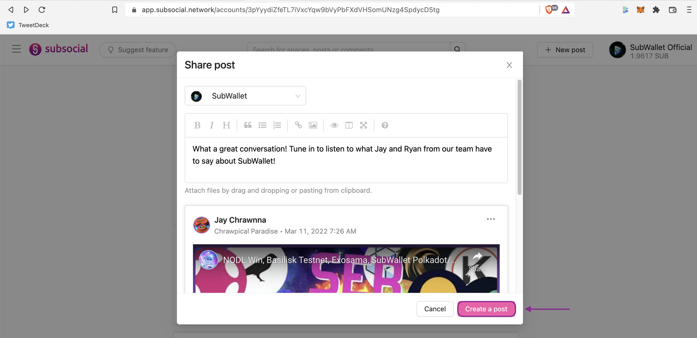

# Subsocial

## Connect SubWallet to Subsocial App


For instructions on creating a **Subsocial** account with SubWallet, please visit [create-an-account.md](../user-guide/create-an-account.md "mention") page.


Log into [Subsocial App](https://app.subsocial.network). On the top right corner, hit **Sign in** and choose your desired account.

## Create a Space

Click on the **Create space** button on the toolbar and fill in the information. Hit **Create new space**, enter your password in the pop-up window and click on **Approve**.

## Create a Post

**Step 1**: In your space, click on either the **New post** button on the toolbar or the **Write Post** button under your space description. Fill in the blank (with bold text, header and hyperlink if you will) and hit **Create post**.&#x20;

**Step 2**: Enter your password in the pop-up window and click on **Approve**.&#x20;

## Edit a Post

**Step 1**: On the space interface, click on the **Edit** button next to the post you would like to edit, or jump into the post and hit **Edit**.&#x20;

**Step 2**: Edit the post however you like, then hit Update post. Enter your password in the pop-up window and click on **Approve**.&#x20;

## React to a Post

You can either Upvote or Downvote a post. Click on the **Thumbs up** or **Thumbs down** icon in each post. Then enter your password in the pop-up window and click on **Approve**. &#x20;

## Share a Post

**Step 1**: Under a post, click on the **Share** icon, and select **Write a post** in the drop-down list. Write some thoughts about the post, then hit **Create a post**. You can also share the post to other social media platforms or simply copy the post link.

**Step 2**: Enter your password in the pop-up window and click on **Approve**.&#x20;

## Make a Comment

Under a post, click on the **Comment** icon, write your comment (format it if you will) and hit **Comment**. Then enter your password in the pop-up window and click on **Approve**.&#x20;

