# Attach a Polkadot Vault (previously Parity-Signer) account

Polkadot Vault is a cold storage solution that turns your iOS or Android device into a dedicated hardware wallet for Substrate-based networks. Your keys are kept secure (i.e., offline) at all times, and transactions are signed in an air-gapped way via QR codes.


We advise you to create a backup of your recovery phrase and update to the latest version of Polkadot Vault if you are utilizing Parity Signer (an older version of the app before its rebranding).


### Add networks to your Polkadot Vault account 

Polkadot Vault supports 3 networks by default: **Polkadot, Kusama, and Westend.**&#x20;

To add more networks, you can scan a **trusted** spec QR code and metadata QR fountain. Below are the detailed instructions:

**Step 1**: Navigate to the [Novasama Metadata Portal](https://metadata.novasama.io/#/polkadot). The interface should be like the image below.

This should be done on a device that is **not** your Polkadot Vault device (PC recommended).

<figure><figcaption></figcaption></figure>

**Step 2**: Choose the network you want to add in the **Network** tab on the sidebar.&#x20;

<figure><figcaption></figcaption></figure>


To make it easier, type the network you want to update in the **Search** bar.

_In this case, we want to add the Avail network._

 (3).png>)


You will see a QR code, which will be used to add the corresponding network to your account.

<figure><figcaption></figcaption></figure>

**Step 3**: Open the Polkadot Vault app and click on the "**Scan QR code**" button at the bottom of the screen.

<figure><figcaption></figcaption></figure>

**Step 4**: Scan the QR code in Step 2 to add the network. Once you've completed, review the verifier certificate and select **"Approve**".

<figure><figcaption></figcaption></figure>

**Step 5**: After approving the addition of the new network, you'll be prompted to create a new key (account) for that network. It will be added to the main tab under the selected key set.

<figure><figcaption></figcaption></figure> <figure>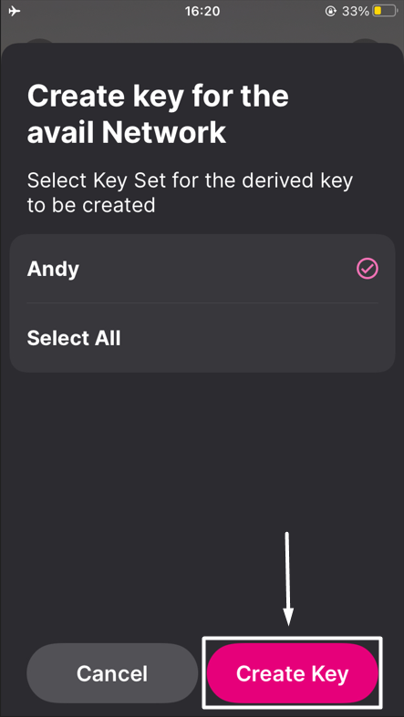<figcaption></figcaption></figure>

**Step 6**: You have successfully added the network!

<figure><figcaption></figcaption></figure>

### Update Network metadata in Polkadot Vault 

Given that your Polkadot Vault device is always offline and separated from any networks (air-gapped), you'll need to engage in a specific process to ensure your transactions remain valid by updating the chain metadata.

This can be done through the use of QR codes found on the [Novasama Metadata Portal](https://metadata.novasama.io/#/polkadot), which will provide your device with the information required to update the chain metadata.

To update the chain metadata, please follow the instructions below:


Please look at the following example for your perusal. Here, we are updating the metadata of the Avail network.


**Step 1**: Navigate to the [Novasama Metadata Portal](https://metadata.novasama.io/#/polkadot). The interface should be like the image below.


This should be done on a device that is **not** your Polkadot Vault device (PC recommended).


In this case, we are using a PC.

<figure><figcaption></figcaption></figure>

**Step 2**: Choose the network you need to update in the "**Network**" tab on the sidebar.

<figure><figcaption></figcaption></figure>


To make it easier, type the network you want to update in the "**Search**" bar.

 (3).png>)


**Step 3**: Go to the "**Metadata**" tab.

<figure><figcaption></figcaption></figure>

**Step 4**: Scan the Metadata Animated QR code using your Polkadot Vault device.

<figure><figcaption></figcaption></figure>


Make sure your device remains stationary while the scanning process is in progress. This may take a few minutes to complete.

.png>)


**Step 5**: Once you've completed, review the verifier certificate and select **"Approve**".

<figure><figcaption></figcaption></figure>

Now, you have successfully updated the network's metadata!

### Attach a Polkadot Vault account

#### **Enable/disable your permission for camera access**

You will need to grant the SubWallet extension permission to use your camera in order to import via this method.

To enable this permission, please follow these steps:

**Step 1**: Open the SubWallet extension and click on the list item at the top left of the screen to get to the Settings section.

<figure><figcaption></figcaption></figure>

**Step 2**: In the Settings screen, choose "**Security settings**".

<figure>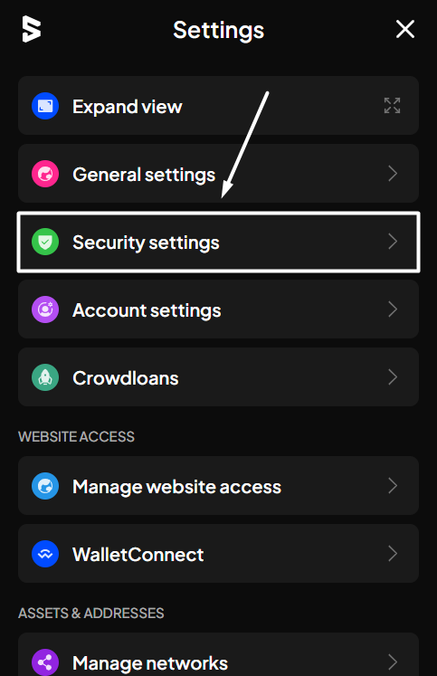<figcaption></figcaption></figure>

**Step 3**: In the Security settings, switch the toggle next to "**Camera access for QR**" and approve the browser's popup to enable camera access.

<figure>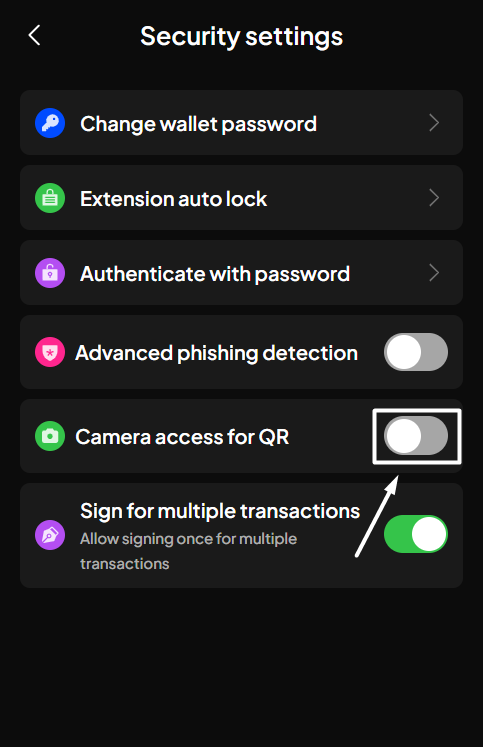<figcaption></figcaption></figure> <figure>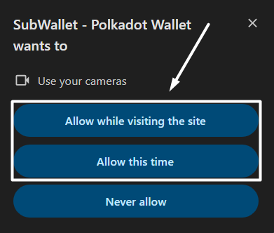<figcaption></figcaption></figure>


If you use the Brave browser, there will be multiple options that allow you to access the camera for different durations. You can choose the time option that best fits your personal preferences.&#x20;

 (3).png>)



If you want to disable this permission, you can switch the toggle back.

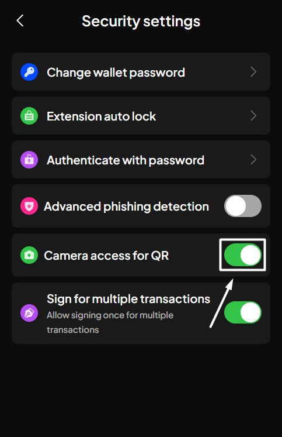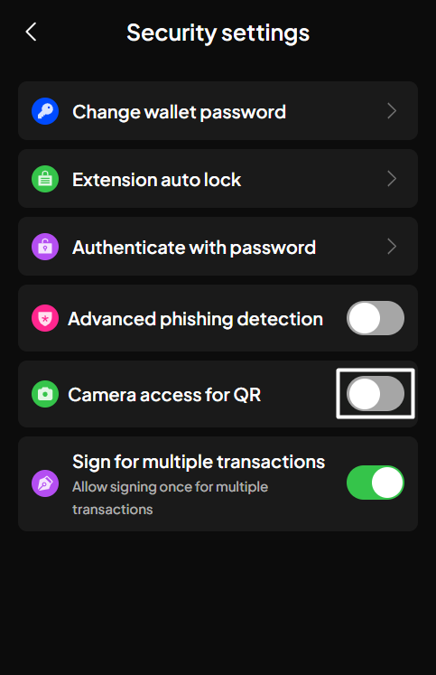


#### **Attach your account**

**Step 1**: Open your Polkadot Vault app and have the QR code ready.

**Step 2:** On the SubWallet homepage, click on the account name at the top of the screen to access the account selection tab.

<figure><figcaption></figcaption></figure>

**Step 3**: In the account selection tab, click the  button at the bottom left corner of the screen.

<figure>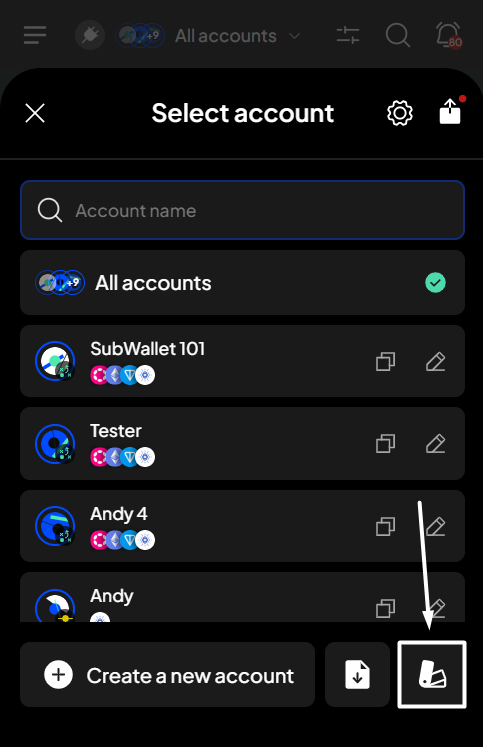<figcaption></figcaption></figure>

**Step 4**: Choose "**Connect a Polkadot Vault account**".

<figure>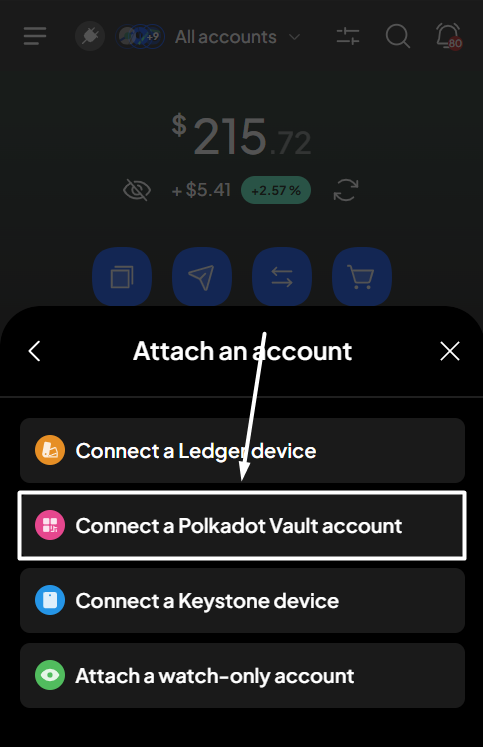<figcaption></figcaption></figure>


If you are on the SubWallet welcome page, select the "**Attach an account**" option, then click  "**Connect a Polkadot Vault account**".

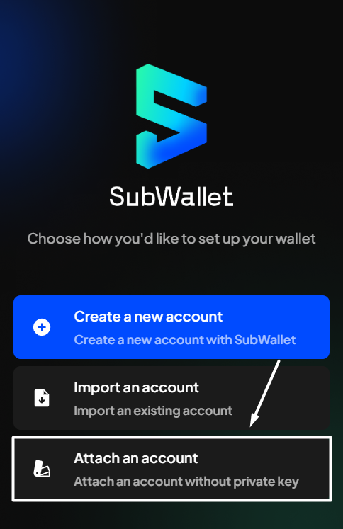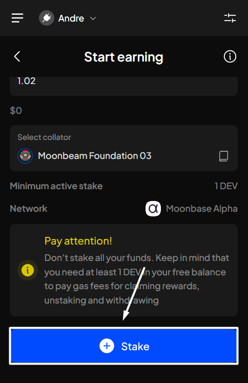


**Step 5**: Click the "**Scan QR code**" button.

<figure>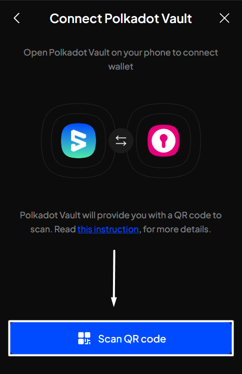<figcaption></figcaption></figure>

**Step 6**: Put the Polkadot Vault app (with the QR code displayed) in front of your computer and scan it with the computer's camera, or upload an image containing this QR code using the "**Upload from photos**" option.

<figure>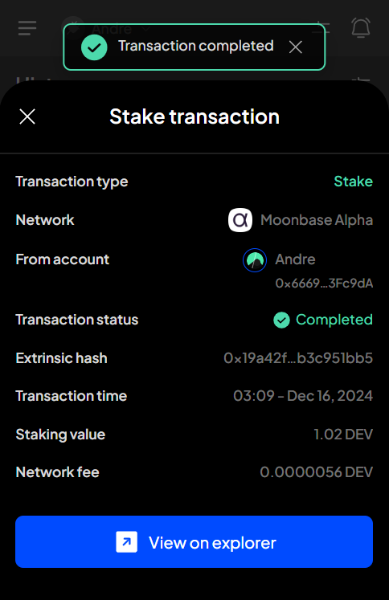<figcaption></figcaption></figure>

**Step 7**: Once your computer recognizes the QR code, a popup will appear, asking you to enter the name of your account. Once done, click "**Confirm**".

<figure>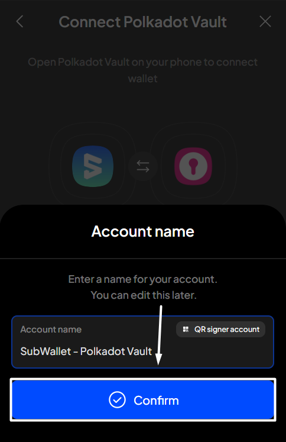<figcaption></figcaption></figure>

You've successfully attached a Polkadot Vault account! If you repeat the action in **Step 2**, you will see your Polkadot Vault account displayed in the "**QR signer account**" section.

<figure>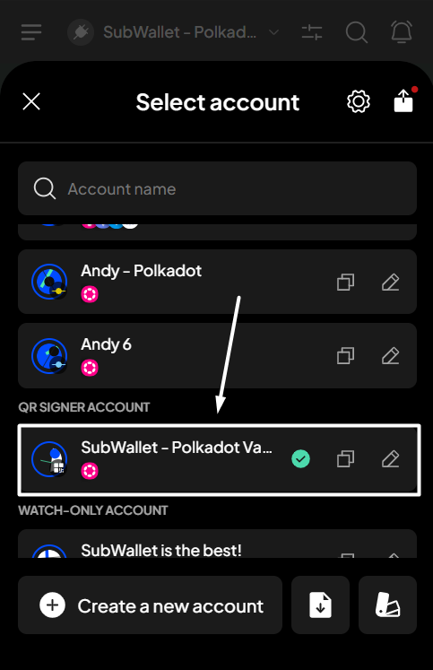<figcaption></figcaption></figure>
