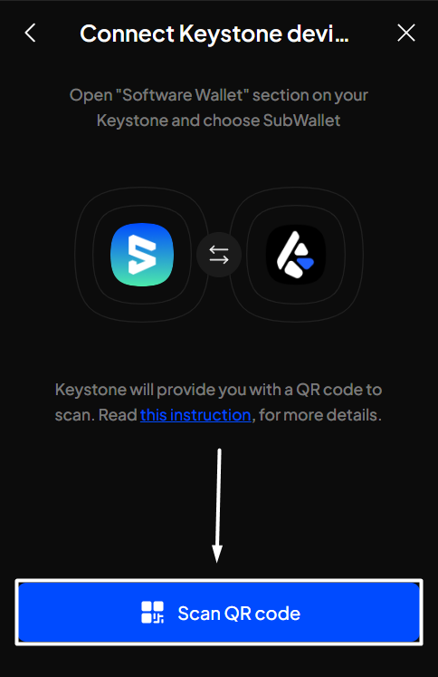

# Connect Keystone device

### **Enable/disable your permission for camera access**

You will need to grant the SubWallet extension permission to use your camera in order to import via this method.

To enable this permission, please follow these steps:

**Step 1**: Open the SubWallet extension and click on the list item at the top left of the screen to get to the Settings section.

<figure><figcaption></figcaption></figure>

**Step 2**: In the Settings screen, choose "**Security settings**".

<figure><figcaption></figcaption></figure>

**Step 3**: In the Security settings, switch the toggle next to "**Camera access for QR**" and approve the browser's popup to enable camera access.

<figure><figcaption></figcaption></figure> <figure><figcaption></figcaption></figure>


If you use the Brave browser, there will be multiple options that allow you to access the camera for different durations. You can choose the time option that best fits your personal preferences.&#x20;

 (3).png>)



If you want to disable this permission, you can switch the toggle back.



### **Connect to your Keystone device**

**Step 1**: Open your Keystone and have the QR code ready.

**Step 2**: Open the SubWallet extension and click on the account name to access the account selection tab.

<figure><figcaption></figcaption></figure>

**Step 3**: In the account selection tab, click the  button at the bottom right corner of the screen.

<figure><figcaption></figcaption></figure>

**Step 4**: Choose "**Connect a Ledger device**".

<figure><figcaption></figcaption></figure>

**Step 5**: Click "Scan the QR code".

<figure><figcaption></figcaption></figure>


If you haven't enabled the "Camera access for QR" toggle in Security settings, SubWallet will show the following message:

To enable access, click on "Go to Setting" and then follow the steps provided in[#enable-disable-your-permission-for-camera-access](connect-keystone-device.md#enable-disable-your-permission-for-camera-access "mention").

Once done, repeat the connecting procedure.


**Step 6**: Put your Keystone device (with the QR code displayed) in front of your computer and scan it with the computer's camera, or upload an image containing this QR code using the "**Upload from photos**" option.

<figure><figcaption></figcaption></figure>

**Step 7:** Once your computer recognizes the QR code, a popup will appear, asking you to enter the name of your account. Once done, click "**Confirm**".

**Step 8**: Your account is ready!&#x20;
