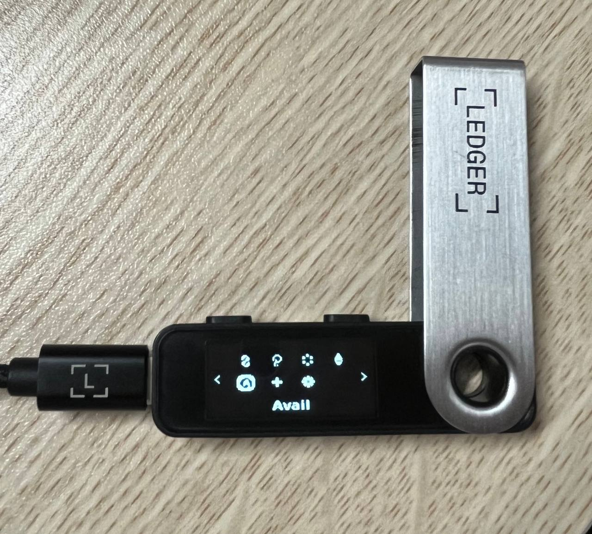
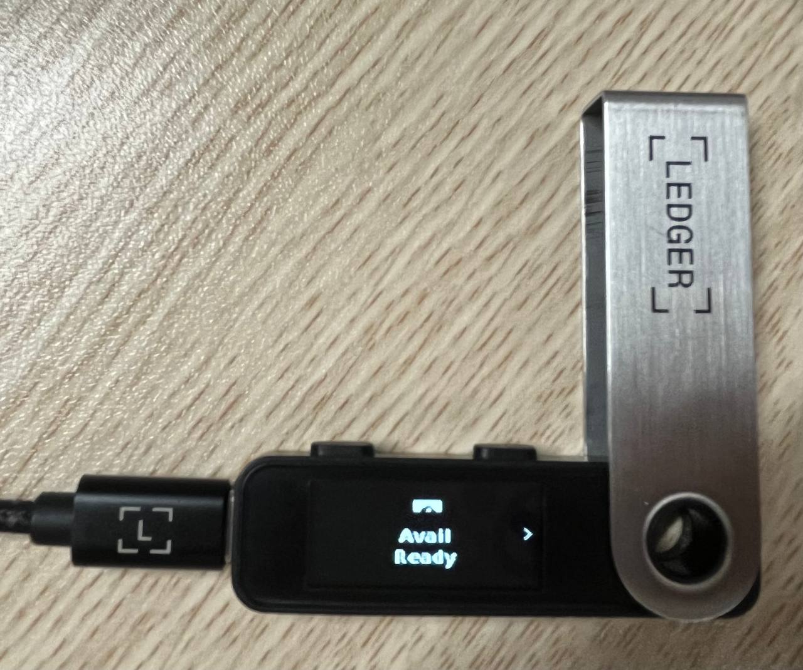

# Connect via network-specific apps

**Step 1**: Have your Ledger device ready & connected to your computer. Choose the App on your Ledger.

_In this example, we will connect Ledger accounts to SubWallet by choosing the Avail app on the Ledger Nano S Plus device._

<figure><figcaption></figcaption></figure>

 

<figure><figcaption></figcaption></figure>

**Step 2**:  Open the SubWallet extension and click on the account name to get to the account selection tab.&#x20;

<figure><figcaption></figcaption></figure>

**Step 3**: Choose the attach account icon at the bottom right corner.

<figure><figcaption></figcaption></figure>

**Step 4**: Choose "**Connect a Ledger device**".

<figure><figcaption></figcaption></figure>

**Step 5**: Select the app corresponding to the current App on your Ledger and click "**Connect**". Your extension will display the following pop-up:

<figure><figcaption></figcaption></figure>

Click on the device name (Nano S Plus in this case) and click "**Connect**".

**Step 6**: After your Ledger has been successfully found by SubWallet, click "**Connect Ledger device**".


Don't forget to turn on the corresponding app on the Ledger device.


<figure><figcaption></figcaption></figure>

**Step 7**: Choose the account(s) you want to use, then click "**Connect Ledger device**"

<figure><figcaption></figcaption></figure>

**Step 8**: Your Ledger account is ready!

If you get to the account list (repeat Step 2), you can see your Ledger account there. You will also see the Ledger icon next to your linked account(s) (see the image below), as this is to differentiate it from other account types.

<figure><figcaption></figcaption></figure>


**Note**: With these apps, their corresponding Ledger accounts can only handle assets like tokens and NFTs within the specific network associated with that account.&#x20;

For example, with Ledger Avail accounts, you will only be able to send, receive and stake tokens on the Avail network.

