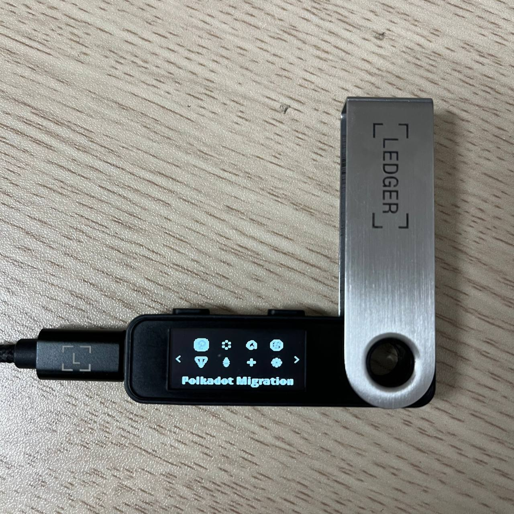
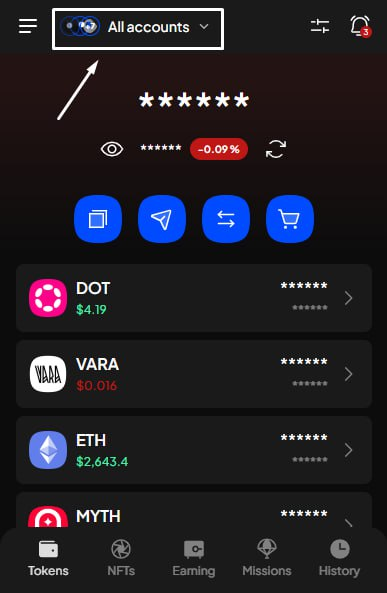
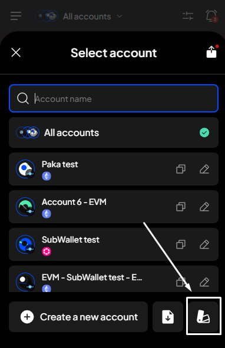
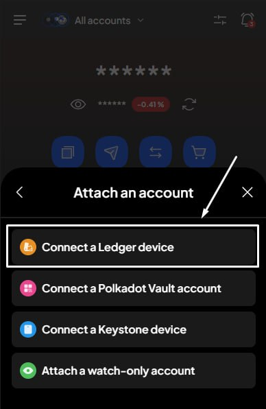
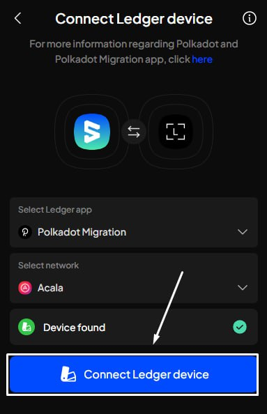
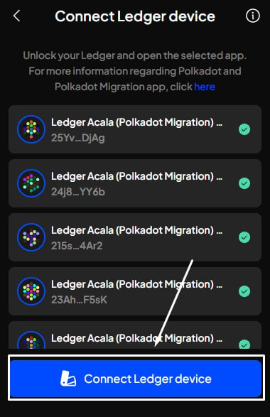
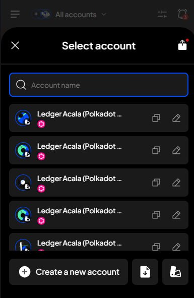

# Connect via the Polkadot Migration app

**Step 1**: Have your Ledger device ready & connected to your computer. Choose the App on your Ledger.

_In this example, we will connect Ledger accounts to SubWallet by choosing the Avail app on the Ledger Nano X device._

<figure><figcaption></figcaption></figure> <figure><figcaption></figcaption></figure>

**Step 2**: Open the SubWallet extension and click on the account name to access the account selection tab.

<figure><figcaption></figcaption></figure>

**Step 3**: In the account selection tab, click the  button at the bottom right corner of the screen.

<figure><figcaption></figcaption></figure>

**Step 4**: Choose "**Connect a Ledger device**".

<figure><figcaption></figcaption></figure>

**Step 5**: You will be directed to a new window. Select the Polkadot Migration app and the network you want to use. Once done, the extension will display the following pop-up:

<figure><figcaption></figcaption></figure>

Click on the device name (Nano X in this case) and click "**Connect**".

**Step 6**: After your Ledger has been successfully found by SubWallet, click "**Connect Ledger device**".


Don't forget to turn on the corresponding app on the Ledger device.


<figure><figcaption></figcaption></figure>

**Step 7**: Choose the account(s) you want to use, then click "**Connect Ledger device**"

<figure><figcaption></figcaption></figure>

**Step 8**: Your Ledger account is ready!

If you get to the account list (repeat Step 2), you can see your Ledger account there. You will also see the Ledger icon next to your linked account(s) (see the image below), as this is to differentiate it from other account types.

<figure><figcaption></figcaption></figure>
