# Create a new account with a new seed phrase

### How SubWallet generates seed phrase for each account

When you create a new account on SubWallet, a 12-word phrase (also known as a **seed phrase/recovery phrase**) is generated. This phrase is essential for safeguarding your account and the assets held within the account.


Seed phrase is randomly generated and consists of a series of 12 words taken from the [BIP-39 wordlist](https://github.com/bitcoin/bips/blob/master/bip-0039/english.txt). With a 12-word seed phrase out of 2048 possible words, determining the right words in the right sequence is almost impossible :wink:


### Create a new account after successfully installing SubWallet

**Step 1**: After installing the SubWallet extension, you will be directed to the Welcome screen on a new window. Click "**Create a new account**" to proceed.

<figure>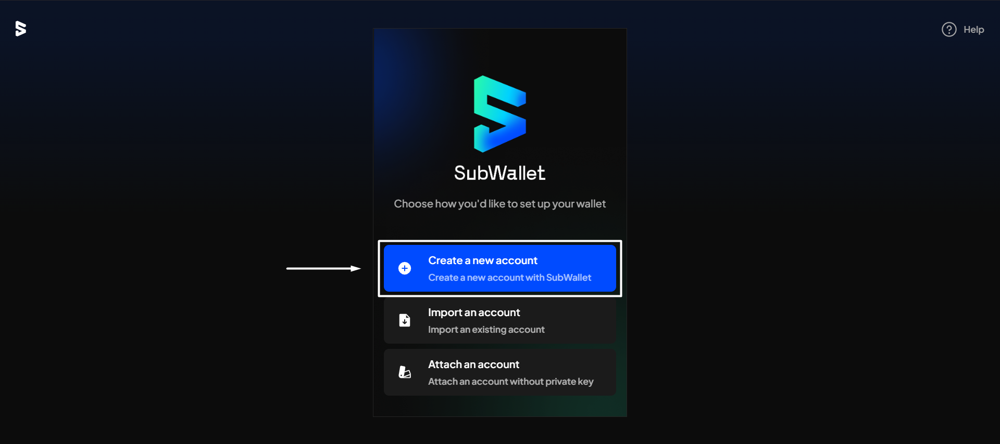<figcaption></figcaption></figure>

**Step 2**: Make sure you read all the Terms of Use by clicking on the scroll-down button and agree with them by ticking the box beside "**I understand and agree to the Terms of Use, which apply to my use of SubWallet and all of its feature**".

<figure>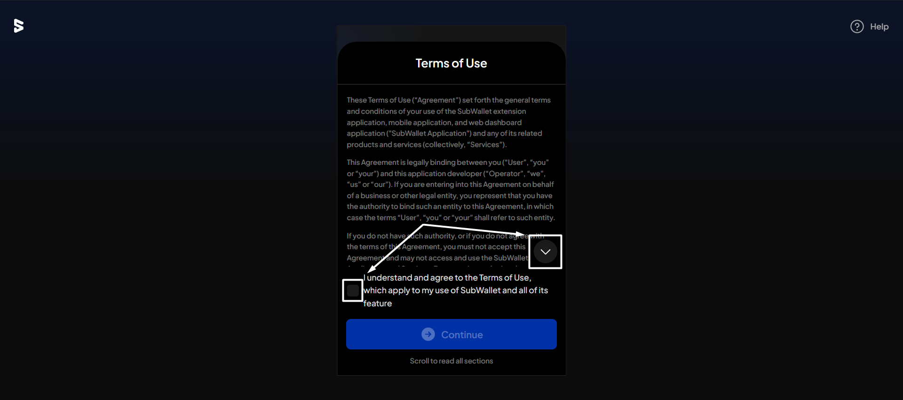<figcaption></figcaption></figure>

Once done, click "**Continue**".&#x20;

<figure>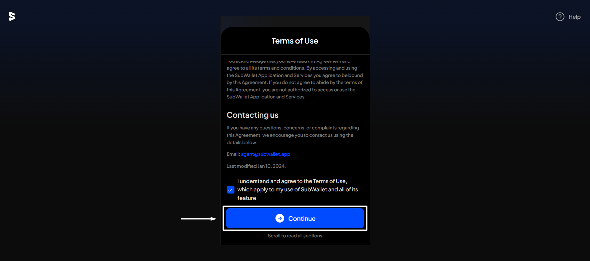<figcaption></figcaption></figure>

**Step 3:** Enter a strong password with at least 8 characters and tick "**I understand that SubWallet can't recover the password**".&#x20;


Password should contain at least 1 uppercase letter, 1 number, and 1 special character.


<figure>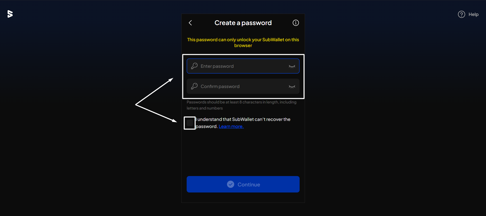<figcaption></figcaption></figure>

Once done, click "**Continue**".

<figure>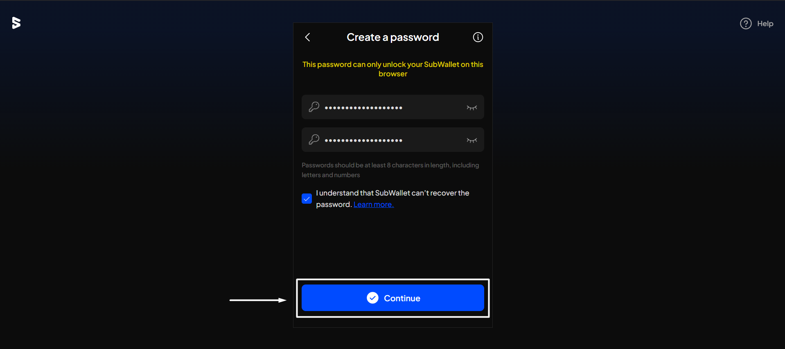<figcaption></figcaption></figure>

**Step 4**: Keep your seed phrase safe by tapping all the checkboxes to confirm you understand the importance of your seed phrase, then click "**Continue**".


Anyone with access to your seed phrase can gain control over your funds.


<figure>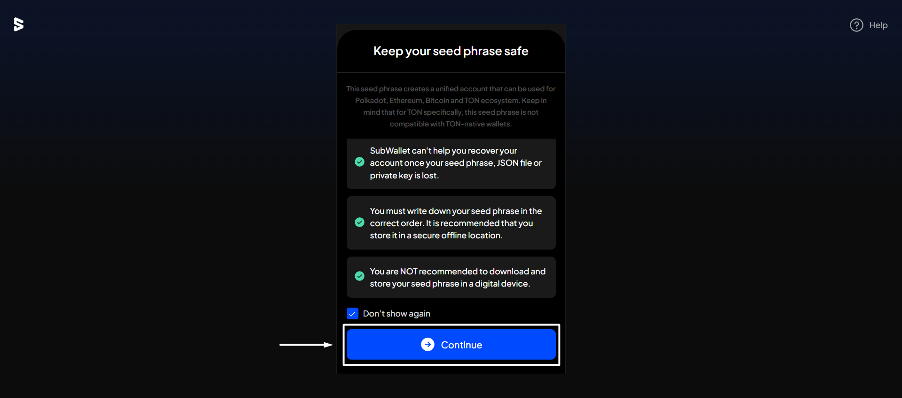<figcaption></figcaption></figure>


If, for instance, you forget your password, you will need your seed phrase to import the account again and set up a new password.


**Step 5**: Your seed phrase will be shown to you. Click "**I have kept it somewhere safe**" to proceed.

<figure>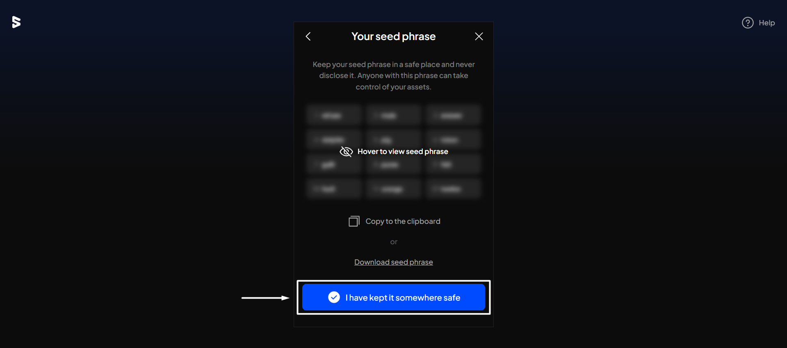<figcaption></figcaption></figure>


If you want to store seed your phrase, you can either:

* Select "**Copy to clipboard**" to paste it, or&#x20;
* Choose "**Download seed phrase**" to save it as a file downloaded from your browser.


**Step 6**: Enter a name for your newly created account. Once done, click "**Continue**".

<figure>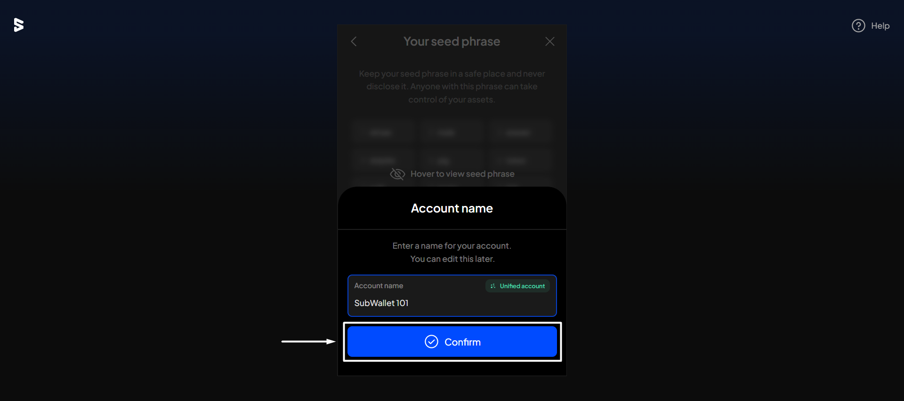<figcaption></figcaption></figure>

**Step 7**: Your account has been successfully set up. Click "**Go to home**" to get to the homepage.

### Create a new account within SubWallet

**Step 1**: Open the SubWallet extension and click on the account name to access the account selection tab.

<figure><figcaption></figcaption></figure>

**Step 2**: In the account selection tab, click "**Create a new account**". Then choose "**Create with a new seed phrase**".

<figure>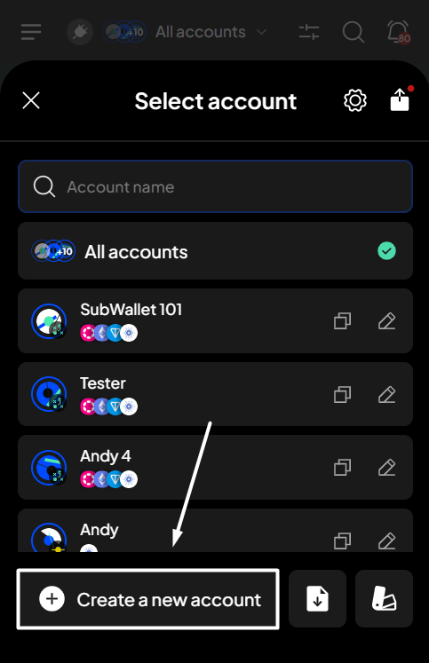<figcaption></figcaption></figure> <figure>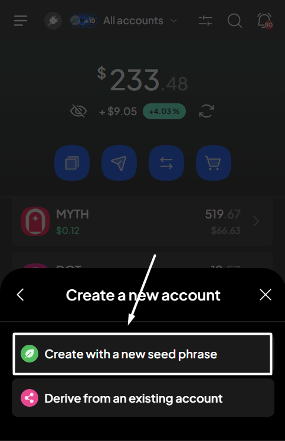<figcaption></figcaption></figure>

**Step 3**: Keep your seed phrase in a safe place by clicking "**Copy to clipboard**" or "**Download seed phrase**". Then, click "**I have kept it somewhere safe**".

<figure>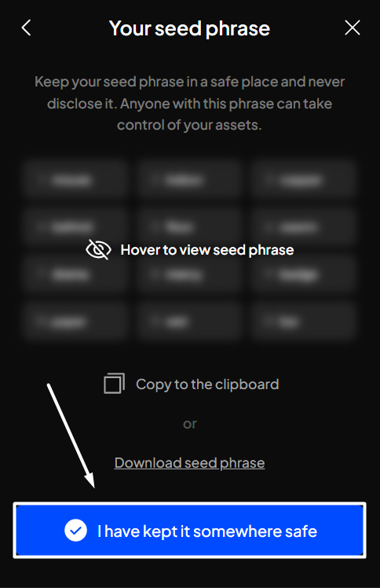<figcaption></figcaption></figure>

Step 4: Enter a name for your newly created account. Once done, click "**Continue**".

<figure>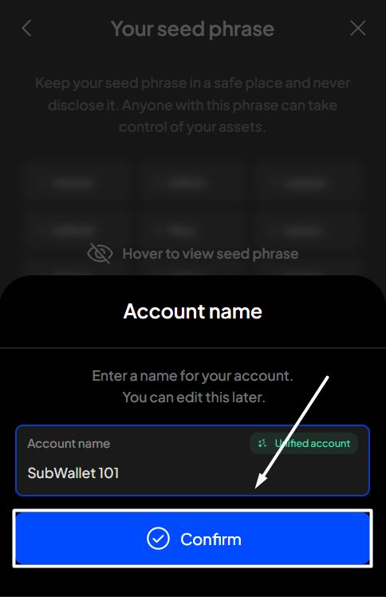<figcaption></figcaption></figure>

You will be redirected to the homepage, where you can see your newly created account.

<figure>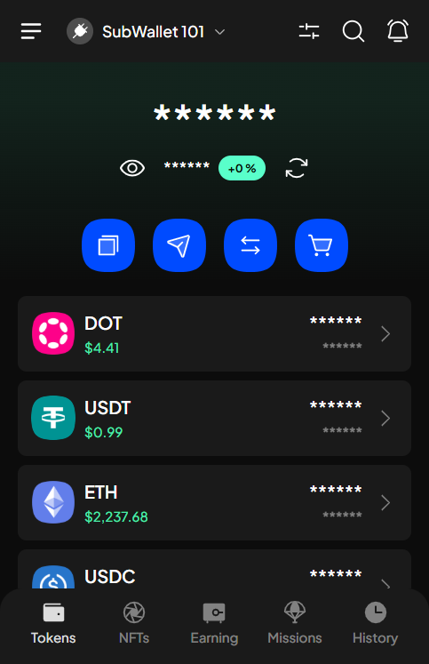<figcaption></figcaption></figure> <figure>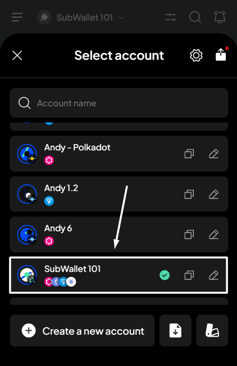<figcaption></figcaption></figure>


For each seed phrase generated from SubWallet, a unified account will be created and used to manage assets and perform transactions across **all** ecosystems.



Note that in order to see your assets, you will need to manually enable the networks you want to use & have assets on.&#x20;

Follow [this instruction](../network-management/customize-your-networks/enable-disable-networks.md) to enable the networks you want to use.

