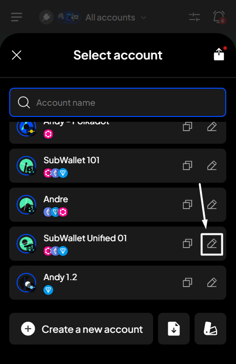
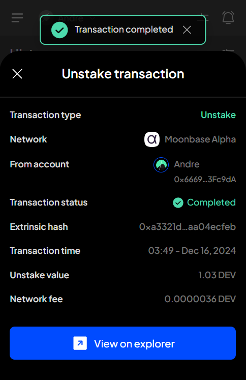
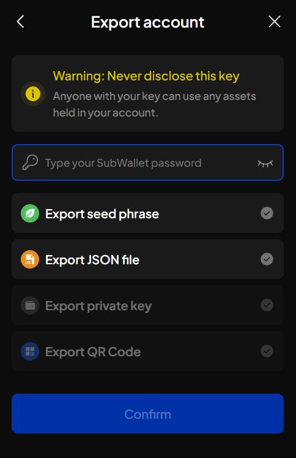
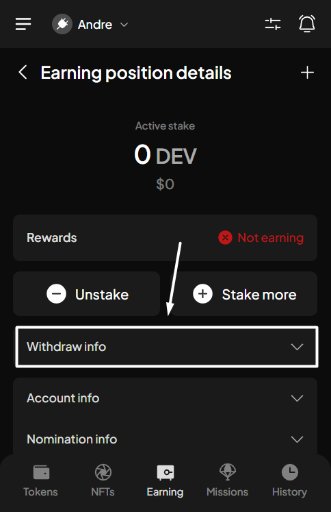
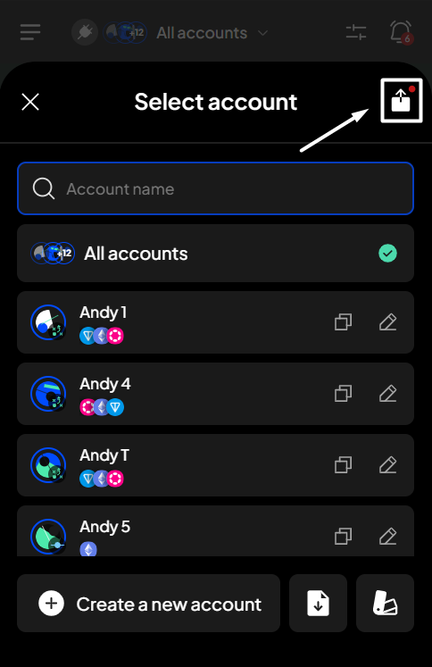
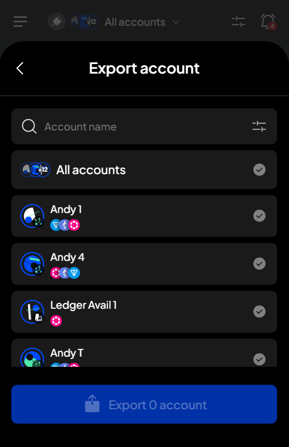
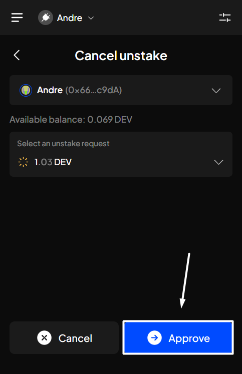
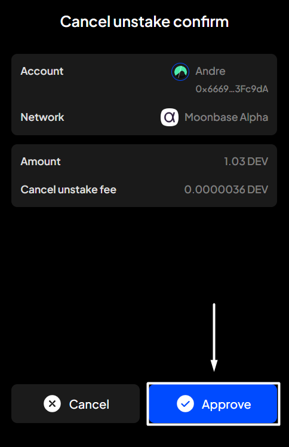
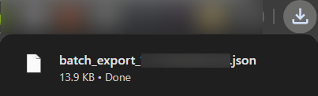
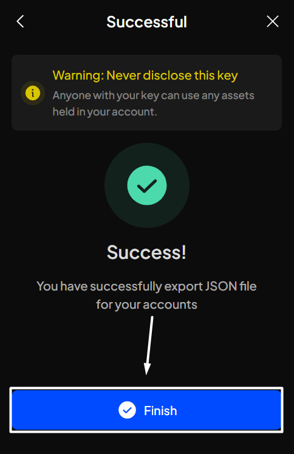

# Export & backup accounts

### Supported export methods

Export your backup information in different forms of backup files, and use these files to restore & import the account again if you so wish.

Depending on the type of account you want to export, SubWallet supports different export methods:

<table><thead><tr><th width="224">Account type</th><th data-type="checkbox">Seed phrase</th><th data-type="checkbox">JSON file*</th><th data-type="checkbox">Private key</th><th data-type="checkbox">QR code</th></tr></thead><tbody><tr><td><strong>Unified account</strong></td><td>true</td><td>true</td><td>false</td><td>false</td></tr><tr><td><strong>Substrate account</strong></td><td>true</td><td>true</td><td>false</td><td>true</td></tr><tr><td><strong>EVM account</strong></td><td>true</td><td>true</td><td>true</td><td>true</td></tr><tr><td><strong>TON account</strong></td><td>true</td><td>true</td><td>true</td><td>false</td></tr><tr><td><strong>Cardano account</strong></td><td>false</td><td>true</td><td>false</td><td>false</td></tr><tr><td><strong>Ledger account</strong></td><td>false</td><td>true</td><td>false</td><td>false</td></tr><tr><td><strong>QR-signer account</strong></td><td>false</td><td>true</td><td>false</td><td>false</td></tr></tbody></table>

_(\*): The exported JSON file **cannot be imported** into EVM-compatible wallets (Metamask, Phantom, Rabby, etc.) or Cardano-native wallets (Typhoon)._

### Export & backup an account

**Step 1**: Open the SubWallet extension and click on the account name to access the account selection tab.

<figure><figcaption></figcaption></figure>

**Step 2**: In the account selection tab, click the  icon on the right-hand side of the account you wish to export.&#x20;

_In this example, we will export the backup information of "SubWallet Unified 01" - a unified account._

<figure><figcaption></figcaption></figure>

**Step 3**: In the Account details section, choose "**Export**".

<figure><figcaption></figcaption></figure>

**Step 4**: Enter your password.&#x20;


You will notice that even if you correctly enter your password, the "**Confirm**" button is still unavailable. You would need to choose your preferred form of export file to continue.


<figure><figcaption></figcaption></figure>

As "SubWallet Unified 01" is a unified account, there are 2 options to export the account, as listed in the table above.

**Step 5**: Choose your preferred way(s) to export your account. Then, click "**Confirm**".

<figure><figcaption></figcaption></figure>


Please save and keep your backup files secure.&#x20;

Furthermore, you will need these backup files to restore your account in case you forget your SubWallet password.



**Don't share your seed phrase with anyone, including us.**&#x20;

SubWallet is non-custodial, which means we don't store any of your backup information to ensure user privacy and security.


### Export multiple accounts


This feature allows you to export backup information of multiple accounts (no matter its account type) in **one JSON file**.


_In this example, we will export multiple accounts on the SubWallet extension on the Chrome browser._

**Step 1**: Open the SubWallet extension and click on the account name to access the account selection tab.&#x20;

<figure><figcaption></figcaption></figure>

**Step 2**: In the account selection tab, click on the export icon  at the top right of the screen.

<figure><figcaption></figcaption></figure>

**Step 3**: In the Export account screen, select as many accounts to export as you wish.

_In this example, we want to export 4 accounts. Once done, click on the "**Export 4 accounts**" button._

<figure><figcaption></figcaption></figure> <figure><figcaption></figcaption></figure>

**Step 4**: Enter your password to confirm, then click "**Submit**" to proceed.

<figure><figcaption></figcaption></figure>

Once clicked, the Chrome browser will download a JSON file. Click **Ctrl + J** to locate the file.

<figure><figcaption></figcaption></figure>

**Step 5**: You have successfully exported multiple accounts! Click "**Finish**" to return to the homepage.

<figure><figcaption></figcaption></figure>


If you want to import these accounts to use them on other devices and browsers, you can import the JSON file downloaded from **Step 4** using this [guide](import-accounts/import-from-json-file.md).

