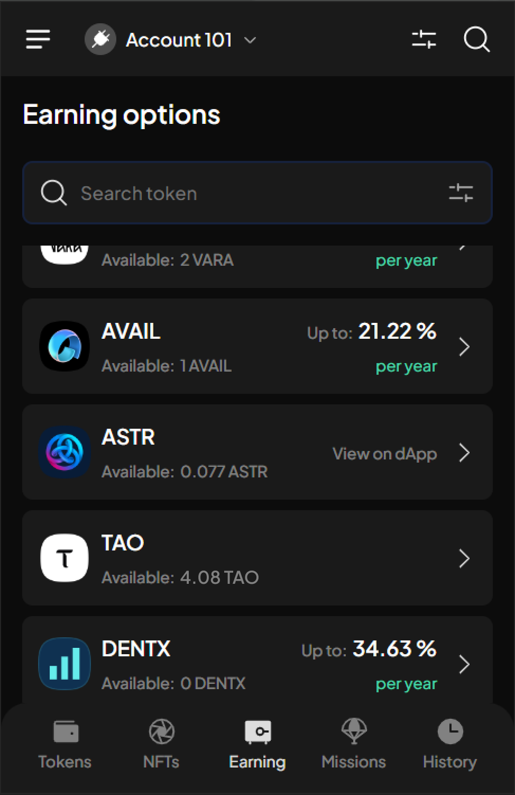

# Export & backup accounts

### Export & backup an account

Export your private key in different forms of backup files, and use these files to restore & import the account again if you so wish.

Depending on the type of account you want to export, SubWallet supports different export methods:

<table><thead><tr><th width="312">Account's type</th><th>Supported export method</th></tr></thead><tbody><tr><td>Polkadot (Substrate) account</td><td><ul><li>Export seed phrase</li><li>Export JSON file</li><li>Export QR code</li></ul></td></tr><tr><td>Ethereum (EVM) acccount</td><td><ul><li>Export seed phrase</li><li>Export JSON file</li><li>Export private key</li><li>Export QR code</li></ul></td></tr><tr><td>Watch-only account</td><td>None</td></tr><tr><td>Ledger account</td><td>None</td></tr><tr><td>QR-signer account</td><td>None</td></tr></tbody></table>

**Step 1**: On the SubWallet homepage, click on the account name to get to the account selection tab.&#x20;

<figure><figcaption></figcaption></figure>

**Step 2**: In the account selection tab, click the edit icon on the right-hand side of the account you wish to export.&#x20;

<figure><figcaption>
In this example, we chose account "Andy" - a Polkadot account - to export.
</figcaption></figure>

**Step 3**: In the Account details section, choose "**Export**".

<figure><figcaption></figcaption></figure>

**Step 4**: Enter your password.&#x20;


You will notice that even if you correctly enter your password, the "**Confirm**" button is still unavailable. You would need to choose your preferred form of export file to continue.


As "Andy" is a Polkadot account, there are 3 options to export the account, as listed in the table above.

<figure><figcaption></figcaption></figure>

**Step 5**: Choose your preferred way(s) to export your account. Then, click "**Confirm**".

<figure><figcaption></figcaption></figure>


Please save and keep your backup files secure.&#x20;

Furthermore, you would need these backup files to restore your account in case you forget your SubWallet password.



**Don't share your seed phrase with anyone, including us.**&#x20;

SubWallet is non-custodial, which means we don't store any of your backup information to ensure user privacy and security.


### Export multiple accounts


This feature allows users to export backup information of multiple accounts (whether Polkadot accounts or Ethereum accounts) in the form of **one JSON file**.&#x20;


In this example, we will export multiple accounts on the SubWallet extension using the Chrome browser.

**Step 1**: On the SubWallet homepage, click on the account name to get to the account selection tab.&#x20;

<figure><figcaption></figcaption></figure>

**Step 2**: In the account selection tab, click on the export icon  at the top right of the screen.

<figure><figcaption></figcaption></figure>

**Step 3**: In the Export account screen, select as many accounts to export as you wish.

<figure><figcaption></figcaption></figure>

In this example, we want to export 4 accounts. Once done, click on the "**Export 4 accounts**" button.

<figure><figcaption></figcaption></figure>

**Step 4**: Enter your password to confirm, then click "**Submit**" to proceed.

<figure><figcaption></figcaption></figure>

Once clicked, the Chrome browser will download a JSON file. Click **Ctrl + J** to locate the file.

<figure><figcaption></figcaption></figure>

**Step 5**: You have successfully exported multiple accounts! Click "**Finish**" to return to the homepage.

<figure><figcaption></figcaption></figure>


If you want to import these accounts to use them on other devices and browsers, you can import the JSON file downloaded from **Step 4** using this [guide](import-and-restore-an-account.md).

