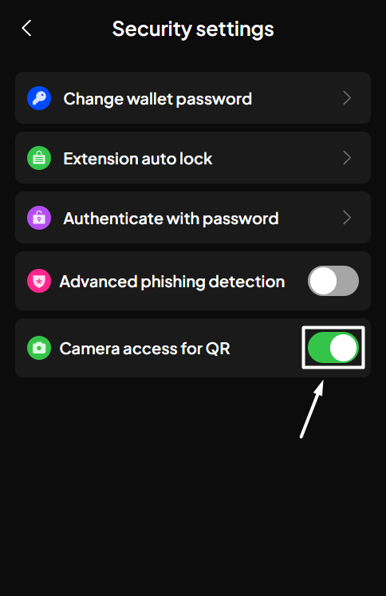
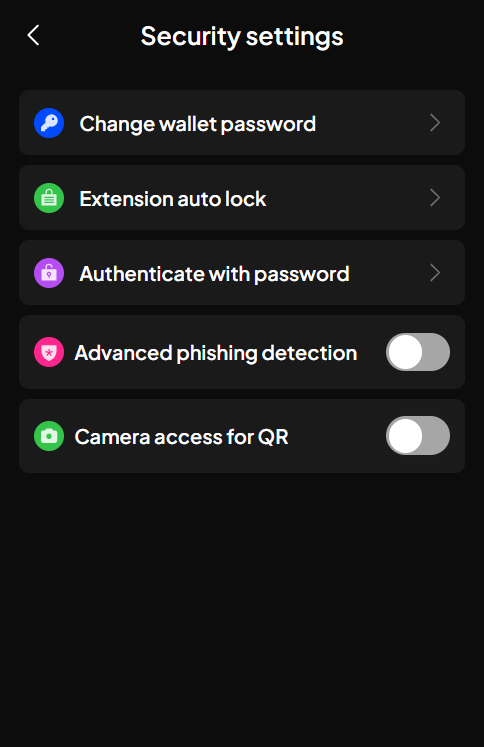
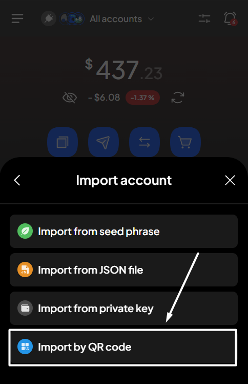
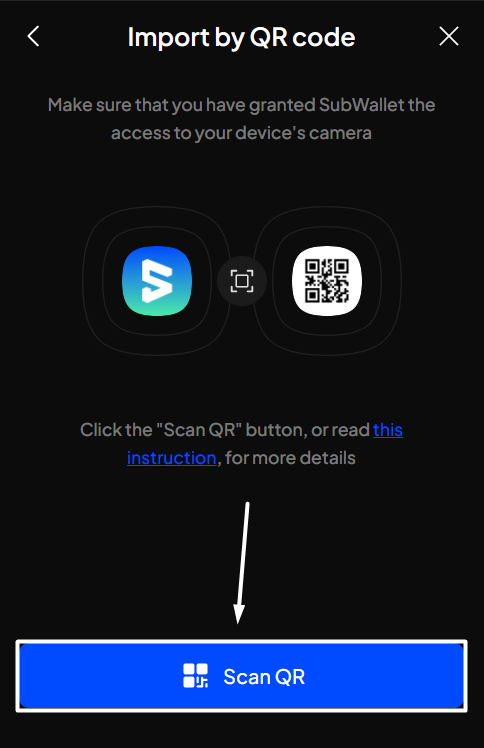
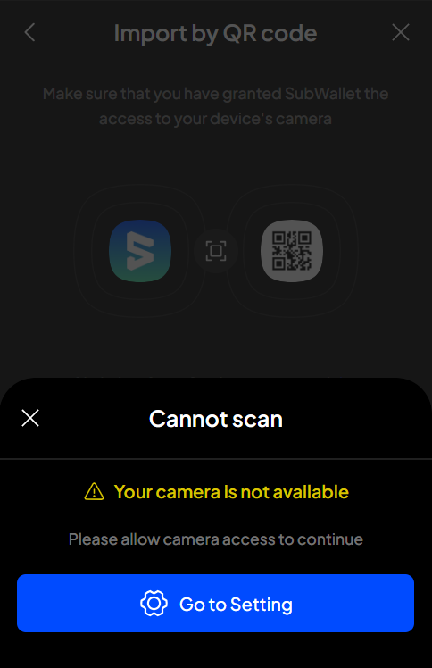
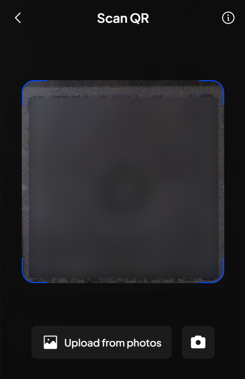
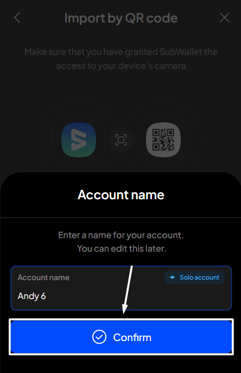

# Import by QR code

### **Enable/disable your permission for camera access**

You will need to grant the SubWallet extension permission to use your camera in order to import via this method.

To enable this permission, please follow these steps:

**Step 1**: Open the SubWallet extension and click on the list item at the top left of the screen to get to the Settings section.

<figure><figcaption></figcaption></figure>

**Step 2**: In the Settings screen, choose "**Security settings**".

<figure><figcaption></figcaption></figure>

**Step 3**: In the Security settings, switch the toggle next to "**Camera access for QR**" and approve the browser's popup to enable camera access.

<figure><figcaption></figcaption></figure> <figure><figcaption></figcaption></figure>


If you use the Brave browser, there will be multiple options that allow you to access the camera for different durations. You can choose the time option that best fits your personal preferences.&#x20;

.png>)



If you want to disable this permission, you can switch the toggle back.



### **Import your account via QR code**

#### If you are currently using SubWallet

**Step 1**: Open the SubWallet extension and click on the account name to access the account selection tab.

<figure><figcaption></figcaption></figure>

**Step 2**: In the account selection tab, click the  icon at the bottom of the screen.

<figure><figcaption></figcaption></figure>

**Step 3**: Choose "**Import by QR code**" as the chosen method to import your account.

<figure><figcaption></figcaption></figure>

**Step 4**: Click the "**Scan QR**" button.

<figure><figcaption></figcaption></figure>


If you haven't enabled the "**Camera access for QR**" toggle in Security settings, SubWallet will show the following message:

To enable access, click "Go to Setting" and then follow the steps provided in[#enable-disable-your-permission-for-camera-access](import-by-qr-code.md#enable-disable-your-permission-for-camera-access "mention").

Once done, repeat the importing procedure.


**Step 5**: Present your QR code and scan it with SubWallet using your device's camera, or upload an image containing this QR code using the "**Upload from photos**" option.

<figure><figcaption></figcaption></figure>

**Step 6**: If SubWallet detects an account from the QR code, a popup will appear, asking you to enter the name of your account. Once done, click "**Confirm**".

<figure><figcaption></figcaption></figure>

You've successfully imported your account!

#### If you have not had any accounts with SubWallet

**Step 1**: Open the SubWallet extension and choose "**Import an account**".

<figure><figcaption></figcaption></figure>

**Step 2**: Choose your preferred way to import account.

<figure><figcaption></figcaption></figure>

**Step 3:** Create a master password with at least 8 characters and tick "**I understand that SubWallet can't recover the password**".&#x20;


SubWallet is non-custodial, so you will be the only person who knows your password; we can't help you restore it once it is lost. Make sure that your password is well-kept.


Once done, click "**Continue**".

<figure><figcaption></figcaption></figure> <figure><figcaption></figcaption></figure>

Once you create a master password, you can follow the importing procedure provided in[#if-you-are-currently-using-subwallet](import-by-qr-code.md#if-you-are-currently-using-subwallet "mention"), starting from **Step 3.**
