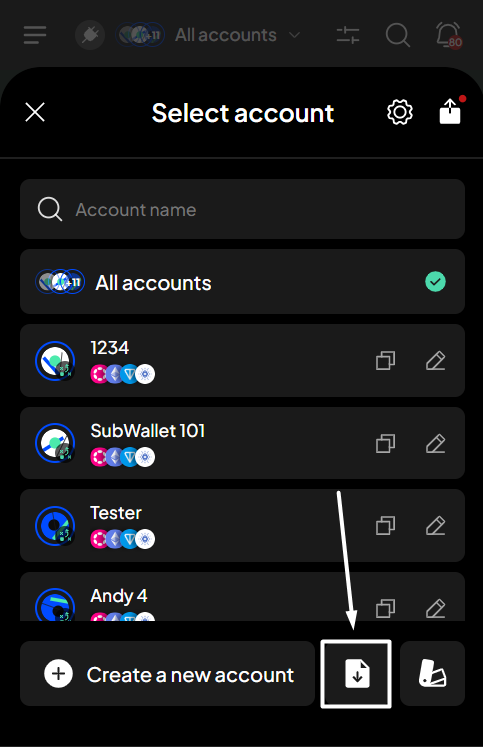
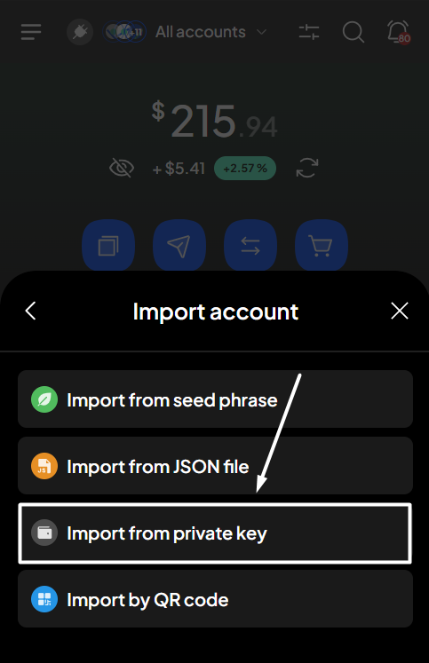
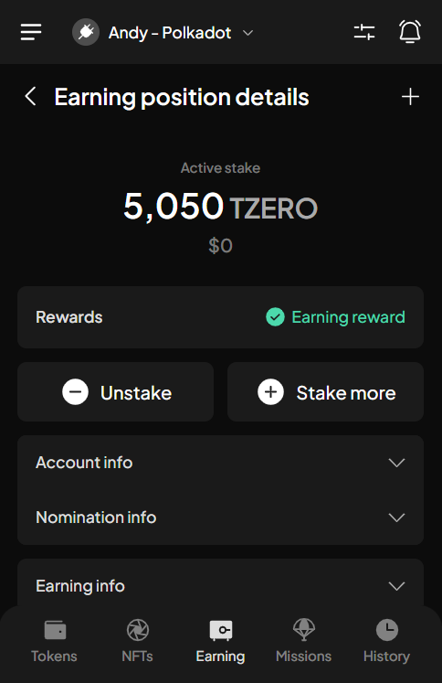
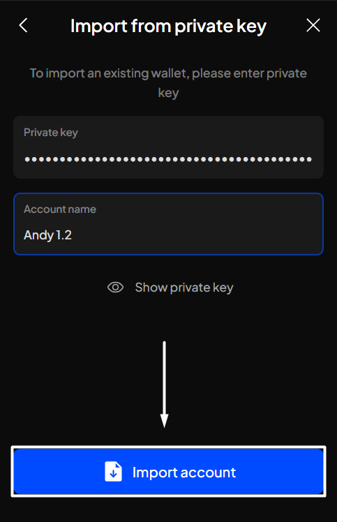
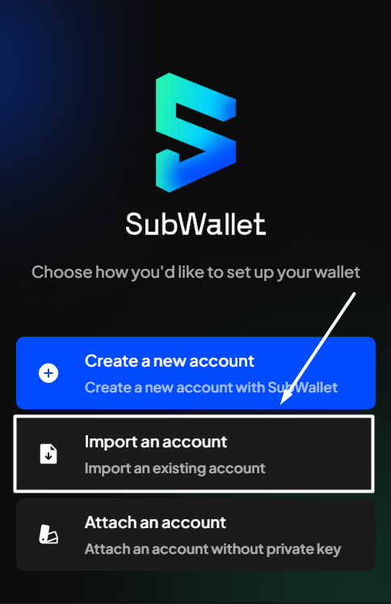
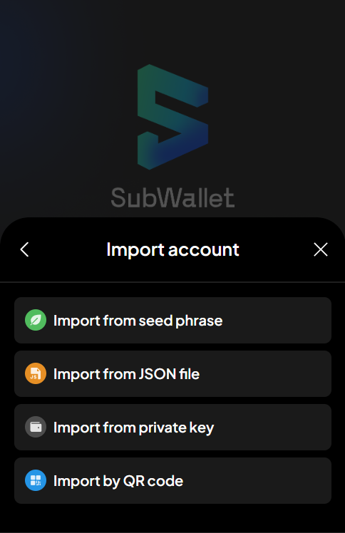
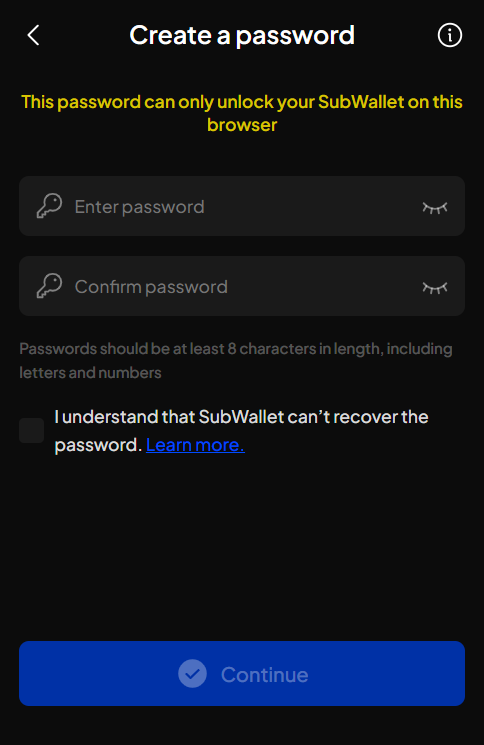
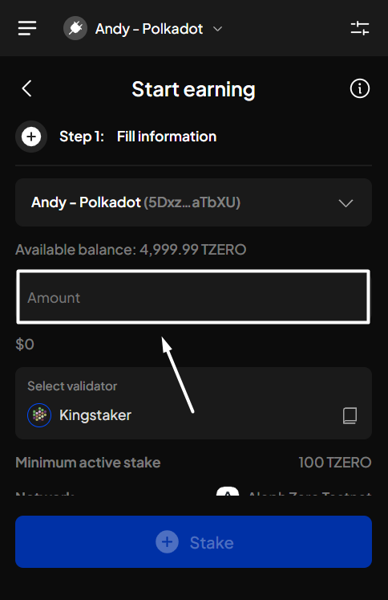

# Import from private key

### Supported account type

Currently, SubWallet allows you to use private key to import solo accounts:

<table data-full-width="false"><thead><tr><th>Solo account type</th><th>Private key compatibility</th></tr></thead><tbody><tr><td>EVM account</td><td>Can be used for EVM-compatible wallets (Metamask, Phantom, Rabby, etc.)</td></tr><tr><td>TON account</td><td>Can only be used within SubWallet (i.e., not compatible with any other wallets)</td></tr></tbody></table>

### Import your account via private key

#### If you are currently using SubWallet

**Step 1**: Open the SubWallet extension and click on the account name to access the account selection tab.

<figure><figcaption></figcaption></figure>

**Step 2**: In the account selection tab, click the  icon at the bottom of the screen.

<figure><figcaption></figcaption></figure>

**Step 3**: Choose "**Import from private key**" as the chosen method to import your account.

<figure><figcaption></figcaption></figure>

**Step 4**: Enter the private key and the name of your account. Once done, click "**Continue**".

<figure><figcaption></figcaption></figure> <figure><figcaption></figcaption></figure>

You have successfully imported your account!

#### If you have not had any accounts with SubWallet

**Step 1**: Open the SubWallet extension and choose "**Import an account**".

<figure><figcaption></figcaption></figure>

**Step 2**: Choose your preferred way to import account.

<figure><figcaption></figcaption></figure>

**Step 3:** Create a master password with at least 8 characters and tick "**I understand that SubWallet can't recover the password**".&#x20;


SubWallet is non-custodial, so you will be the only person who knows your password; we can't help you restore it once it is lost. Make sure that your password is well-kept.


Once done, click "**Continue**".

<figure><figcaption></figcaption></figure> <figure><figcaption></figcaption></figure>

Once you create a master password, you can follow the importing procedure provided in[#if-you-are-currently-using-subwallet](import-from-private-key.md#if-you-are-currently-using-subwallet "mention"), starting from **Step 3.**
