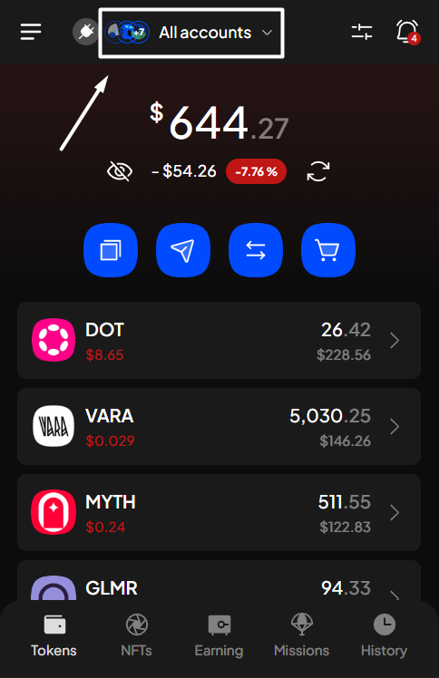
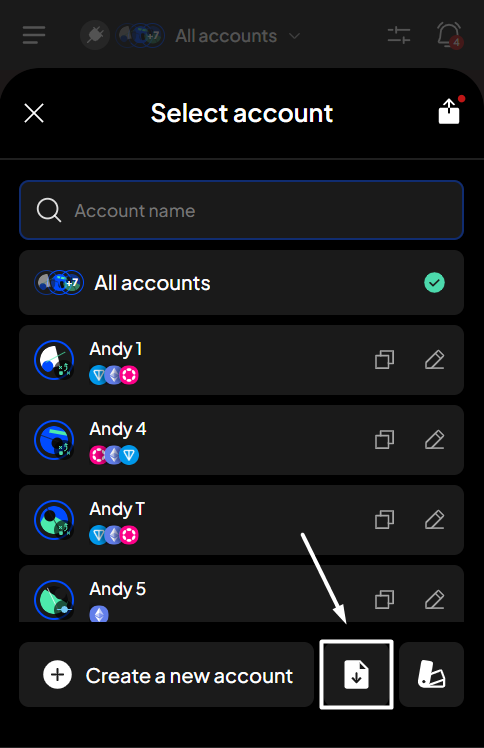
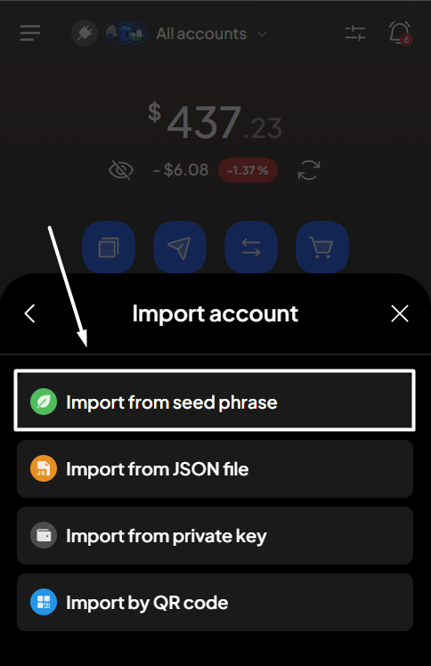
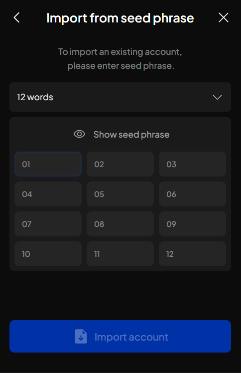
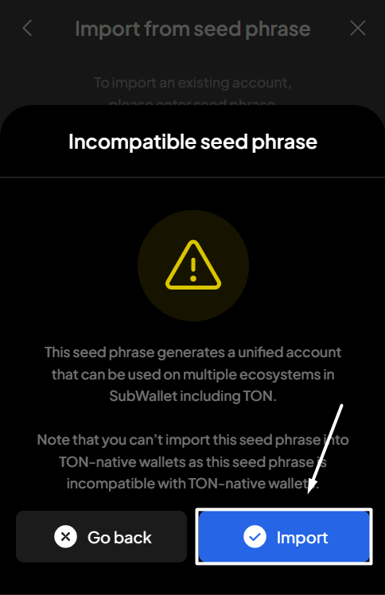
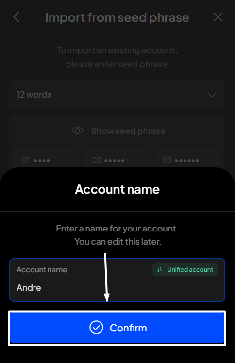

# Import from seed phrase

### Supported seed phrase types

SubWallet currently supports seed phrases created from words in the [BIP-39 wordlist](https://github.com/bitcoin/bips/blob/master/bip-0039/english.txt). Supported seed phrase types include:

| Seed phrase type      | Corresponding imported account type                   |
| --------------------- | ----------------------------------------------------- |
| 12-word seed phrase   | Unified account                                       |
| 24-word seed phrase\* | <ul><li>Unified account</li><li>TON account</li></ul> |

_(\*): If you import a seed phrase created from a non-native TON wallet into SubWallet, SubWallet will generate a unified account for you. If seed phrase is from a TON-native wallet, SubWallet will restore your existing TON account._


If you import a seed phrase incompatible with SubWallet, you may be unable to import the account, or the imported account may not be the one you intended to import.

**Trust Wallet, Safepal, and TON-native wallets** are among the wallets that are not compatible with SubWallet.&#x20;


### **Import your account via seed phrase**

#### If you are currently using SubWallet

**Step 1**: Open the SubWallet extension and click on the account name to access the account selection tab.

<figure><figcaption></figcaption></figure>

**Step 2**: In the account selection tab, click the  icon at the bottom of the screen.

<figure><figcaption></figcaption></figure>

**Step 3**: Choose "**Import from seed phrase**" as the chosen method to import your account.

<figure><figcaption></figcaption></figure>

**Step 4**: Enter your seed phrase by filling in the blank fields. Once done, click "**Import account**".&#x20;

<figure><figcaption></figcaption></figure> <figure><figcaption></figcaption></figure>


When you import a seed phrase generated from a non-native TON wallet into SubWallet, a popup will appear informing you that this phrase is incompatible with TON-native wallets:

* Click "**Import**" to proceed.
* Click "**Go back**" to cancel the process.



**Step 5**: Enter a name for your newly imported account, then click "**Confirm**".

<figure><figcaption></figcaption></figure>

You've successfully imported your account into SubWallet!

#### If you have not had any accounts with SubWallet

**Step 1**: Open the SubWallet extension and choose "**Import an account**".

<figure><figcaption></figcaption></figure>

**Step 2**: Choose your preferred way to import account.

<figure><figcaption></figcaption></figure>

**Step 3:** Create a master password with at least 8 characters and tick "**I understand that SubWallet can't recover the password**".&#x20;


SubWallet is non-custodial, so you will be the only person who knows your password; we can't help you restore it once it is lost. Make sure that your password is well-kept.


Once done, click "**Continue**".

<figure><figcaption></figcaption></figure> <figure><figcaption></figcaption></figure>

Once you create a master password, you can follow the importing procedure provided in[#if-you-are-currently-using-subwallet](import-from-seed-phrase.md#if-you-are-currently-using-subwallet "mention"), starting from **Step 3.**
