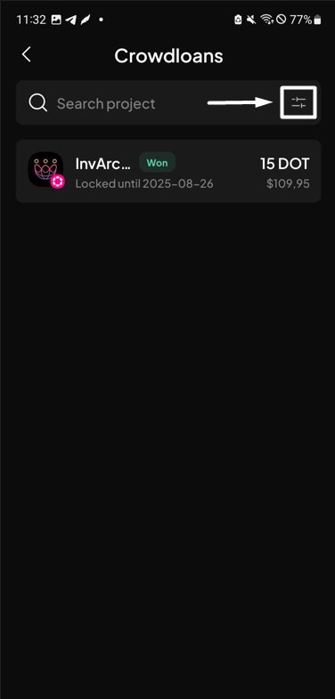
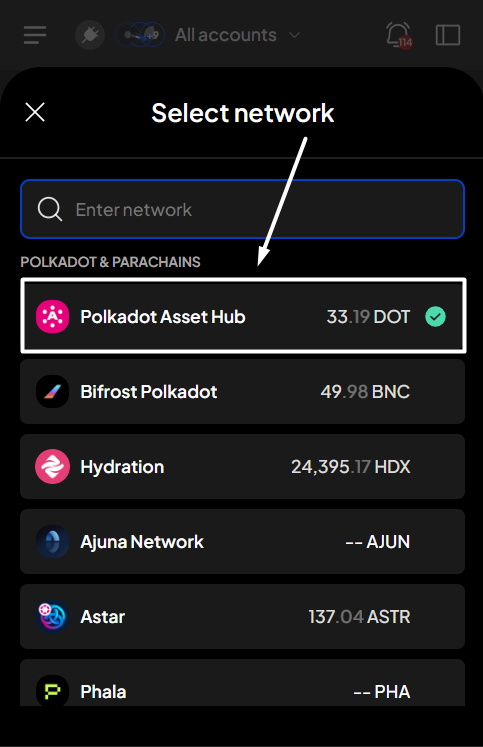
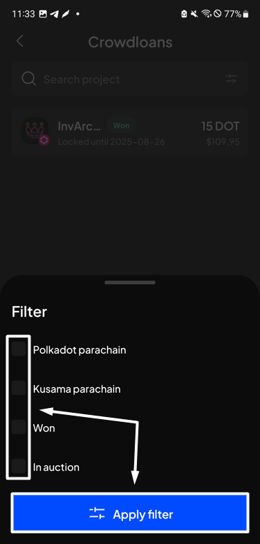
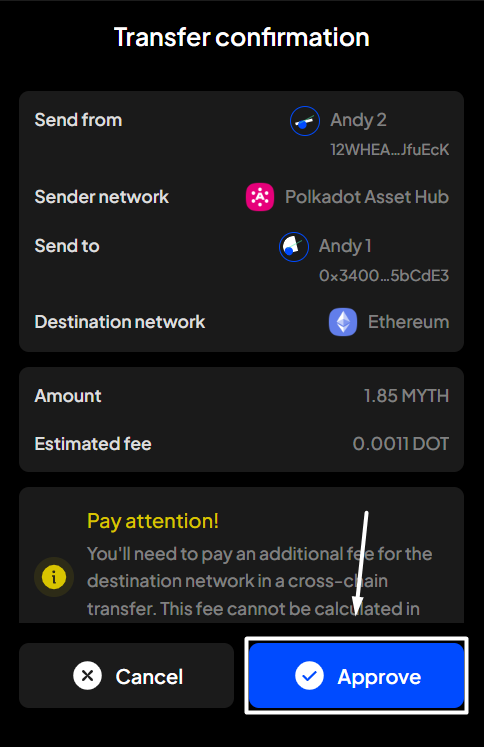
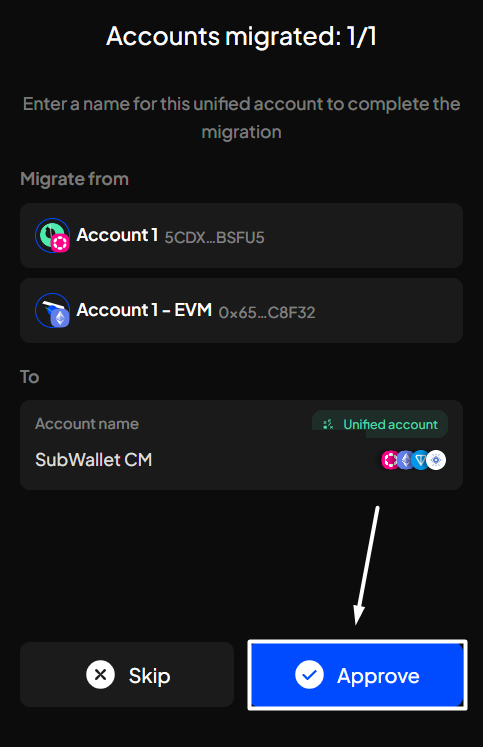
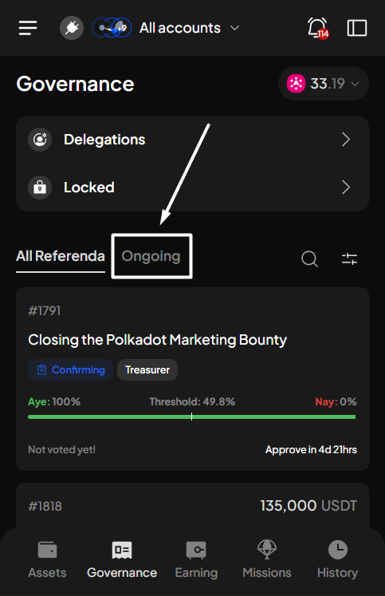
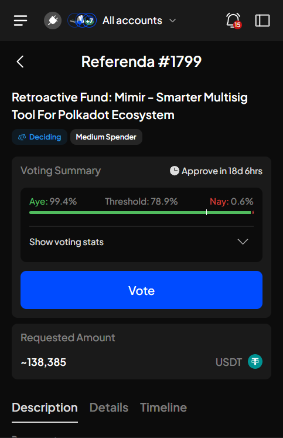
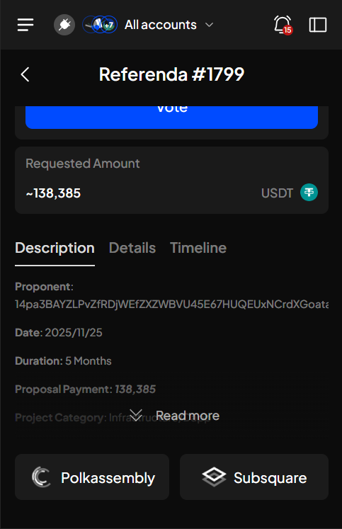

# Migrate solo accounts to unified accounts

### Supported account type for migration

Currently, SubWallet supports migrating solo accounts that are i**mported via seed phrase**. In other words, if your solo accounts were previously imported to SubWallet using the seed phrase, they are eligible for migration.


If your account list contains 2 solo accounts with the same seed phrase, SubWallet will detect and then perform the migration by combining these 2 accounts into one unified account with added support for TON & Cardano ecosystem.


<figure><figcaption></figcaption></figure>


With the new support for the Cardano ecosystem, your initial unified accounts (already being used across Substrate, EVM, and TON ecosystems) will be automatically migrated to the new unified account, including support for Cardano.


### Migrate to unified accounts


The migration process can only be done in Popup view mode (the view when you open the extension). If you open the Expand view mode, you won't be able to perform this action.


**Step 1**: Open the SubWallet extension and click the  icon at the top left of the screen to get to the Settings section.

<figure><figcaption></figcaption></figure>

**Step 2**: In the Settings screen, select "**Account settings**".

<figure><figcaption></figcaption></figure>


You can also open the Settings screen by clicking on the account name to access the account selection tab. Then, click the  icon to access the Settings section.



**Step 3**: Click on the "**Migrate to unified account**" option.

<figure><figcaption></figcaption></figure>

**Step 4**: The migration popup will appear, informing you of how the migration works. Read carefully, then select "**Migrate now**".

<figure><figcaption></figcaption></figure>

If you don't have any accounts that require migration

In this case, once you click "**Migrate now**", you will be directed to the Finish screen. Select "**Back to home**" to return to the homepage.

.png>)

**Step 5**: Enter your SubWallet password to start the migration.

<figure><figcaption></figcaption></figure> <figure><figcaption></figcaption></figure>

**Step 6**: At the top of the screen, you will see the progress and number of unified accounts that will be created from the migration.

Enter a name for your account and then click "**Approve**" to proceed. Repeat the process until all accounts have been migrated.

<figure><figcaption></figcaption></figure> <figure><figcaption></figcaption></figure>

If the eligible account list contains 2 solo accounts with the same seed phrase

In this case, SubWallet will detect and then perform the migration by combining these 2 accounts into one single unified account with added support for the TON & Cardano ecosystem.


During the migration process, **DO NOT** close the extension. If you close it, the migration will be temporarily stopped.

To continue the migration, open the extension, click "**Continue**", re-enter your password, and then select "**Continue**" to resume the process.



**Step 7**: Once all eligible accounts are successfully migrated, the migration will be completed. Hit "**Finish**" to return to the homepage.

<figure><figcaption></figcaption></figure>

Your solo accounts have been successfully migrated to their corresponding unified accounts!

<figure><figcaption></figcaption></figure>
