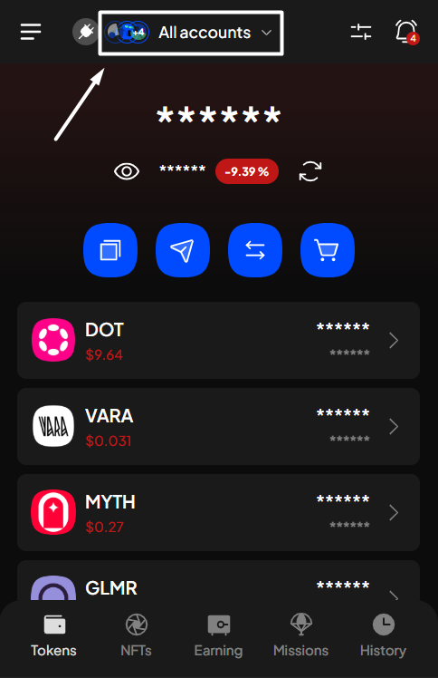

# Switch between accounts and change account name

### Switch between accounts

**Step 1**: Open the SubWallet extension and click on the account name to access the account selection tab.

<figure><figcaption></figcaption></figure>

**Step 2**: In the account selection tab, choose the account you want to use.


You can also switch between the "**All accounts**" and single-account modes here.


<figure><figcaption></figcaption></figure>

### Change your account name

**Step 1**: Open the SubWallet extension and click on the account name to access the account selection tab.

<figure><figcaption></figcaption></figure>

**Step 2**: In the account selection tab, click the pen icon next to the account you want to change its name.

<figure><figcaption></figcaption></figure>

**Step 3**: Click on the account name field and change it. We will automatically save the new name if it's not one of the used account names in your account list.&#x20;

Once done, click the "**X**' button or the left-arrow icon at the top left corner to return to the homepage.

<figure><figcaption></figcaption></figure> <figure><figcaption></figcaption></figure>

