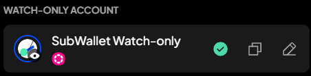
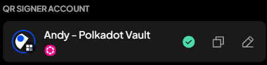

# Understand account types

Currently, SubWallet supports 5 account types, each with its unique features:

<table><thead><tr><th width="196">Account type</th><th width="353">Characteristic</th><th>Displayed on wallet</th></tr></thead><tbody><tr><td>Unified account</td><td>
Accounts that can be used for <strong>all</strong> ecosystems:
<ul><li>Substrate (Polkadot)</li><li>EVM (Ethereum)</li><li>TON</li><li>Cardano</li><li>Bitcoin</li></ul></td><td></td></tr><tr><td>Solo account</td><td>
Accounts that can be used on <strong>one</strong> ecosystem only. There are 5 types of solo accounts:
<ul><li>Substrate (Polkadot) account</li><li>EVM (Ethereum) account</li><li>TON account</li><li>Cardano account</li><li>Bitcoin account*</li></ul></td><td> </td></tr><tr><td>Watch-only account</td><td>Solo accounts in which you can <strong>only view</strong> but cannot make any transactions</td><td></td></tr><tr><td>Ledger account</td><td>Solo accounts created on Ledger devices</td><td></td></tr><tr><td>QR-signer account</td><td>Solo accounts created via the Polkadot Vault app or Keystone devices</td><td></td></tr></tbody></table>

_(\*): Currently, SubWallet supports 3 Bitcoin address types in Bitcoin-supported accounts:_

* _Legacy Bitcoin address (BIP-44)_
* _Native SegWit Bitcoin address (BIP-84)_
* _Taproot Bitcoin address (BIP-86)_
