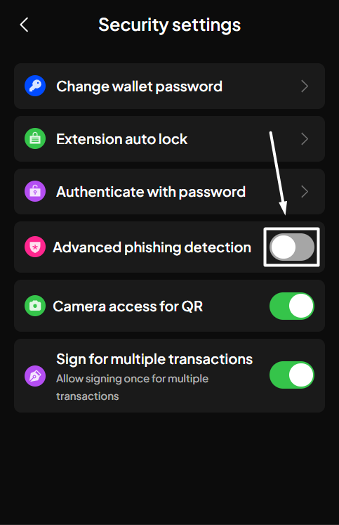
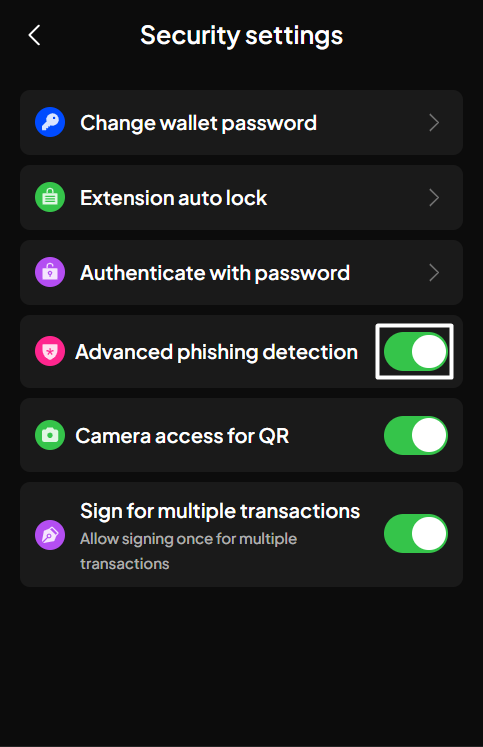

# Advanced phishing detection

### How phishing detection works 

**We have integrated phishing lists from Polkadot {.js} and ChainPatrol to protect you from scams.** When you encounter a potentially malicious website, you will receive a prominent warning notification like this:

<figure><figcaption></figcaption></figure>

You can either click:

* "**I trust this site**" to continue to the site, or
* "**Get me out of here**" to exit the screen and return to the homepage.


Please be aware that we won't take responsibility for any action once you click "**I trust this site**".


### **Enable phishing detection** 

**Step 1**: Open the SubWallet extension and click on the  icon at the top left corner to get to the Settings section.

<figure><figcaption></figcaption></figure>

**Step 2**: In the Settings section, select “**Security settings**”.

<figure><figcaption></figcaption></figure>

**Step 3**: Enable the toggle next to the "**Advanced phishing detection**" option.

<figure><figcaption></figcaption></figure> <figure><figcaption></figcaption></figure>

You have successfully enhanced the security of your wallet with an additional layer of protection!
