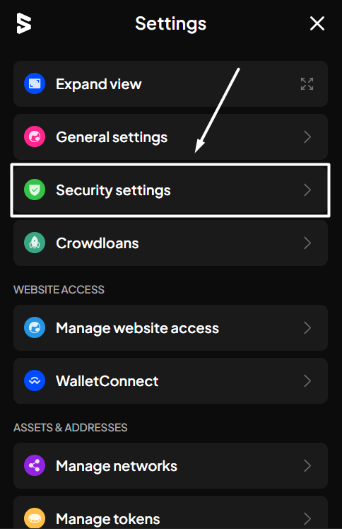

# Lock & unlock wallet

### **Lock your wallet** 

**Step 1**: Open the SubWallet extension and click on the list item at the top left corner to get to the Settings section.

<figure><figcaption></figcaption></figure>

**Step 2**: In the Settings section, scroll down to the end to see the "**Lock**" button and then click it to lock your wallet.

<figure><figcaption></figcaption></figure>

### Unlock your wallet 


If you have previously locked the wallet or been inactive for a while, your wallet will be **locked**.


To unlock the wallet, enter your master password and click "**Unlock**".

<figure><figcaption></figcaption></figure>

### Change auto-lock time 


Auto-lock is a security feature that locks your wallet after a period of inactivity.


**Step 1**: Open the SubWallet extension and click on the list item at the top left corner to get to the Settings section.

<figure><figcaption></figcaption></figure>

**Step 2**: In the Settings section, select “**Security settings**”.

<figure><figcaption></figcaption></figure>

**Step 3**: Choose "**Extension auto lock**".

<figure><figcaption></figcaption></figure>

**Step 4**: Select the lock time you prefer.

<figure><figcaption></figcaption></figure>


By default, SubWallet locks your wallet after 15 minutes of not being used, but you can adjust the lock time to fit your needs.[\
](https://docs.openbit.app/extension-user-guide/account-security/manage-master-password/forgot-master-password)

