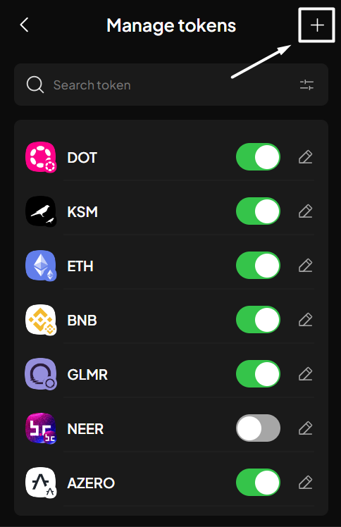
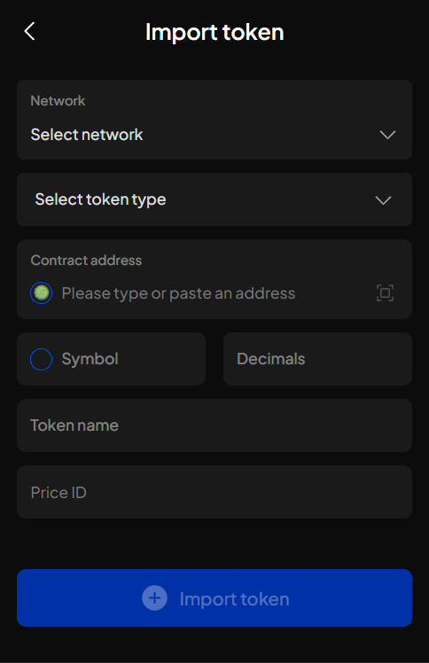
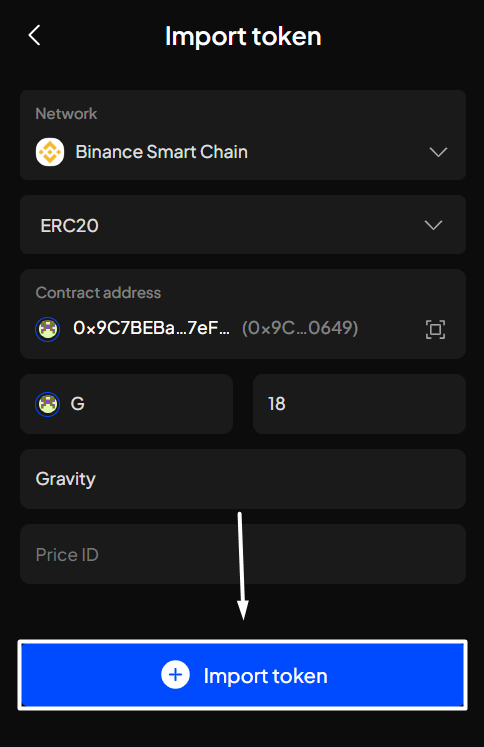
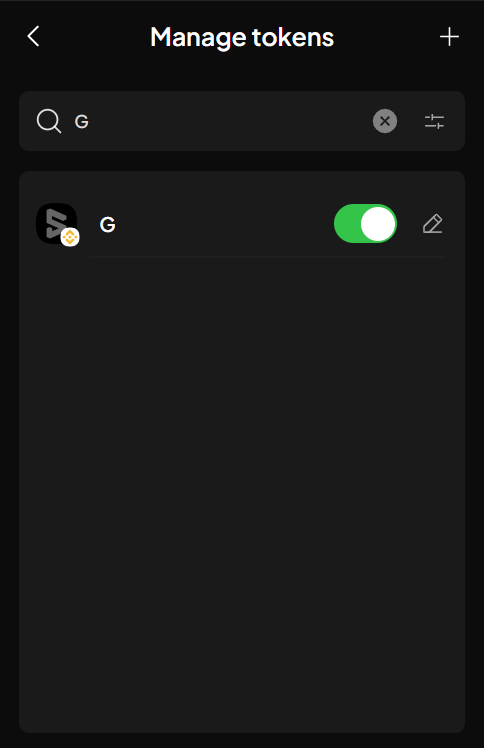
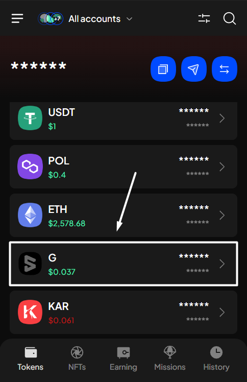

# Import & manage customized tokens

### Import customized tokens

**Step 1**: Open the SubWallet extension and click on the list item at the top left of the screen to get to the Settings section.

<figure><figcaption></figcaption></figure>

**Step 2**: In the Settings screen, choose "**Manage tokens**".

<figure><figcaption></figcaption></figure>

**Step 3**: In the token list, click the "**+**" icon at the top right of the screen to add your customized tokens.

<figure><figcaption></figcaption></figure>

**Step 4**: Enter the required information.&#x20;

<figure><figcaption></figcaption></figure>

Here is the completed input screen for importing a token. Once done, click "**Import token**".

<figure><figcaption></figcaption></figure>

**Step 5**: You can find the token in the search bar after successfully importing it.

<figure><figcaption></figcaption></figure>

### Manage your custom tokens

**Step 1**: Open the SubWallet extension and click on the list item at the top left of the screen to get to the Settings section.

<figure><figcaption></figcaption></figure>

**Step 2**: In the Settings screen, choose "**Manage tokens**".

<figure><figcaption></figcaption></figure>

**Step 3**: In the token list, search for your customized token. Once found, click the pencil icon on the right-hand side of the token.


You can also click on the fader icon in the search bar, then select "**Custom tokens**" to filter the customized tokens from the initial list.


<figure><figcaption></figcaption></figure>

At this point, you can either edit the token's information or remove it. Choose the appropriate tab to suit your needs.




Once a token is imported onto SubWallet, you can only edit the token's price information.



SubWallet uses **Coingecko API** to retrieve token prices accurately. This API provides the most comprehensive and reliable crypto market data using RESTful JSON endpoints.

You can read more information about Coingecko API via [this article](https://docs.coingecko.com/reference/introduction).


**Step 4**: In the Token details screen, scroll down to see the "**Price ID**" field. Paste the API ID of your tokens (taken from Coingecko) and click "**Save**".

<figure><figcaption></figcaption></figure> <figure><figcaption></figcaption></figure>

**Step 5**: Once done, return to the homepage and scroll down the list to see your customized token and its price.

<figure><figcaption></figcaption></figure>






