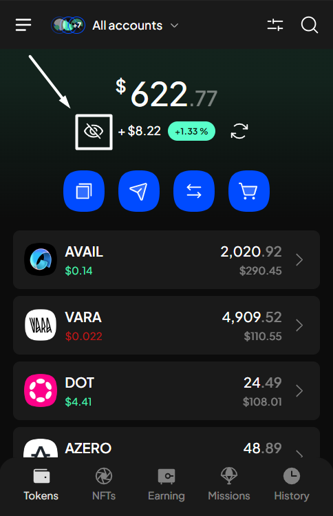

# Show/Hide balances


SubWallet will hide your balances by default when you first use the extension.&#x20;


You can choose to either unveil your balances to get a clear view of your assets or keep them private from prying eyes, safeguarding your funds from public exposure.

### To show your balances

**Step 1**: Open the SubWallet extension and click the eye symbol to unveil your balance.

<figure><figcaption></figcaption></figure>

**Step 2**: Your balances will be displayed once you click.

<figure><figcaption></figcaption></figure>

### To hide your balances

**Step 1**: Open the OpenBit extension and click the hide icon.

<figure><figcaption></figcaption></figure>

**Step 2**: All information regarding your balances will be hidden once you click.

<figure><figcaption></figcaption></figure>


While hidden, you can still view your balances individually by clicking on the token you want to unveil.


