# Connect dApps & manage website access

With SubWallet, you can seamlessly connect to virtually any dApp within the Ethereum and Polkadot ecosystems.&#x20;


Support for TON dApps/websites will be available soon - stay tuned :wink:



Substrate solo accounts will not be able to connect to EVM dApps/websites due to their incompatibility.

EVM solo accounts will not be able to connect to Substrate dApps/websites due to their incompatibility.


If you encounter any connection issues, don't hesitate to contact us on [Telegram](https://t.me/subwallet) or [Discord](https://discord.com/invite/EkFNgaBwpy) for assistance or get in touch with the dApp developers directly. We're here to help you make the most of your experience!

If you use multiple wallets other than SubWallet, we recommend disabling all of them while using ours to ensure the best user experience and prevent any wallet overrides.

### **Connect dApps**

**Step 1**: Launch the dApp you want to connect to and find the Connect button.&#x20;


Depending on each dApp, you will see different buttons, but they are mostly labeled "**Connect**" or "**Connect Wallet**".


_In this example, we are connecting to Uniswap. The "**Connect**" button will be at the top right of the screen._

<figure>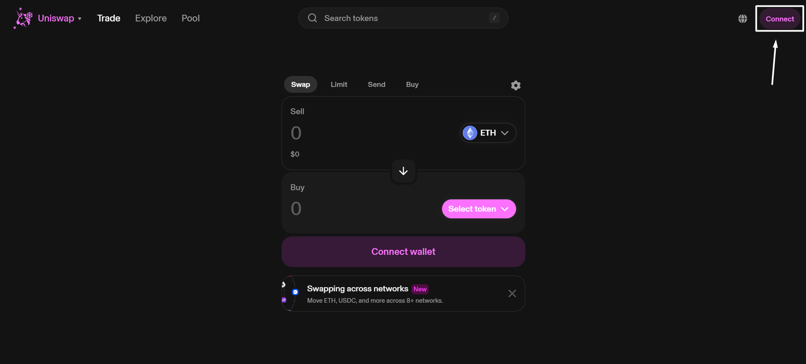<figcaption></figcaption></figure>

**Step 2**: After clicking the button, you will see various wallet connect options. Choose "**SubWallet**".

<figure>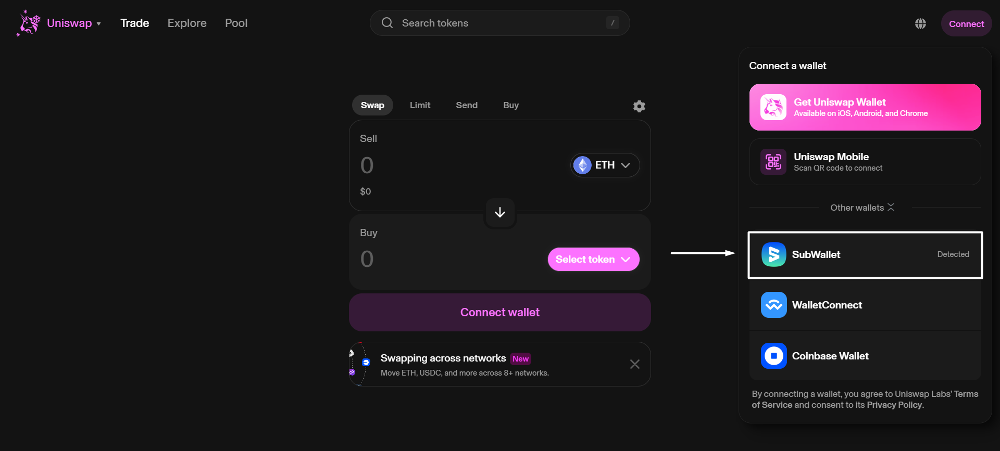<figcaption></figcaption></figure>

**Step 3**: A popup will appear. Choose the account(s) you want to connect to and click the "**Connect**" button.

<figure>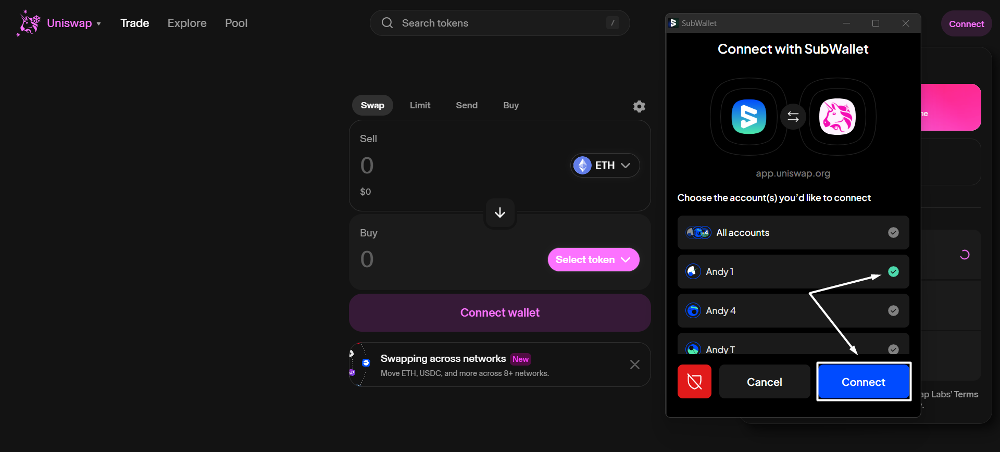<figcaption></figcaption></figure>


Some dApps may require verifying your account ownership before you connect to them.&#x20;

In such instances, another popup will appear. Choose the "**Approve**" option to complete the process.



**Step 4**: You have successfully connected your account(s) to a dApp! You can check the connection status directly on the wallet by hovering your mouse over the connecting symbol next to the account name.

<figure>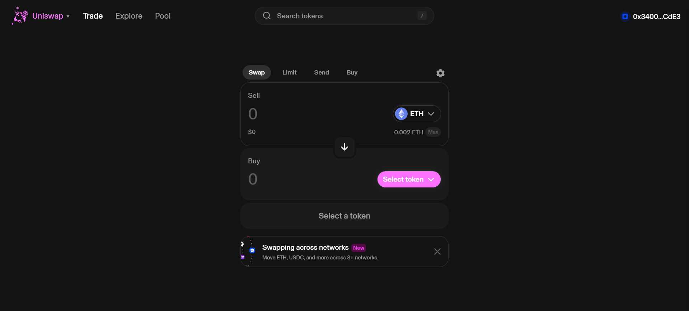<figcaption></figcaption></figure>

<figure>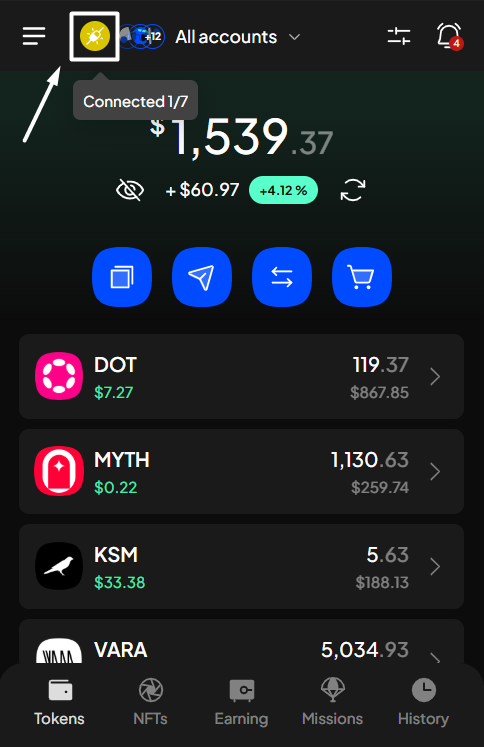<figcaption></figcaption></figure> <figure>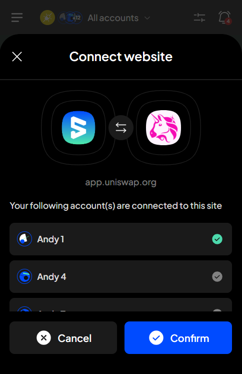<figcaption></figcaption></figure>

### Manage websites access

After successfully connecting to dApps, you can manage the connected dApps/websites from the wallet by following these steps:

**Step 1**: Open the SubWallet extension and click on the list item at the top left corner of the screen to get to the Settings section.

<figure>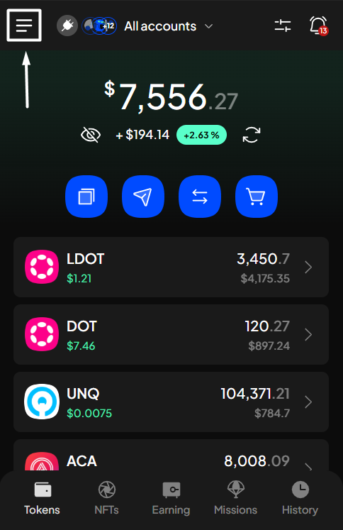<figcaption></figcaption></figure>

**Step 2**: In the Settings screen, select "**Manage website access**".

<figure>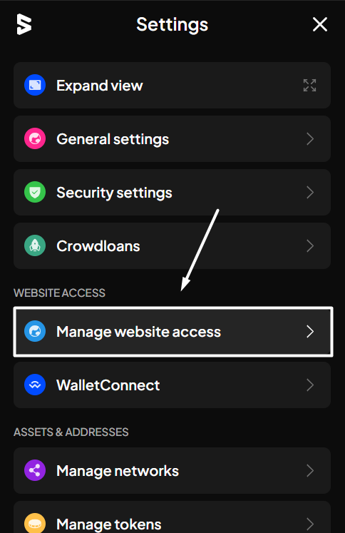<figcaption></figcaption></figure>

**Step 3**: You will see a list of websites connected to SubWallet and the corresponding number of accounts connecting.&#x20;

<figure>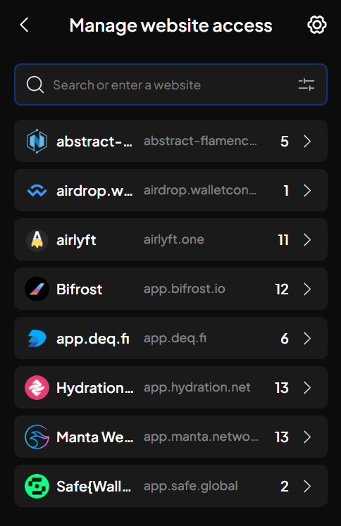<figcaption></figcaption></figure>

Click on the website/dApp you want to manage access.

_In this case, we've previously connected to Uniswap via 1 account (Andy 1). You could manually enable/disable access to this website by switching the toggle corresponding to each account._&#x20;

<figure>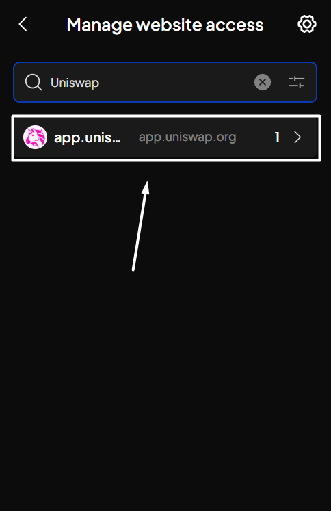<figcaption></figcaption></figure> <figure>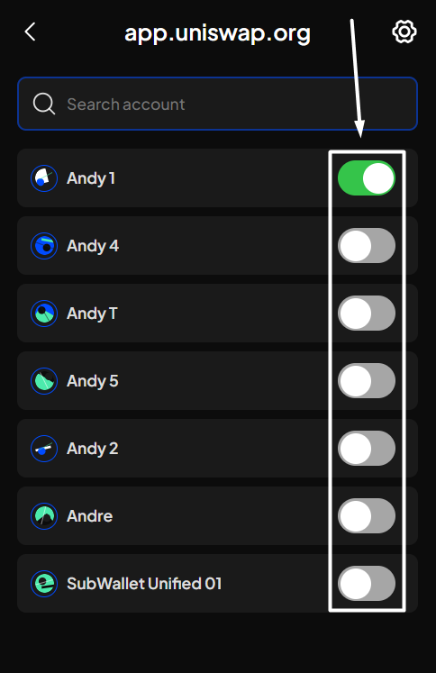<figcaption></figcaption></figure>


Additionally, if you click on the  icon at the top right corner of the screen, you will see other options to manage website access, such as:

* _Block this site_: when clicked, the dApp/website will be blocked and can't be connected again unless you decide to unblock it.
* _Forget this site_: when clicked, the dApp/website will be excluded from the website list, but you can re-connect the site again by following the procedure displayed on  [#connect-dapps](./#connect-dapps "mention")
* _Disconnect all accounts_: this action, when clicked, will disconnect every account you've connected. To reconnect, switch the toggle next to the account name.
* _Connect all accounts_: this action, when clicked, will connect all eligible accounts.

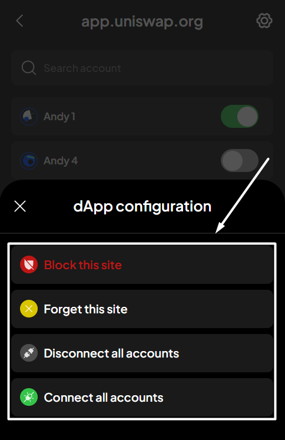

