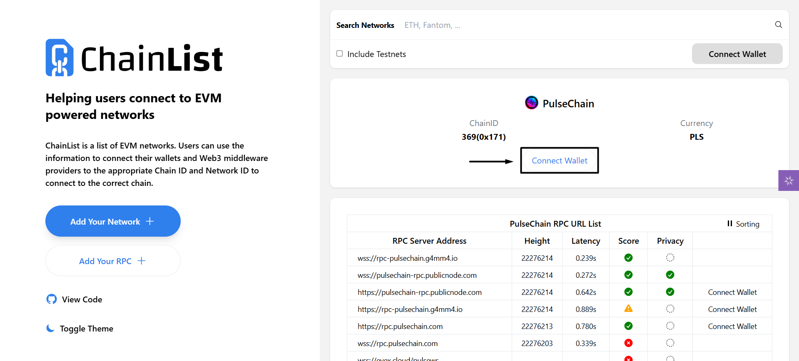
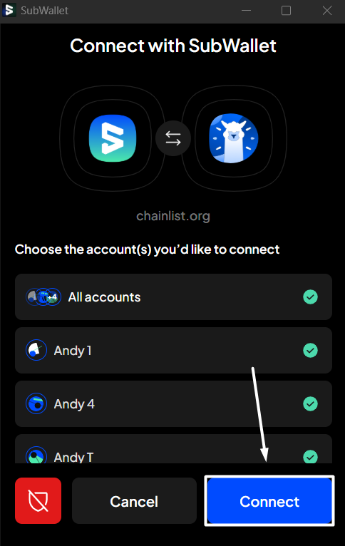
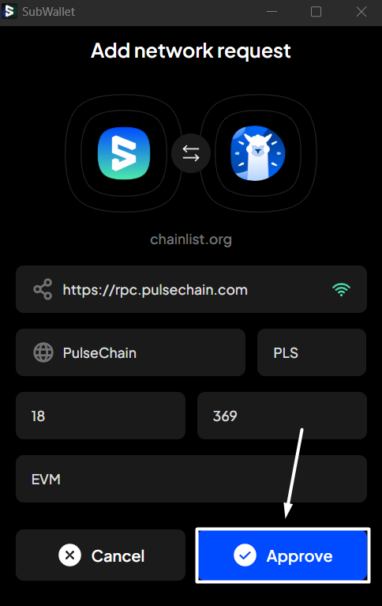
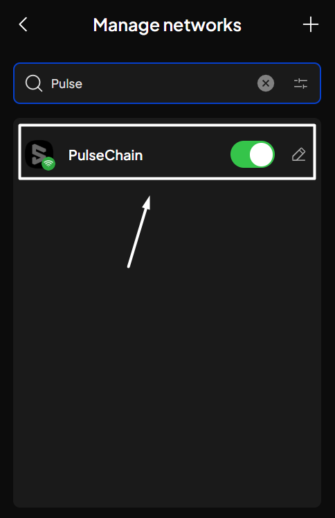

# Add new networks unavailable in pre-defined list from dApp


Currently, SubWallet supports adding new EVM & Substrate networks.


**Step 1:** Open the dApp you want to use, and then click on "Connect" to link it to your wallet.

Here, we are using [ChainList](https://chainlist.org/) as an example.


As ChainList is a list of EVM networks, MetaMask will be its default wallet for connecting. Therefore, if you want to connect via SubWallet, disable the MetaMask extension first.


<figure><figcaption></figcaption></figure>

**Step 2:** Select the network you want to add and click "**Connect Wallet**".

_In this example, we want to add the PulseChain network._

<figure><figcaption></figcaption></figure>

**Step 3:** The SubWallet popup window will appear. Select the account(s) in which you want to add the network, then click "**Connect**".

<figure><figcaption></figcaption></figure> <figure><figcaption></figcaption></figure>

**Step 4**: Once you've selected the account(s), the initial popup will be closed, and another popup will appear, asking you to confirm the add network request. Check the request details, then click "**Approve**" to proceed.&#x20;

<figure><figcaption></figcaption></figure>

**Step 5**: You've successfully added a custom network from dApp! To find your newly added network, follow this [guide](../network-management/customize-your-networks/manage-custom-networks.md).

<figure><figcaption></figcaption></figure>
