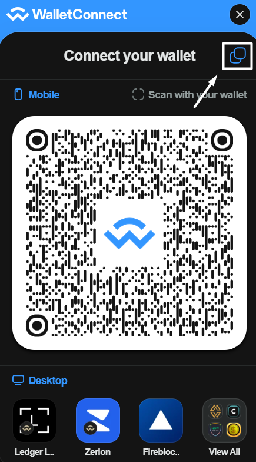
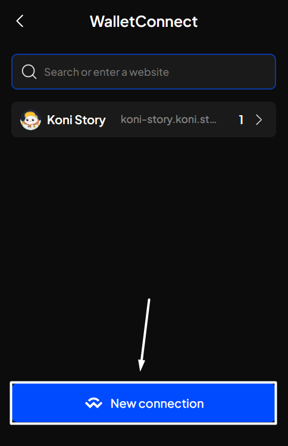

# Connect/disconnect dApp via WalletConnect


WalletConnect is a protocol that securely connects users' cryptocurrency wallets with dApps, enabling convenient and secure interaction between the two. It eliminates the need for manual entry of wallet information and enhances security in transactions and account access.


## Connect dApp with WalletConnect

**Step 1**: Launch the dApp you want to connect to and find the Connect button.&#x20;


Depending on each dApp, you will see different buttons, but they are mostly labeled "**Connect**" or "**Connect Wallet**".


_In this example, we are connecting to Uniswap. The "**Connect**" button will be at the top right of the screen._

<figure><figcaption></figcaption></figure>

**Step 2**: After clicking the button, you will see various wallet connect options. Choose "**WalletConnect**".

A WalletConnect popup will appear. Choose the way you want to connect your account(s):


Here, there will be 2 ways to connect your account(s):

* Save the QR code and use it to connect.
* Copy the URI link by clicking the Copy button at the top right of the popup and use it to connect.



**Step 3:** Open the SubWallet extension and click on the list item at the top left corner of the screen to get to the Settings section, then select "**WalletConnect**".

<figure><figcaption></figcaption></figure> <figure><figcaption></figcaption></figure>

**Step 4:** In the WalletConnect screen, click the "**New connection**" button.

<figure><figcaption></figcaption></figure>

Once clicked, choose your preferred way from Step 2 to connect your account(s), then click "**Connect**".

<figure><figcaption></figcaption></figure> <figure><figcaption></figcaption></figure>

**Step 5:** A popup will appear. Choose the account(s) you want to connect to and click "**Approve**".


Some dApps may require verifying your account ownership before you connect to them.&#x20;

In such instances, another popup will appear. Choose the "**Approve**" option to complete the process.



**Step 6**: You have successfully connected your account(s) to a dApp via WalletConnect! The WalletConnect screen in SubWallet will display as follows:

<figure><figcaption></figcaption></figure>

## Disconnect dApp with WalletConnect

**Step 1:** Open the SubWallet extension and click on the list item at the top left corner of the screen to get to the Settings section, then select "**WalletConnect**".

<figure><figcaption></figcaption></figure> <figure><figcaption></figcaption></figure>

**Step 2:** You will see a list of websites connected to SubWallet and the corresponding number of accounts connecting.&#x20;

<figure><figcaption></figcaption></figure>

Select the dApp you want to disconnect, then click "**Disconnect**".

<figure><figcaption></figcaption></figure> <figure><figcaption></figcaption></figure>

Step 3: A popup will appear, asking you to confirm the action. Click "**Disconnect**" to complete the process.

<figure><figcaption></figcaption></figure>

**Step 4**: You have successfully disconnected your account(s) via WalletConnect! The WalletConnect screen will no longer display the dApp you previously connected to:

<figure><figcaption></figcaption></figure>
