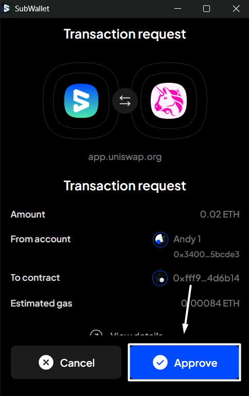
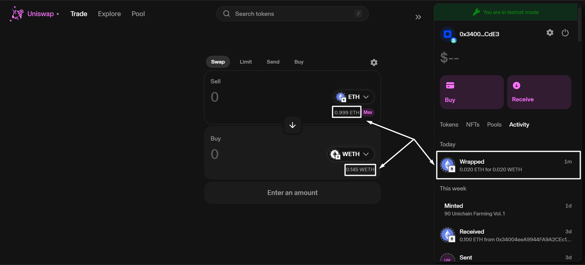

# Sign transactions from dApp


In this instruction, we will sign transactions on Uniswap. This instruction can also be applied to any other Substrate and EVM dApp/website.

The user interface (UI) and buttons you encounter will vary based on the specific designs of each dApp/website.


**Step 1:** Open the dApp and connect your account(s) to it from either one of these options:&#x20;

* Connect by selecting [the SubWallet option](https://app.gitbook.com/o/CyPU0v2iA12ILmupTKub/s/x2bpnbQM0WCkMm0eOyd6/)
* Connect by selecting [the WalletConnect option](https://app.gitbook.com/o/CyPU0v2iA12ILmupTKub/s/-Lh39Kwxa1xxZM9WX_Bs/~/changes/702/extension-user-guide/connect-dapps-and-manage-website-access/connect-disconnect-dapp-via-walletconnect#connect-dapp-with-walletconnect)

_Once you've connected your account(s) to Uniswap, it will display as follows:_

<figure><figcaption></figcaption></figure>

**Step 2:** Fill in the necessary information for the transaction.&#x20;

_In this example, we will swap ETH for WETH on the Ethereum Sepolia network. This transaction is also referred to as wrapping ETH. Once completed, click "**Wrap**"._

<figure><figcaption></figcaption></figure>

**Step 3**: The SubWallet popup window will appear. Check the transaction details, then click "**Approve**" to proceed.&#x20;

<figure><figcaption></figcaption></figure>

**Step 4**: You've successfully signed a transaction on a dApp! If the transaction is successful, you'll see the fluctuation in the balance of each token.

<figure><figcaption></figcaption></figure>
