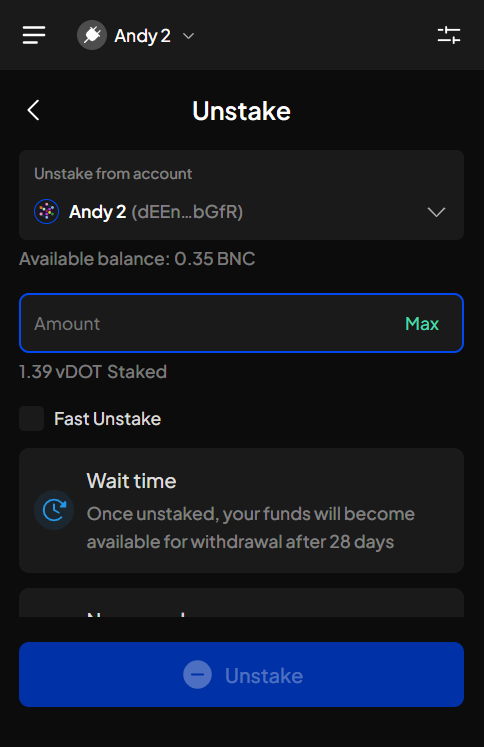

# Unstake & redeem funds

### Unstaking process & its characteristics

With liquid staking, once you have successfully unstaked your minted token, your redeemed funds will be in the unstaking queue. This means the funds will only arrive in your account once it's your turn.

Depending on the market conditions (particularly the liquidity), your turn can come sooner or later than expected, but it won't exceed the maximum unstaking period (28 days for DOT, 7 days for MANTA).&#x20;

You can speed up the process by choosing to unstake immediately (i.e., "lightning mode" on the Bifrost app or "Fast unstake" in SubWallet). Although this option is much faster (as you won't have to wait for the unstaking period), the funds you redeem will be less than the normal unstake option, as you have to pay a more significant fee to get your funds ahead of others in the unstaking queue.

### Unstake & redeem your funds

**Step 1**: Open the SubWallet extension and choose the "**Earning**" tab at the bottom of the screen. In the Your earning positions screen, select the funds you want to unstake.

<figure><figcaption></figcaption></figure> <figure><figcaption></figcaption></figure>

**Step 2**: Click "**Unstake**" to start the unstaking process.

<figure><figcaption></figcaption></figure>

**Step 3:** Enter the amount you want to unstake, then click "**Unstake**" to proceed.


If you wish to unstake a portion of your minted tokens, ensure the remaining amount you continue to stake is higher than the minimum required active stake; otherwise, you won't be able to perform the action.


<figure><figcaption></figcaption></figure> <figure><figcaption></figcaption></figure>


You can fasten up the unstaking process by ticking the "**Fast Unstake**" field. Once the transaction is made, you can redeem your funds immediately.




If you are in "**All accounts**" mode, you will need to select the account you want to unstake.



&#x20;**Step 4**: Check the information and confirm your request by clicking "**Approve**".

<figure><figcaption></figcaption></figure>


With "**Fast Unstake**" you'll see a field labeled "**Minimum receivables**" on the confirmation screen. In situations where liquidity is low, you might receive a low redemption quote. SubWallet safeguards you by enforcing a minimum receivables threshold. The transaction will not be processed if the amount you are trying to redeem is lower than this threshold.



**Step 5:** Your request has been submitted!

<figure><figcaption></figcaption></figure>

You can either click "**Back to home**" to return to the homepage or "**View transaction**" to see transaction details in the History tab.
