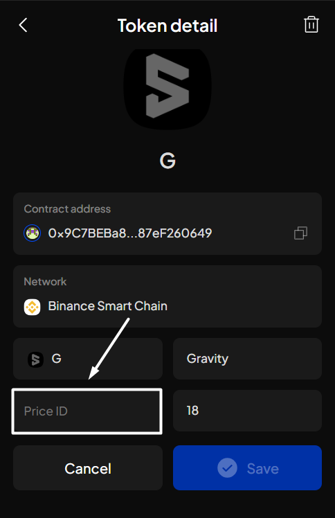
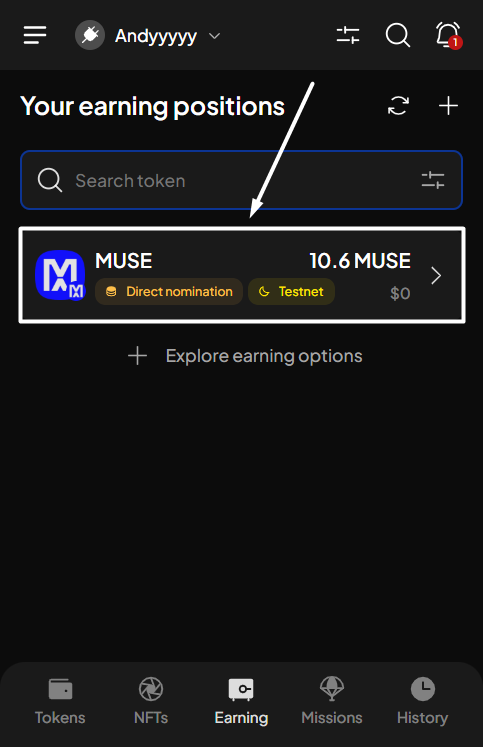
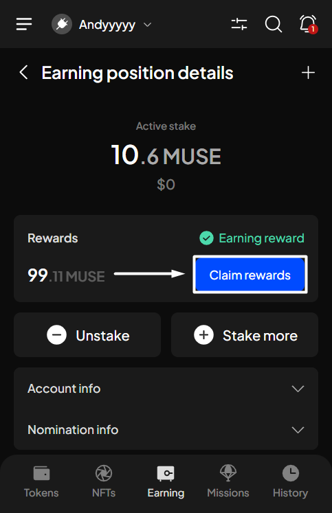
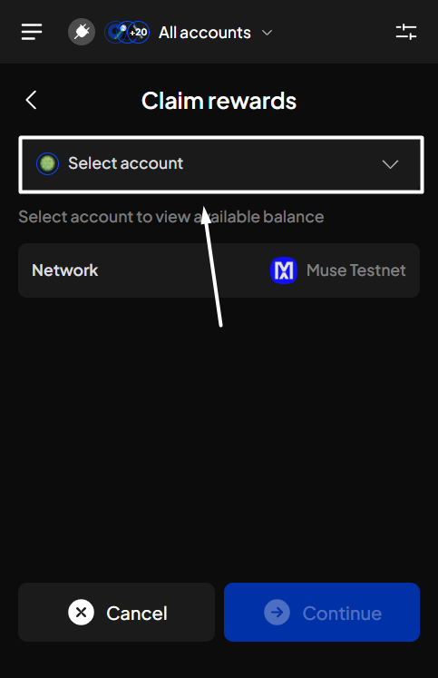
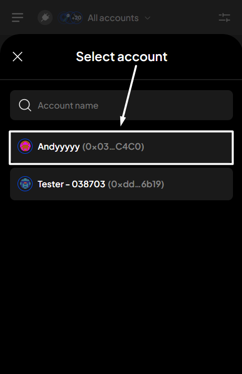

# Claim staking rewards

### Supported tokens for claiming

This action is only available for these 2 tokens:

* MYTH (Mythos)
* MUSE (Muse Testnet)


Unlike earning via Nomination pool, your rewards will automatically be sent to your transferable balance once claimed.


### Claim rewards

**Step 1**: Open the SubWallet extension and choose the "**Earning**" tab at the bottom of the screen. In the Your earning positions screen, select the funds for which you want to claim rewards.

_In this case, we will be claiming rewards from staking MUSE on Muse Testnet - the testnet network of Mythos._

<figure><figcaption></figcaption></figure> <figure><figcaption></figcaption></figure>

**Step 2**: Select "**Claim rewards**" to start the claiming process.

<figure><figcaption></figcaption></figure>

**Step 3:** Click "**Continue**" to proceed.

<figure><figcaption></figcaption></figure>


If you are in "All accounts" mode, you will need to select the account for which you want to claim rewards.



**Step 4**: Check the information and confirm your request by clicking "**Approve**".&#x20;

<figure><figcaption></figcaption></figure>

**Step 5:** Your request has been submitted!

<figure><figcaption></figcaption></figure>

You can either click "**Back to home**" to return to the homepage or "**View transaction**" to see transaction details in the History tab.


If you click "**View transaction**", SubWallet will show you the latest transaction record in your transaction history along with the extrinsic hash of the transfer.&#x20;


