# Start staking

**Step 1**: Open the SubWallet extension and choose the "**Earning**" tab at the bottom of the screen.&#x20;

<figure><figcaption></figcaption></figure>

**Step 2**: In the Earning options screen, choose the token you want to stake by searching the list or typing the token name on the search bar.

_In this example, we want to stake DEV tokens._

<figure><figcaption></figcaption></figure> <figure><figcaption></figcaption></figure>


If you have previously staked funds on the account, after choosing the "**Earning**" tab, you will be directed to the Your earning positions screen. From there, click the "**+**" icon at the upper right corner to get to the Earning options screen.

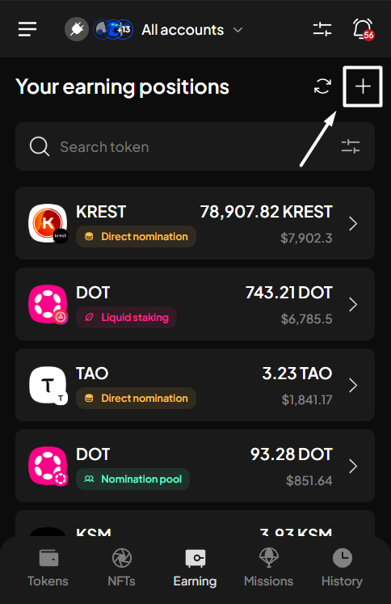


**Step 3**: A pop-up will appear. Read carefully, scroll down, then choose "**Stake to earn**" to proceed.

<figure>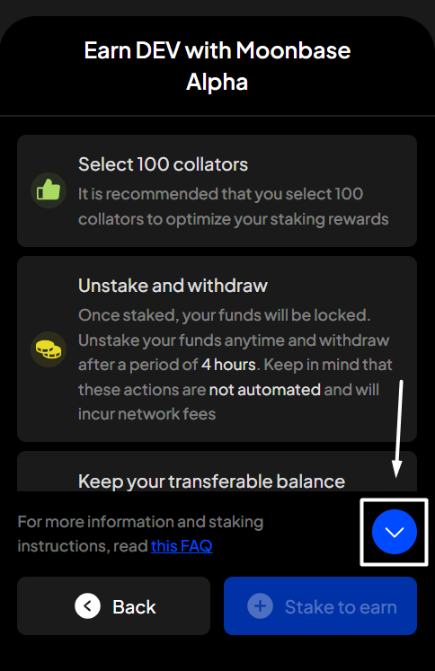<figcaption></figcaption></figure> <figure>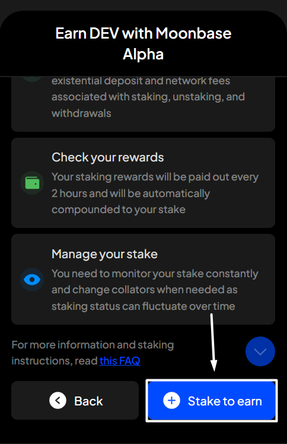<figcaption></figcaption></figure>

You will be directed to the following Start earning screen.


Make sure you have more than the minimum amount required for staking in your transferable balance to start staking and earning.


**Step 4**: Enter the required earning information.

<figure>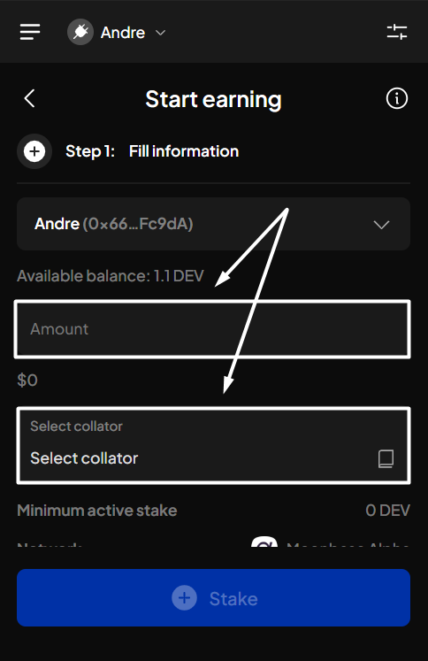<figcaption></figcaption></figure>


We suggest you pay close attention to the collator you are choosing. When selecting a collator, SubWallet supports you with the latest record of collator details.&#x20;

Click the three-dot icon on each collator's right side to see the details.

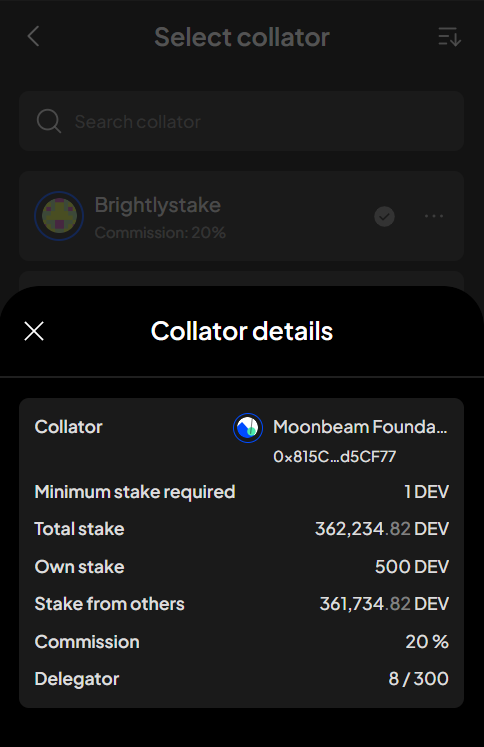



You can use the **Sort** function to find the most suitable collator that fits your needs. Please click the  icon at the top right corner and choose your sorting criteria.

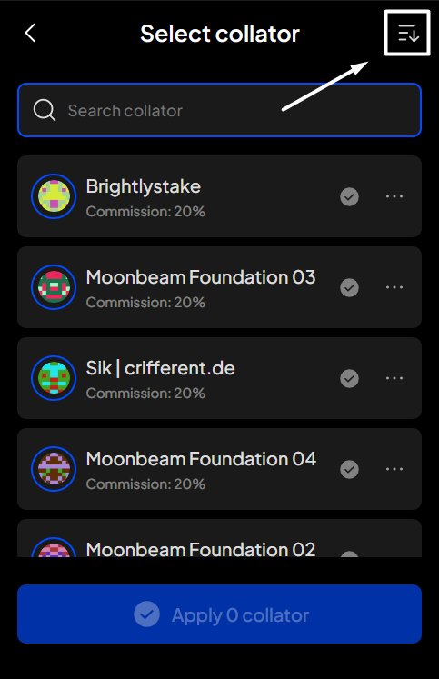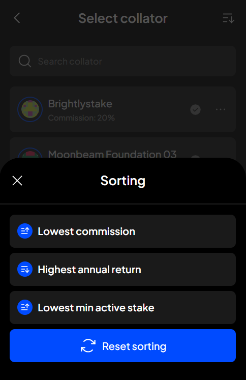


A completed earning request will look like the following picture. Click "**Stake**" to proceed.

<figure>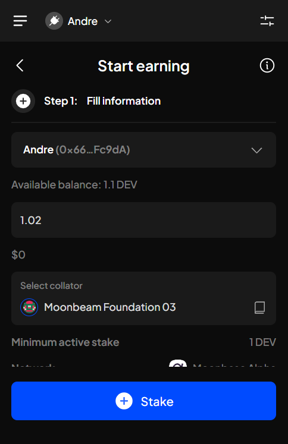<figcaption></figcaption></figure> <figure><figcaption></figcaption></figure>


If you are in the "**All accounts**" mode, in addition to the above information, you will also need to select the staking account.

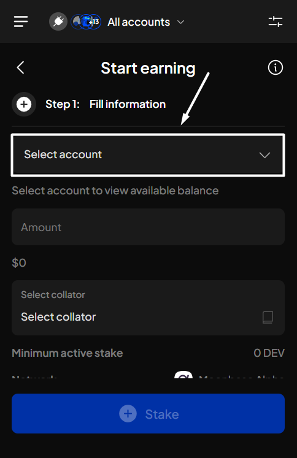



Make sure you leave enough tokens to pay gas fees for rewards claims, unstaking, or withdrawal.


**Step 5**: Check the information and confirm your staking request by clicking "**Approve**".&#x20;

<figure>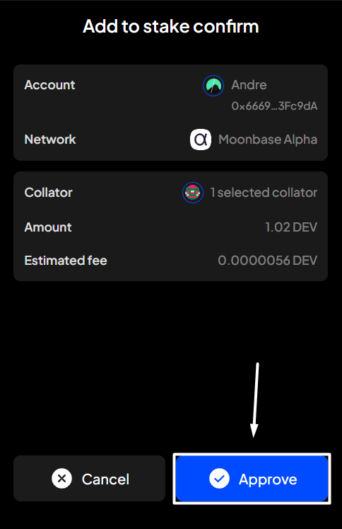<figcaption></figcaption></figure>

**Step 6:** Your staking request has been submitted!

<figure><figcaption></figcaption></figure>

You can either click "**Back to home**" to return to the homepage or "**View transaction**" to see transaction details in the History tab.


If you click "**View transaction**", SubWallet will show you the latest transaction record in your transaction history along with the extrinsic hash of the transfer.



To check the status of your staked funds, after selecting "**Back to home**", click the Earning tab as per **Step 1**. In the Your earning positions screen, scroll down, then click on your newly staked funds.

<figure><figcaption></figcaption></figure> <figure>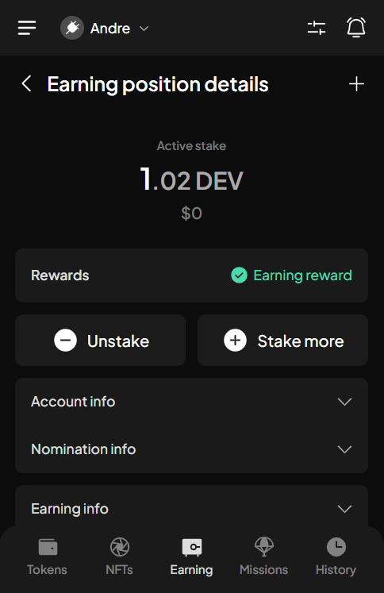<figcaption></figcaption></figure>

