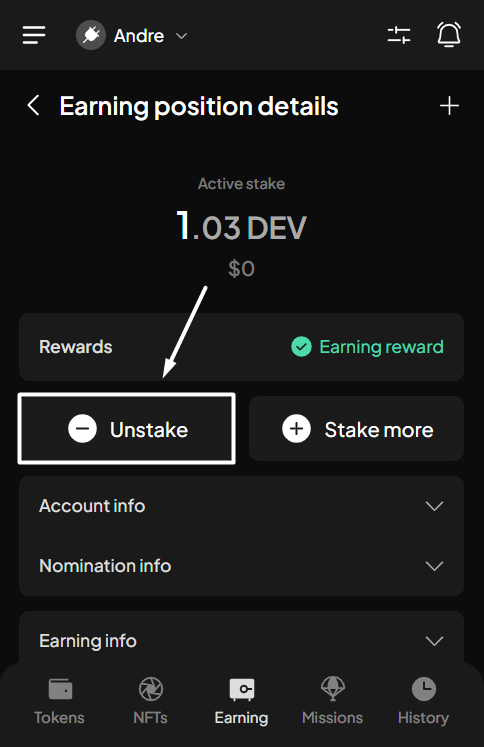
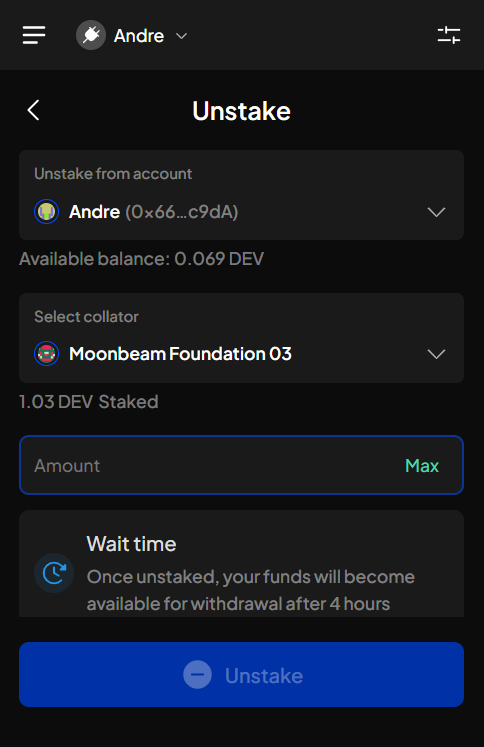
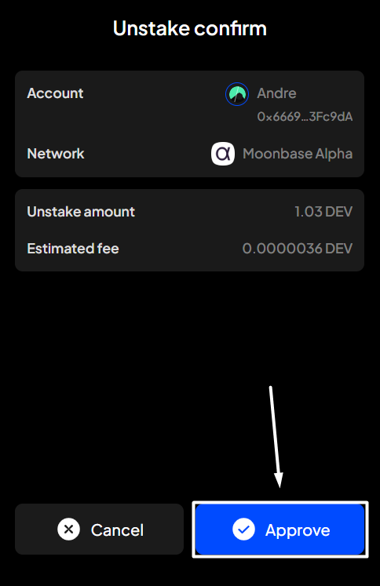

# Unstake

**Step 1**: Open the SubWallet extension and choose the "**Earning**" tab at the bottom of the screen. In the Your earning positions screen, select the funds you want to unstake.

<figure><figcaption></figcaption></figure> <figure><figcaption></figcaption></figure>

**Step 2**: Click "**Unstake**" to start the unstaking process.

<figure><figcaption></figcaption></figure>

**Step 3:** Enter the amount you want to unstake, then click "**Unstake**" to proceed.


If you wish to unstake a portion of your staked funds, ensure the remaining amount you continue to stake is higher than the minimum required active stake; otherwise, you won't be able to perform the action.


<figure><figcaption></figcaption></figure> <figure><figcaption></figcaption></figure>


If you are in "**All accounts**" mode, you will need to select the account for which you want to unstake.



**Step 4**: Check the information and confirm your request by clicking "**Approve**".

<figure><figcaption></figcaption></figure>

**Step 5:** Your request has been submitted!

<figure><figcaption></figcaption></figure>

You can either click "**Back to home**" to return to the homepage or "**View transaction**" to see transaction details in the History tab.


If you click "**View transaction**", SubWallet will show you the latest transaction record in your transaction history along with the extrinsic hash of the transfer.&#x20;


