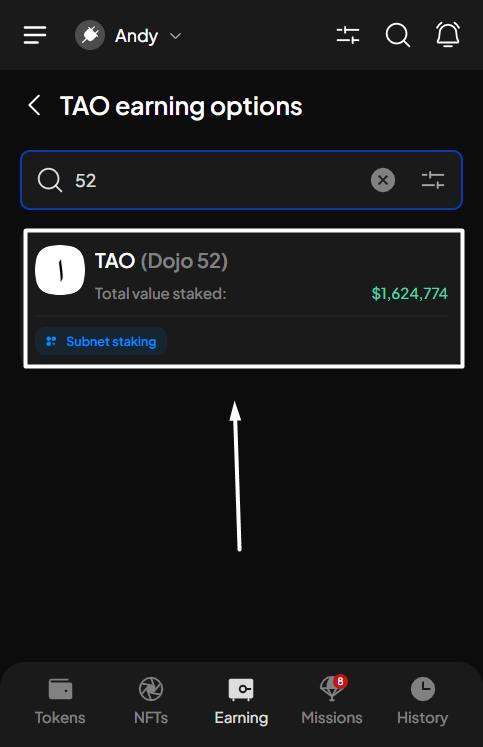

# Start staking

**Step 1**: Open the SubWallet extension and choose the "**Earning**" tab at the bottom of the screen.&#x20;

<figure><figcaption></figcaption></figure>

**Step 2**: In the Earning options screen, choose TAO in the earning option list.

<figure><figcaption></figcaption></figure> <figure><figcaption></figcaption></figure>


If you have previously staked funds on the account, after choosing the "**Earning**" tab, you will be directed to the Your earning positions screen. From there, click the "**+**" icon at the upper right corner to get to the Earning options screen.



**Step 3**: In the TAO earning options screen, choose the subnet you want to stake by searching the list or typing the subnet name on the search bar.

<figure><figcaption></figcaption></figure> <figure><figcaption></figcaption></figure>

A pop-up will appear. Read carefully, scroll down, then choose "**Stake to earn**" to proceed.

<figure><figcaption></figcaption></figure> <figure><figcaption></figcaption></figure>

You will be directed to the following Start earning screen.


Make sure you have more than the minimum amount required for staking in your transferable balance to start staking and earning.


**Step 4**: Enter the required earning information.

<figure><figcaption></figcaption></figure>


If you are in the "**All accounts**" mode, in addition to the above information, you will also need to select the staking account.



Tips on selecting a validator in a subnet

We suggest you pay close attention to the validator you are choosing. When selecting a validator, SubWallet supports you with the latest record of validator details.&#x20;

Click the three-dot icon on each validator's right side to see the details.

Sort validators from the list

You can use the **Sort** function to find the most suitable validator that fits your needs. Please click the  icon at the top right corner and choose your sorting criteria.

If you're unable to stake due to exceeding maximum slippage tolerance

When staking on any subnet (alpha), there is an inherent loss of value during the transaction called **slippage**. SubWallet will calculate this number once you enter the stake amount and validator.


The maximum slippage tolerance SubWallet set for any staking action is 0.5%.&#x20;



If the slippage calculated by SubWallet for your transaction exceeds 0.5%, you will not be able to proceed with your stake. In this case, you will need to adjust your slippage tolerance to a higher percentage than what we calculated to proceed.



A completed earning request will look like the following picture. Click "**Stake**" to proceed.

<figure><figcaption></figcaption></figure> <figure><figcaption></figcaption></figure>

**Step 5**: Check the information and confirm your staking request by clicking "**Approve**".&#x20;

<figure><figcaption></figcaption></figure>


A staking fee of 0.00005 TAO will be deducted from your stake once the transaction is complete.&#x20;

_For example, if you enter 1 TAO in the Amount field, after the transaction is complete, your staked amount will be 1 - 0.00005, which equals 0.99995 TAO._

.png>)


**Step 6:** Your staking request has been submitted!

<figure><figcaption></figcaption></figure>

You can either click "**Back to home**" to return to the homepage or "**View transaction**" to see transaction details in the History tab.

To check the status of your staked funds, after selecting "**Back to home**", click the Earning tab as per **Step 1**. In the Your earning positions screen, scroll down, then click on your newly staked funds.

<figure><figcaption></figcaption></figure> <figure><figcaption></figcaption></figure>

