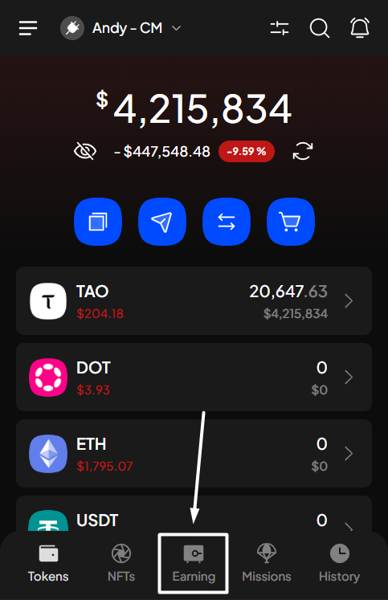

# Unstake & redeem TAO

**Step 1**: Open the SubWallet extension and choose the "**Earning**" tab at the bottom of the screen. In the Your earning positions screen, select the subnet from which you want to unstake your funds.

<figure><figcaption></figcaption></figure> <figure><figcaption></figcaption></figure>

**Step 2**: Click "**Unstake**" to start the unstaking process.

<figure><figcaption></figcaption></figure>

**Step 3**: Enter the amount and the validator you want to unstake. Once done, click "**Unstake**".

<figure><figcaption></figcaption></figure> <figure><figcaption></figcaption></figure>


Like staking, there will be an inherent loss of value during the unstaking action (also known as **slippage**).


**Step 4**: Check the information and confirm your request by clicking "**Approve**".&#x20;

<figure><figcaption></figcaption></figure>


An unstaking fee of 0.00005 TAO will be deducted from your stake once the transaction is complete.&#x20;

_For example, if you unstake 1 TAO, after the transaction is complete, you will redeem 1 - 0.00005, which equals 0.99995 TAO._

.png>)


**Step 5:** Your request has been submitted!

<figure><figcaption></figcaption></figure>

You can either click "**Back to home**" to return to the homepage or "**View transaction**" to see transaction details in the History tab.
