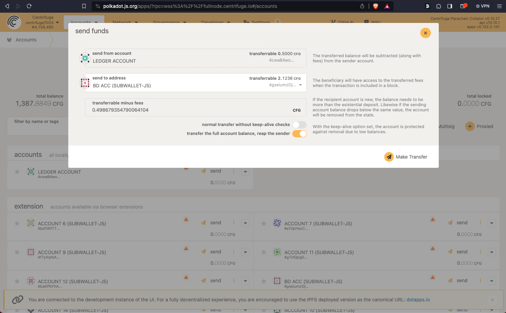

# FAQs

## Why does SubWallet show nothing when I use the extension on Brave?

If the extension keeps on loading and does not show balances on all networks like this, try the following steps.

**Step 1**: Go to [brave://flags/](brave://flags/) and type "websockets" on the Search bar. In the drop-down menu, select **Disabled**.&#x20;

 

**Step 2**: Brave will ask you to relaunch the browser so that the change can take effect. Click **Relaunch** and open SubWallet extension again. Your balances should all show up now.

 

## Why do some of my nodes keep on showing nothing?

This might result from a broken link to the nodes. Follow these steps:&#x20;

**Step 1**: Reload the network using the **Reload** icon next to the network's account. If the network continues to load, move on to step 2.

.png>) 

**Step 2:** Click on the **Edit** icon to edit the network endpoints. Under Provider URL, click on the drop-down menu and choose a different link. Hit **Save**, then hit **Done**.

 

## I want to log off my wallet when I’m not at my computer. Can I do this with SubWallet?

For now, SubWallet extension doesn't have the lock feature, so you can not lock/log off your wallet.

To keep the security of your assets, the wallet requires password everytime you submit a transaction, so no one will be able to transfer your assets without a password.

Our developers are working on the master password and locking mechanism.

## Where can I get my account address?

Your account address should be visible under your account name. If you cannot see the address, it is likely that you are in the All Accounts mode. Since an address must go with a specific account, you would need to choose the exact account you want to get the address for.

To choose an account, click on the round item on the upper right corner of the wallet, scroll and choose the specific account you want, and the address would be visible.&#x20;

.jpg>)

## I cannot see my assets. What’s the problem?

Make sure to activate the network you have assets on.

In case you have your network activated but still cannot see the asset, you might want to restart the wallet or check again later. Some networks have slow processing speed and sometimes nodes can be unstable. If you need extra support, you can always visit us on [Discord](https://discord.gg/CvVewvApry)  and [Telegram](https://t.me/subwallet).

## I imported an account from another wallet and now I cannot see my assets. What is the problem?

Please make sure that you have activated the network on which you have the assets.

In some cases, if you import account by seedphrase, problems can arise if the seedphrase of your original wallet is not compatible with SubWallet. Trust Wallet and Safepal are among the wallets not compatible with us. \
In this case, we would suggest you create a new wallet account with SubWallet and transfer your assets from your original wallet to this new account.&#x20;

To create a new wallet account with SubWallet, please follow the instruction [here](https://docs.subwallet.app/user-guide/create-an-account).&#x20;

To receive assets with SubWallet account, please follow the instruction [here](https://docs.subwallet.app/user-guide/transfer-and-receive-assets).

If you need further information, feel free to reach out to us via [Discord](https://discord.gg/CvVewvApry) and [Telegram](https://t.me/subwallet).

## How do I add my USDT/USDC to SubWallet?

You can transfer USDC/USDT to SubWallet using the Moonbeam network.

## I cannot unstake. What might be the problem?

The unstake feature can be unavailabe if you haven’t yet withdrawn the amount you have unstaked earlier. Please claim/withdraw the assets you had unstaked before and you can continue unstaking.

## Where can I withdraw my unstaked amount?

Before withdrawing your unstaked assets, please make sure that you are NOT in All Accounts mode, since this is a read-only mode. Then please follow the instruction for unstaking & withdrawing [here](manage-staking/).&#x20;

## I cannot find some of the functions I want to use / some of the functions on my screen are disabled

If some features on your homescreen such as Send funds, Receive, etc… are disabled, it is likely that you are in the All Accounts mode.&#x20;

Please click the round item on the upper right corner of your wallet, scroll to see your accounts and choose the account you want to use. Once a specific account has been chosen, the buttons would be enabled.

.jpg>)

##

## I cannot see my staking rewards

For some networks, there has not been any data indexers to track real-time information about your staking rewards. However, you can observe your balance to know whether or not your staking is paying off. A slight increase in your total balance would be a sign of staking rewards.

## Would my staking reward be restaked automatically?

If you stake on a parachain, your staking reward would NOT be restaked automatically.

If you stake on a relaychain or solochain, then your staking reward would be restaked automatically.

If you stake your assets via a nomination pool, your staking reward would NOT be restaked automatically.&#x20;

## Problems connecting with Astar portal

Due to some problems with Astar portal, you might have to refresh the webpage, or if you have connected Astar with SubWallet before, forget site in SubWallet before you can access Astar.

## My transaction was successful but cannot see it in the transaction tab

We are still working on the transaction history feature and the wallet might not display all transactions. If this problem is applicable to you, please reach out to us via [Discord](https://discord.gg/CvVewvApry) and [Telegram](https://t.me/subwallet).&#x20;

## I cannot see my NFTs

Please make sure that you have manually imported your NFTs into SubWallet.

 

In case you have imported your NFTs into SubWallet, it might take some loading time for the wallet to display them. Please wait for a while and check again later.&#x20;

## I cannot see my crowdloans in SubWallet

At the moment, if you participate in crowdloans via third parties such as [Bifrost Finance](https://bifrost.finance/) and [Parallel Finance](https://parallel.fi/), your crowdloans would not be visible in SubWallet.&#x20;

## I lost my account after a transaction

Before signing a transaction, please make sure that the remaining balance in your account after that transaction is above the existential deposit amount. More information on existential balance can be found [here](https://support.polkadot.network/support/solutions/articles/65000168651-what-is-the-existential-deposit-).

## The network I want to use keeps showing the loading icon.

It might be the case that the endpoint (provider) are disconnected. Please follow these steps to change provider for such network:

.png>)

## I cannot see my Astar EVM deposit in SubWallet.

Due to differences in the cryptography algorithm between SubWallet and Astar, our wallet might not display the correct information about your Astar EVM deposit. However, it does not mean that your assets are gone; you can still see them in the Astar portal. Something to remember is that funds aren't locked in wallets. They are on chains.&#x20;

Please connect your Substrate wallet account (SubWallet native account) to the Astar portal following the instruction [here](https://docs.subwallet.app/dapps-user-guide/astar-portal), and scroll down to see your EVM deposit.&#x20;

If you still want to see your Astar EVM deposit in SubWallet, we would suggest you import the corresponding EVM account of your SubWallet native account into SubWallet, using the read-only account feature.&#x20;

To get the corresponding EVM address for your SubWallet native account, please follow these steps:\

**Step 1**: Visit [SubScan](https://www.subscan.io/) and choose the Astar network.

<figure><figcaption></figcaption></figure>

<figure><figcaption></figcaption></figure>

**Step 2**: In the Astar Explorer site in SubScan, please choose Account Format Transform in Tools:

<figure><figcaption></figcaption></figure>

Then, input the SubWallet native account address into the textbox, choose H160 as your Output type, and click the Transform button.&#x20;

<figure><figcaption></figcaption></figure>

<figure><figcaption></figcaption></figure>

The result you see on the right side of the screen is your corresponding EVM address for your SubWallet native account. \

**Step 3**: Please import this address back to SubWallet using the read-only account feature.&#x20;

 .png>)

## I cannot use  dApp after connecting dApp with SubWallet extension

This issue can happen if you have multiple extension wallets with your browser. Extension wallets can cause conflict among each other.

We would suggest you disable other extension wallets and reconnect SubWallet. If that also does not work, please reach out to us via via [Discord](https://discord.gg/CvVewvApry) and [Telegram](https://t.me/subwallet).&#x20;

## What if I mistakenly transfer an unsupported network’s token into my Ledger account?


Which situation does this user guide refer to?

When a user attaches a Ledger account to any hot wallet and chooses to connect a Substrate network (aka Polkadot SDK network such as Polkadot, Kusama, etc.), all the actions users can execute are only limited to the chosen network. For example, if a user chooses to connect Polkadot network, this user can only see the balance of DOT and make transactions on the Polkadot network.\
\
For some reason, users can mistakenly send different tokens to the chosen Substrate network. To illustrate, when a user sends his/her CFG tokens to his/her Ledger account on Polkadot network, these tokens can not be displayed and as a result, they can not be used for any kind of transactions, either. (Including token transfer, staking, etc)\
\
In this FAQ, we will demonstrate the case where CFG is mistakenly transferred to a Ledger account currently on Polkadot and How you can withdraw it using Polkadot {js} app.&#x20;



Note: This method also applies to the following networks: Acala, Ajuna Network Aleph Zero, Astar, Bifrost (Polkadot), Bifrost (Kusama), Centrifuge, Composable Finance, Darwinia2, Dock, Edgeware, Equilibrium, Genshiro, HydraDX, Interlay, Karura, Khala, Kusama, Nodle, OriginTrail, Parallel, Pendulum, Phala, Picasso, Polkadex, Polkadot, Polymesh Mainnet, QUARTZ by UNIQUE, AssetHub (Polkadot), AssetHub (Kusama), Ternoa, Unique Network, Zeitgeist, and SORA.


**Step 1: Log into Polkadot.js UI**

Log into \[[https://polkadot.js.org/app](https://polkadot.js.org/app)] and choose the network that the Ledger account is on. In this example, we choose Polkadot.


We highly recommend the user use the anonymous tab or create a new profile on the browser (which creates a new environment without any extension) to implement this process.  This is to improve your account and assets' security.&#x20;


<figure><figcaption></figcaption></figure>

**Step 2: Configure your account**

* After activating the network, choose **Settings** —> **General**, move to a_ccount options_ and set up your account according to the following information:
  * address prefix = “Default for the connected node (Polkadot Relay Chain, 0)".


Note: The information "(Polkadot Relay Chain, 0)" will change depending on the selected network.


* in-browser account creation = “Allow local in-browser account storage”.
* Manage hardware connections = “Attach Ledger via WebUSB (Chrome, recommended)".


Note: This option is only displayed when the user has set up in-browser account creation = ''Allow local in-browser account storage".&#x20;


* Click **Save** to save the configuration.

<figure><figcaption></figcaption></figure>

**Step 3: Import Ledger account**

*   After successfully configuring your account, access the _Accounts_ menu, select _Accounts_ sub-menu and click + **Account.**\

    <figure><figcaption></figcaption></figure>
*   At the _Add account_ screen — Step 1:

    * Enter your mnemonic seed (seed phrase).
    * Click _Advance creation options_ and fill in the following information:
      * keypair crypto type = “Ledger (ed25519, BIP32 derivation)”.
      * ledger app type (originated from) = Network on your Ledger account (in this example it’s Polkadot Relay Chain).
      * account type = The index on your Ledger account when you attach it to a wallet minus 1. For example, if your attached Ledger account shows Ledger Polkadot 1, select Account type 0. (See Attach Ledger account).
      * address index = “Address index 0”.
    * Tick on **I have saved my mnemonic seed safely.**

    <figure><figcaption></figcaption></figure>

    * Enter **Next** to move on to the next step.
*   At the _Add account_ screen — Step 2:

    * Enter information: name, password, password (repeat).
    * Enter **Next** to move on to the next step.

    <figure><figcaption></figcaption></figure>
* At the _Add account_ screen — Step 3:
* Review all information and click **Save** to complete account creation.
* A backup file will pop up and prompt you to download it. You can choose to download now or download later.

<figure><figcaption></figcaption></figure>

**Step 4: Change the scope of account use**

After successfully creating your account, hover to the new account:

* Select the vertical ellipsis icon to open account configuration options.
* Disable **only this network** toggle so that this account can be used on other networks.

<figure><figcaption></figcaption></figure>

**Step 5: Transfer token**

After changing the scope of account use, switch to the network that you need to send your tokens too (in this example it’s Centrifuge). Click on the network logo on the upper toolbar, choose the network, and hit **Switch**.

<figure><figcaption></figcaption></figure>

* On the _Accounts_ screen, select the newly created Ledger account in Step 3 and hit **Send** to open the _send funds_ screen.

<figure><figcaption></figcaption></figure>

* On the _send funds_ screen, enter transfer information and hit **Make transfer** to move to the _authorize transaction_ screen.

<figure><figcaption></figcaption></figure>

* On the _authorize transaction_ screen, enter your password and hit **Sign and Submit** to finish the transaction.

<figure><figcaption></figcaption></figure>


Note: After completing the transaction, users should delete the account from the Polkadot JS app. To delete the account, follow these steps:


* Step 1: On the account you want to delete, click the "Three vertical dots" button and select the "Forget this account" option.

<figure><figcaption></figcaption></figure>

* Step 2: In the confirm account removal screen, click the "Forget" button to complete the account deletion process.

<figure><figcaption></figcaption></figure>
