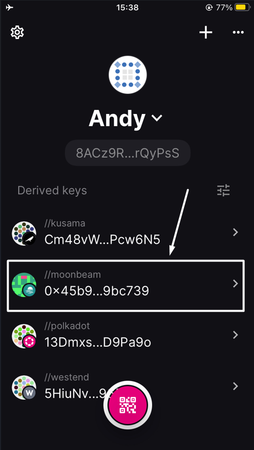
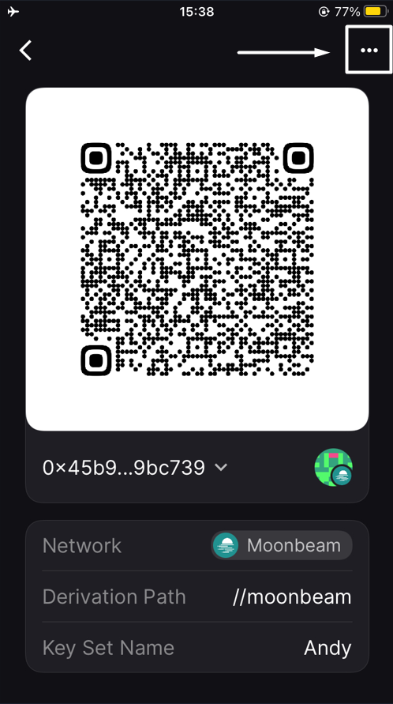
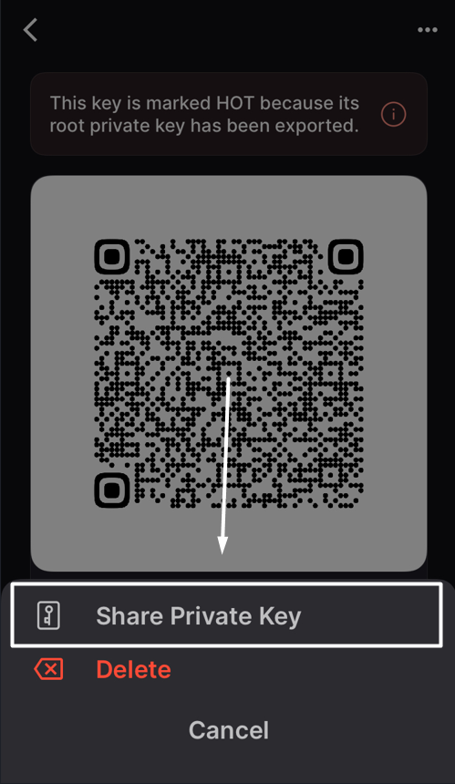
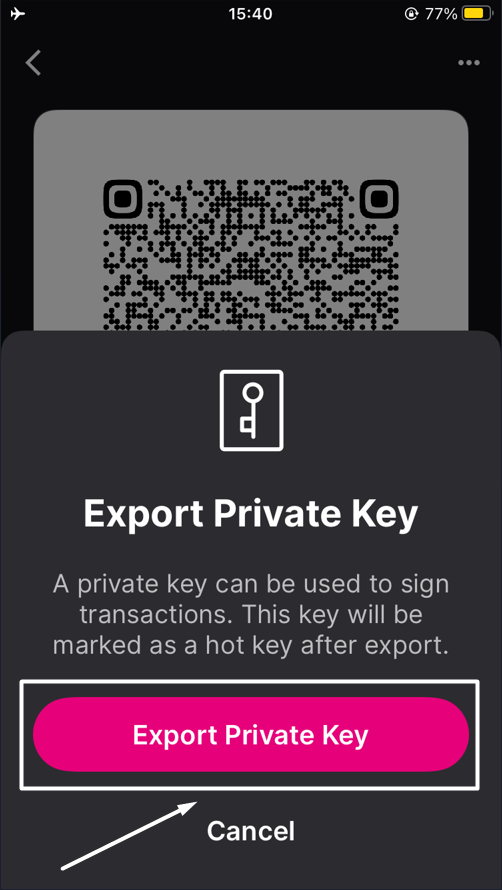
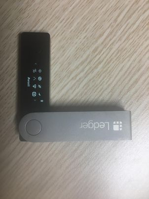

# FAQs

I want to log off my wallet when I’m not at my computer. Can I do this with SubWallet?

To keep the security of your assets while you are away, you can use the **lock function** of SubWallet. Please follow the instructions [here](getting-started/lock-and-unlock-your-wallet/).

Where can I get my account address?

Your account address should be visible under your account name. If you cannot see the address, you are likely in the "All accounts" mode. Since an address must go with a specific account, you would need to choose the exact account for which you want to get the address.

To choose an account, click on the account name to get to the account selection tab, select the specific account you want, and the address will be visible.&#x20;

.png>)

I cannot see my assets. What’s the problem?

You can change the endpoint/provider or add a new endpoint/provider by following the instructions [here](customize-endpoint-provider.md).

In case you have changed your provider but still cannot see the asset, you should restart the wallet or check again later. Some providers have slow processing speeds, and sometimes nodes can be unstable. If you need extra support, you can always visit us on [Discord](https://discord.gg/CvVewvApry) and [Telegram](https://t.me/subwallet).

I imported an account from another wallet, and I cannot see my assets. What's the problem?

Please make sure that you have activated the network on which you have the assets.

In some cases, if you import an account by seedphrase, problems can arise if the seedphrase of your original wallet is not compatible with SubWallet. Trust Wallet and Safepal are among the wallets that are not compatible with us. In this case, we suggest you create a new wallet account with SubWallet and transfer your assets from your original wallet to this new account.&#x20;

To create a new wallet account with SubWallet, please follow the instructions [here](https://docs.subwallet.app/user-guide/create-an-account).&#x20;

To receive assets with a SubWallet account, please follow the instructions [here](receive-and-transfer-assets/receive-tokens-and-nfts.md).

If you need further information, feel free to reach out to us via [Discord](https://discord.gg/CvVewvApry) and [Telegram](https://t.me/subwallet).

How do I add my USDT/USDC to SubWallet?

Before adding your USDT/USDC, you should select the correct network corresponding to your USDT/USDC in SubWallet.

With **USDT**, SubWallet currently supports a list of the networks below.

* Acala
* Astar
* Astar - EVM
* Bifrost Polkadot
* Calamari
* Parallel
* Hydration
* Interlay
* Kintsugi
* Pendulum
* Polkadot Asset Hub (Statemint)
* Moonbeam
* Kusama Asset Hub (Statemint)
* Shiden - EVM
* Equilibrium
* Binance Smart Chain
* Ethereum
* Polygon
* Arbitrum One
* Optimism
* Viction
* Hydration Rococo

With **USDC**, we support a list of the below networks.

* Calamari
* Moonbeam
* Moonriver
* Astar - EVM
* Shiden - EVM
* Binance Smart Chain
* Ethereum
* Polygon
* Arbitrum One
* Optimism
* Viction
* Polkadot Asset Hub (Statemint)
* Hydration
* Acala
* Interlay
* Centrifuge
* Ethereum Goerli
* Ethereum Sepolia

I cannot unstake. What might be the problem?

The unstake feature can be unavailable if you haven't yet withdrawn the amount you have unstaked earlier. Please claim/withdraw the assets you have unstaked before, and you can continue unstaking.

Where can I withdraw my unstaked amount?

Before withdrawing your unstaked assets, please make sure that you are **NOT** in "All accounts" mode, since this is a read-only mode. Then please follow the instructions for unstaking & withdrawing [here](manage-staking/).&#x20;

Why did I stake but not receive any rewards?

There are several reasons why you cannot see/receive staking rewards.

1. You might want to double-check the pool/validator you staked in.&#x20;

With **Nomination pool**, you will not be rewarded if your selected pool appears in "**Not earning**" status. This occurs when either you choose a pool with a Not earning status from the start or your selected pool is inactive.

An example of a "_Not earning" nomination pool_ would look like this.

With **Direct nomination**, you can go to the [Staking tab on the Subscan website](https://polkadot.subscan.io/validator) to check whether your chosen validator is active. Here, we attached a link to the Staking tab on the Polkadot network for your example.

2. Your chosen pool/validator might be slashing. If you were actively nominating that pool/validator when the slash occurred, your stake would get slashed too.
3. If you unstake your chosen pool/validator midway, the staking status will change to unbond, and you will not receive any rewards.
4. You might not see your staking rewards due to UI bugs, even if you actually received them. In this case, please contact us via [Discord](https://discord.gg/CvVewvApry) and [Telegram](https://t.me/subwallet) for support.

I cannot see my staking rewards

For some networks, there have not been any data indexers to track real-time information about your staking rewards. However, you can observe your balance to know whether or not your staking is paying off. A slight increase in your total balance would be a sign of staking rewards.&#x20;

If you stake with a validator, your staking rewards will be automatically claimed in your wallet. Below are the instructions for checking your rewards in the Rewards History tab.

My transaction was successful, but I cannot see it in the History tab

In this case, you might want to select the network corresponding to the transactions you made on that network.&#x20;

**Step 1: Check your account**&#x20;

In order to change your account, you can click on the account name to get to the account management screen.&#x20;

SubWallet supports two types of accounts: EVM and Polkadot-SDK. We choose a _Polkadot-SDK account_ for this example.

**Step 2: Check your network**

Click on the network name to get to the network selection tab.

A list of networks will appear for you to choose from. We choose the _Polkadot network_ for this example.

I cannot see my NFTs

:information\_source: While SubWallet covers many standard NFTs and Tokens, some may not be supported automatically. If yours are among these, please reach out to us on [Discord](https://discord.gg/CvVewvApry) or [Telegram](https://t.me/subwallet) for assistance.

If you don't see your NFTs and tokens, you can manually import them into SubWallet.

In case you have imported your NFTs into SubWallet, it might take some time for the wallet to display them. Please wait for a while and check again later.&#x20;

I cannot see my crowdloans in SubWallet

At the moment, if you participate in crowdloans via third parties, such as [Bifrost Finance](https://bifrost.finance/) and [Parallel Finance](https://parallel.fi/), your crowdloans will not be visible in SubWallet.

I lost my account after a transaction

Before signing a transaction, please make sure that the remaining balance in your account after that transaction is above the existential deposit amount. More information on existential balance can be found [here](https://support.polkadot.network/support/solutions/articles/65000168651-what-is-the-existential-deposit-).

I cannot use dApp after connecting dApp with SubWallet extension

This issue can happen if you have multiple extension wallets with your browser. Extension wallets can cause conflict among each other.

We suggest you disable other extension wallets and reconnect SubWallet. If that also does not work, please reach out to us via [Discord](https://discord.gg/CvVewvApry) and [Telegram](https://t.me/subwallet).&#x20;

What if I mistakenly transfer an unsupported network’s token into my Ledger account?

:information\_source: _**Which situation does this user guide refer to?**_

When a user attaches a Ledger account to any hot wallet and chooses to connect a Substrate network (aka Polkadot SDK network such as Polkadot, Kusama, etc.), all the actions users can execute are only limited to the chosen network. For example, if a user chooses to connect Polkadot network, this user can only see the balance of DOT and make transactions on the Polkadot network.\
\
For some reason, users can mistakenly send different tokens to the chosen Substrate network. To illustrate, when a user sends his/her CFG tokens to his/her Ledger account on the Polkadot network, these tokens can not be displayed, and as a result, they can not be used for any kind of transaction, either. (Including token transfer, staking, etc)\
\
In this FAQ, we will demonstrate the case where CFG is mistakenly transferred to a Ledger account currently on Polkadot and How you can withdraw it using our tool.&#x20;

:information\_source: _**Note**_: This method also applies to the following networks: Acala, Ajuna Network, Aleph Zero, Astar, Bifrost (Polkadot), Bifrost (Kusama), Centrifuge, Composable Finance, Darwinia2, Dock, Edgeware, Equilibrium, Genshiro, HydraDX, Interlay, Karura, Khala, Kusama, Nodle, OriginTrail, Parallel, Pendulum, Phala, Picasso, Polkadex, Polkadot, Polymesh Mainnet, QUARTZ by UNIQUE, AssetHub (Polkadot), AssetHub (Kusama), Ternoa, Unique Network, Zeitgeist, and SORA.

**Step 1: Download the tool from this** [**link**](https://github.com/Koniverse/Ledger-Account-Recovery-Tool/releases)

**Step 2: Turn off your internet connection**

**Step 3: Extract the folder from the downloaded zip file and open index.html**

**Step 4: Open the file in a browser**

We use _Chrome_ for this example.

**Step 5: Select the network of the Ledger account, enter the seed phrase, and account address**

**Step 6: Click Export JSON file, and create a strong password to protect the JSON file**

**Step 7: Import the JSON file into SubWallet and recover the funds by sending all tokens to another account**

You can see how to import the JSON file into SubWallet [here](account-management/import-and-restore-an-account.md).

The imported account will have the name "Ledger Recovery".

Then, you send all your tokens to another account. You can follow the instructions [here](receive-and-transfer-assets/transfer-tokens/) to transfer all your assets to another account.

That's how you can recover the tokens you mistakenly transferred to an unsupported network in your Ledger account. Should any issues arise, please reach out to us via [Discord](https://discord.gg/CvVewvApry) and [Telegram](https://t.me/subwallet).&#x20;

I see the "Connection unsuccessful" pop-up when connecting to dApp via WalletConnect.

In this case, please try re-connecting WalletConnect again using 1 of the 2 options below:

#### **Option 1: Get the latest connection on WalletConnect and re-connect**

**Step 1**: Open the dApp you want to connect and choose “**WalletConnect**”.

_Here, we are using Galxe as an example._

**Step 2**: Get the latest connection from the WalletConnect pop-up by selecting your preferred way to connect.

:information\_source: Here, there will be 2 ways to connect your wallet:

* Save the QR code and use it to connect.
* Copy the URI link by clicking the copy icon and use it to connect.

**Step 3**: Open the SubWallet extension, go to Settings, choose WalletConnect, then select “**New Connection**”.

#### **Option 2: Check the VPN connection and repeat the process as in Option 1**

:information\_source: WalletConnect connection access can be restricted/blocked in some countries, as stated in Section (C) of [WalletConnect's Terms of Service](https://walletconnect.com/terms). As a result, before connecting dApp via WalletConnect, please ensure the VPN connection is not connected to the servers of these countries.

Once done, you can repeat the process as in Option 1.

I need to connect to a dApp, but it doesn't have a SubWallet option to connect

To connect to a dApp that does not have a SubWallet wallet option, you can connect via WalletConnect using this [guide](https://docs.subwallet.app/main/extension-user-guide/connect-dapps-and-manage-website-access/connect-dapp-with-walletconnect).

If there is no WalletConnect option, please suggest it to us so we can work on integrating it as soon as possible.

I can’t send tokens. The pop-up message says “Transaction failed” / “Cannot get balance”

When you receive these messages, please do the following:

**Step 1**: On the SubWallet homepage, click on the list item at the upper left corner to get to the Settings section.

**Step 2**: In the Settings section, choose "Manage networks".

**Step 3**: Search for the network that supports your token to check the network connection.&#x20;

If the connect icon is yellow/grey → You need to turn off the network and enable it back or [change to another provider](customize-endpoint-provider.md) to restore the network connection.&#x20;

If it still doesn't work (due to all the RPCs not working at that moment), please come back another time and try again.

It kept loading forever and showed no information whenever I tried to open the SubWallet extension on the Firefox/Chrome/Brave/Microsoft Edge browser

#### If you haven't enabled WebGL yet&#x20;

The reason it happened is that you have not yet enabled the configuration to display WebGL images (3D images) in the browser.

To enable configuration in Firefox/Chrome/Microsoft Edge, please follow the instructions [here](https://help.constructiononline.com/en/scheduling-webgl-and-hardware-acceleration).

#### If you have enabled WebGL beforehand

In this case, you will need to clear the extension's database.&#x20;

:warning:  **Please note that by doing this, some account-related data may be lost, **<mark style="background-color:yellow;">**but the seed phrase will not be affected.**</mark>** This includes:**

* **Custom networks/tokens added**
* **Networks that are manually turned on/off**
* **Transaction history of networks that don't have indexers.**

Please follow the instructions below if you are using Chrome/MS Edge/Brave browser:

**Step 1**: Open the SubWallet extension, right-click on the extension screen, and click "**Inspect**".

**Step 2**: The browser's DevTools window will appear. Select the "**Application**" tab to open the Application panel.

**Step 3**: In the tab, expand the IndexDB menu, then select the "**SubWalletDB\_v2**" database.

Once done, choose "**Delete database**", then click "**OK**" to confirm the request and then close the window.

**Step 4**: Click on the 3-dot icon at the top right of the screen, then select "**Extension**" and click "**Manage extension**" to open the Extension panel.

**Step 5**: Find the SubWallet extension in the extension list, then **turn off and on** the toggle.

**Step 6**: You have successfully cleared the extension data. Now, you can use the extension normally.

How can I import my Metamask account (or other wallet accounts) onto the SubWallet extension?

SubWallet offers a variety of options for importing accounts from other wallets to SubWallet.

You can import a Metamask account onto the SubWallet extension using the [Import by private key](https://docs.subwallet.app/main/extension-user-guide/account-management/import-and-restore-an-account#import-by-private-key-currently-supported-with-evm-account) option, in which the private key is exported from the account.

In addition, SubWallet also supports the following methods:

* [Import by seed phrase](https://docs.subwallet.app/main/extension-user-guide/account-management/import-and-restore-an-account#import-from-seed-phrase) (if you have a seed phrase)
* [Import by JSON file](https://docs.subwallet.app/main/extension-user-guide/account-management/import-and-restore-an-account#import-from-polkadot-js-import-by-json-file)
* [Import by QR code](https://docs.subwallet.app/main/extension-user-guide/account-management/import-and-restore-an-account#import-by-qr-code).

I can’t export the seed phrase of my account

The “**Export seed phrase**” feature is only available for accounts:

* Imported onto the SubWallet extension by seed phrase after the release of [version v1.0.3](https://github.com/Koniverse/SubWallet-Extension/releases/tag/v1.0.3) **OR**
* Created on the SubWallet extension after the release of [version v1.0.3](https://github.com/Koniverse/SubWallet-Extension/releases/tag/v1.0.3).

I forgot the password to open my wallet

SubWallet does not store any copy of your password. If you don't remember your password, you will need to reset your wallet by re-importing your account.

To reset your wallet, please follow the instructions [here](https://docs.subwallet.app/main/extension-user-guide/getting-started/create-a-master-password/forgot-master-password).

What is “Derive account”?

“**Derive account**” is a feature allowing you to create a new account from an original one. With one seed phrase, you can create many different accounts to use.

* Derivative accounts have the exact seed phrase and different paths.
* You can use a derivative account as the original account to make transactions.

Which networks does SubWallet support staking?

Subwallet lets you easily stake your tokens and receive staking rewards by directly nominating validators or joining a nomination pool.

**With the direct nomination staking option, SubWallet is currently supporting the following networks:**

* Polkadot
* Kusama
* Aleph Zero
* Avail
* Vara
* Calamari
* Turing
* Polkadex
* Amplitude
* Bifrost Kusama
* Bifrost Polkadot
* Edgeware
* Ternoa
* Pendulum
* Creditcoin Mainnet
* Kilt
* Astar
* Shiden
* Shibuya
* Moonbeam
* Moonriver

**With the nomination pool staking option, SubWallet is currently supporting the following networks:**

* Polkadot
* Kusama
* Aleph Zero
* Avail
* Vara

I can't sign transactions via Polkadot Vault on EVM networks

This is due to the latest update of the Polkadot Vault app, in which Polkadot Vault no longer supports signing transactions for the EVM networks (Moonbeam, Moonriver, Moonbase).

If you have assets on these networks on Polkadot Vault, please follow the steps below to transfer them out of your Polkadot Vault account:

_In this example, we want to transfer GLMR on Moonbeam out of the account._

**Step 1**: On the homepage, click on the Moonbeam Key Set.

**Step 2**: Click on the 3-dot icon at the top right of the screen and select the "**Share Private Key**" option.

**Step 3**: Enter your passcode to authorize the action, then choose the "**Export Private Key**" button.

The "**Export Private Key**" screen will pop up with the QR code of your private key. Screenshot and keep it in a safe place.

**Step 4**: Open the SubWallet extension. On the SubWallet homepage, click on the account name at the top left of the screen to get to the account list.

**Step 5**: Click the "**Import**" icon at the bottom of the account list.

**Step 6**: Choose the "**Import by QR code**" option.

**Step 7**: Click the "**Scan the QR code**" button.

**Step 8**: If you have not previously granted camera access to SubWallet, please click "**OK**" to allow.

Then, put your phone (with the QR code of your private key taken in **Step 3**) close to the screen to scan it with SubWallet.

**Step 9**: After successfully importing the account, you will be directed to the homepage. You can now transfer your GLMR to another account using the guide [here](https://docs.subwallet.app/main/extension-user-guide/receive-and-transfer-assets/transfer-tokens).

I can't connect my accounts to any dApps on Firefox. What should I do?

:warning: The information will be available soon.

How do I sync my account on the extension to the mobile app using the QR code?

You can easily sync your account on mobile to the extension by exporting your account's QR code. If you have multiple accounts, repeat the instructions below for each account.

**Step 1:** Export your account's QR code by following this [guide](https://docs.subwallet.app/main/extension-user-guide/account-management/export-and-backup-accounts#export-and-backup-an-account). Please note that in Step 4 of the guide, select "**Export QR code**" only.

You can either screenshot it or keep the export screen.

**Step 2**: Import your newly exported account onto the mobile app by following this [guide](https://docs.subwallet.app/main/mobile-app-user-guide/account-management/import-restore-an-account#import-by-qr-code).

:information\_source: You can also export all your accounts on the extension using this [guide](https://docs.subwallet.app/main/extension-user-guide/account-management/export-and-backup-accounts#export-multiple-accounts) and import them onto the mobile app by [importing the JSON file](https://docs.subwallet.app/main/mobile-app-user-guide/account-management/export-and-backup-accounts#export-multiple-accounts).

:information\_source: This is the quickest way to sync your accounts on the extension to mobile, but transferring the JSON file from the computer/PC to your mobile will require some time.

If you have not yet installed the SubWallet mobile, you can do so by following this [guide](https://docs.subwallet.app/main/mobile-app-user-guide/getting-started/install-subwallet-mobile).

How do I re-attach a new Polkadot account on Ledger?

If you have previously created a Polkadot account with Ledger, you'll need to re-attach that account by selecting the "**Polkadot (new)**" network when connecting your Ledger to the SubWallet extension.&#x20;

The new Polkadot app version will become the main app for all substrate-based networks in the future.

:information\_source: The new Polkadot app will enable your Ledger device to sign transactions on **all Substrate-based networks** without facing app disruptions due to runtime upgrades.&#x20;

:information\_source: In contrast, the old Polkadot app only allows your Ledger to sign transactions **on the Polkadot network**.

To re-attach a new Polkadot account, please follow the instructions below:

**Step 1**: Have your Ledger device ready & connected to your computer. Choose the **Polkadot** app on your Ledger.

**Step 2**: Update the **Polkadot** app in your Ledger to the latest version.

**Step 3**: Connect your Ledger using this [guide](https://docs.subwallet.app/main/extension-user-guide/account-management/connect-ledger-device). Please note that in Step 4 of the guide, you need to select "**Polkadot (new)**" to match the Polkadot app on your Ledger.

**Step 4**: You have successfully re-attached the new Polkadot account!

How do I move assets from a Polkadot-SDK network to the new Polkadot account on Ledger?

:information\_source: You'll only need to do this action if your assets **are not** on the 2 networks:&#x20;

* Polkadot (displayed as "**Polkadot**" in your Ledger)
* Polkadot Asset Hub (displayed as "**Statemint**" in your Ledger).

**Step 1**: Connect your Ledger device to the SubWallet extension following this [guide](https://docs.subwallet.app/main/extension-user-guide/account-management/connect-ledger-device). Please note that in Step 4 of the guide, you need to select a Substrate network that is not from the 2 networks mentioned above.

_In this example, we will transfer the funds from the Ledger Kusama account to the new Polkadot account. Select "**Kusama**" and click "**Connect Ledger device**"._

**Step 2**: Transfer your assets in that network to the new Polkadot account using this [guide](https://docs.subwallet.app/main/extension-user-guide/receive-and-transfer-assets/transfer-tokens/cross-chain-transfer). Make sure you already have the network address of your new Polkadot account to paste into the _Send to_ field.

:information\_source: If you see the pop-up message "**Network's metadata out of date**", consider updating the network metadata to its latest spec to continue with the transaction. Check out this [guide](faqs.md#how-do-i-update-network-metadata) if you want to update the network metadata.

:information\_source: You will need to use the **Polkadot Migration** app to sign the transaction.

:warning: If you have funds being staked on the network, please unlock them by unstaking them first, then withdraw. After that, you can transfer the funds to your new Polkadot account.

How do I update network metadata?

To update network metadata on Ledger, you can choose one of the following options:

#### Option 1: Turn off and on the network on the SubWallet extension using this [guide](https://docs.subwallet.app/main/extension-user-guide/customize-your-networks), or reload the extension.

#### Option 2: Update the network metadata using the Polkadot.js app

Please follow the instructions below. In this instruction, we will update the Kusama metadata on the new Polkadot account.

**Step 1:** Head to [the Polkadot.js app site](https://polkadot.js.org/apps/#/accounts) and connect your new Polkadot account.

**Step 2**: Click on the Polkadot button at the top left of the screen to switch to the Kusama network.

Choose your preferred provider and then click "**Switch**".

**Step 3**: Once done, click "**Settings**" on the taskbar and select the "**Metadata**" tab.

In the Metadata tab, choose "**Update metadata**" to update the Kusama metadata.

**Step 4**: The SubWallet extension pop-up will appear, asking you to approve this update. Click "**Approve**" to proceed.

I can't sign transactions on the Avail network using Ledger.

:information\_source: SubWallet has integrated the Avail Ledger app on version v1.2.22 to fix this issue. Update your extension to this version or the later one before you start doing this.

:warning: If you are using the SubWallet extension on Firefox, you will need to export and import your accounts to another browser (Brave, Chrome recommended). The SubWallet extension on Firefox cannot be updated at the moment due to compatibility issues with Manifest V3, which means you won't be able to transfer/withdraw any tokens, including AVAIL.&#x20;

In order to sign transactions on the Avail network using Ledger, follow this [guide](account-management/connect-ledger-device.md#connect-via-legacy-ledger-apps). Please note that you need to **select and open the Avail app** in your Ledger (not the Polkadot app) and **choose the Avail option** in the dropdown list when connecting your Ledger to SubWallet.&#x20;

.jpg>)

Once connected, you'll be able to make AVAIL-related transactions on Ledger.

:warning: **If you've previously used the Polkadot app to claim AVAIL, the problem will still remain**. The Avail network is not compatible with the Polkadot app on Ledger; therefore, your AVAIL tokens are trapped. In this case, the only way is to use the [Ledger Account Recovery Tool](https://github.com/Koniverse/Ledger-Account-Recovery-Tool) to be able to transfer your AVAIL out of your Ledger Polkadot account. Detailed instructions on migrating your assets using this tool can be found [here](faqs.md#what-if-i-mistakenly-transfer-an-unsupported-networks-token-into-my-ledger-account).

:warning: **Using the tool exposes your seed phrase; you are recommended to create new and move assets. Use it at your own risk!**

