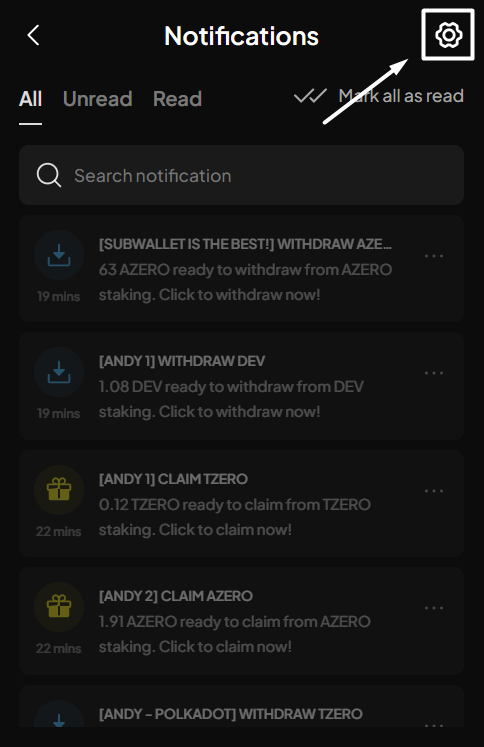
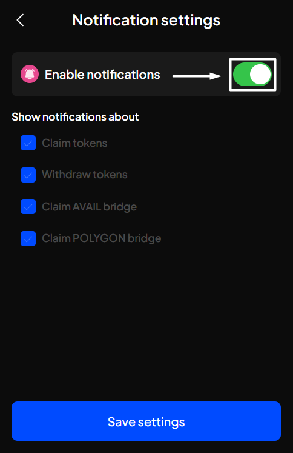
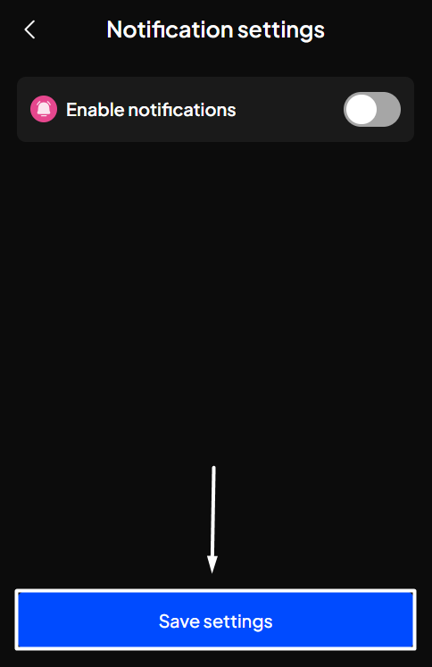

# Manage in-app notifications

### Supported in-app notifications

Currently, SubWallet supports these notification types:

| Notification type       | Supported range                                                                                                                                                                                    |
| ----------------------- | -------------------------------------------------------------------------------------------------------------------------------------------------------------------------------------------------- |
| Claim staking rewards   | Funds staked via [nomination pool](../manage-staking/nomination-pool/)                                                                                                                             |
| Withdraw unstaked funds | 
Funds previously staked via:
<ul><li><a href="../manage-staking/nomination-pool/">Nomination pool</a></li><li><a href="../manage-staking/direct-nomination/">Direct nomination</a></li></ul> |
| Claim bridged tokens    | 
Funds bridged via these bridges:
<ul><li>Avail Bridge</li><li>Unified Bridge</li></ul>                                                                                                       |

### Customize notifications display

**Step 1**: Open the SubWallet extension and click the  at the top right of the screen.

<figure><figcaption></figcaption></figure>

**Step 2**: In the Notifications screen, click the  at the top right of the screen.

<figure><figcaption></figcaption></figure>

Step 3: In the Notifications settings screen, enable/disable the toggle. Once done, click "**Save settings**".


By default, SubWallet enables every notification type so you can keep track of and manage your assets more easily.


<figure><figcaption></figcaption></figure> <figure><figcaption></figcaption></figure>

