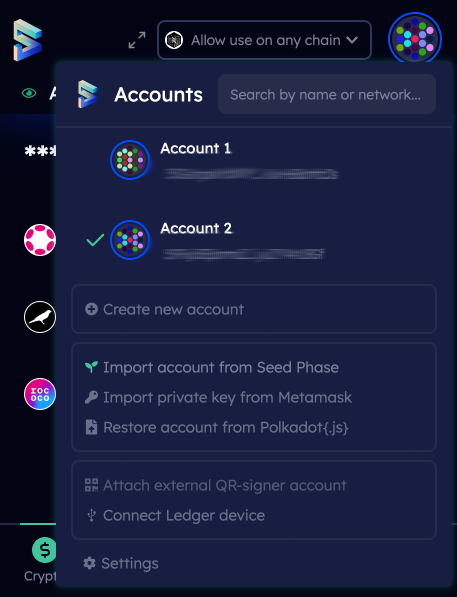

# Import an Account using mnemonic seed

## **Import an Account using mnemonic seed (secret recovery phrase)**&#x20;

### **In a newly installed SubWallet**&#x20;

**Step 1:** During installation setup, click **Import account from pre-existing seed**.

 

**Step 2:** Enter your mnemonic seed (secret recovery phrase) and hit **Next Step**. Then enter your new password. Press **Add the account with the supplied seed**. Your Polkadot wallet is successfully imported!

.png>) 

### **In an existing SubWallet**

Open SubWallet extension and click on the round favicon icon in the top right corner. Then hit **Import account from seed phrase** and repeat the steps. This instruction applies to both Polkadot native wallet (Substrate account) and Polkadot EVM wallet (EVM account).

  
