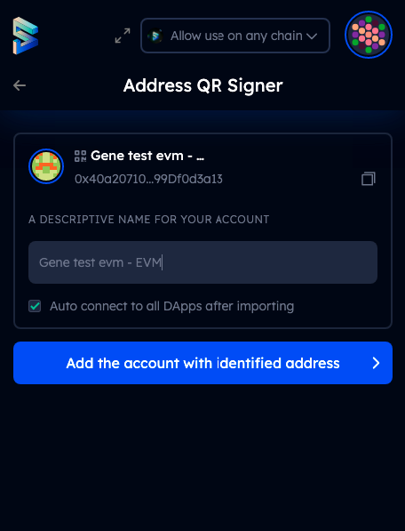

# Import an Account using QR-code

**Step 1:** Open SubWallet. Please click on the round item on the upper right corner of the wallet. You would see the Account section as below:

The option "Import account by QR code" might be disabled and the wallet might not respond if you try to click it. Don't worry! This happens because we need to ask for permission to use your camera first. Please click on the "Setting" button in the bottom right corner.

In the Setting screen, please allow QR camera access and repeat Step 1. The option should be enabled!

**Step2:** After you choose the import by QR option, the wallet would scan the QR of the account you want to import. Please note that sometimes scans can be unsuccessful because of the devices and not because of the wallet.

We suggest you try scanning from other devices if your attempts are not successful. QR-code can be easily transfered to other devices by screenshot.&#x20;

After scanning the QR, please name your new wallet and click the "Add the account with identified address" button. You can uncheck the "auto connect to all dapps..." option if you wish to do so.&#x20;

Your new account should be ready for use after this step.&#x20;

