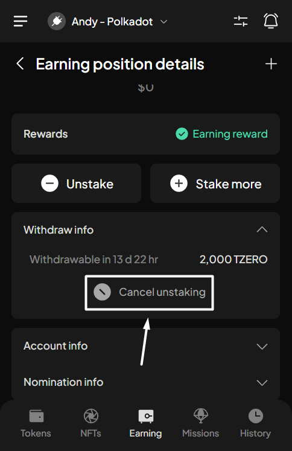

# Cancel a previous unstaking action

### **Track the withdrawal time**

After successfully unstaking your tokens, you must wait for the unstaking process to finish before withdrawing the funds.


The unstaking period varies depending on each token and network you've previously staked on.


**Step 1**: Open the SubWallet extension and choose the "**Earning**" tab at the bottom of the screen. In the Your earning positions screen, select the funds you've previously unstaked.

<figure><figcaption></figcaption></figure> <figure><figcaption></figcaption></figure>

**Step 2**: In the Earning position details screen, click the "**Withdraw info**" section to see the countdown for the withdrawal.

<figure><figcaption></figcaption></figure> <figure><figcaption></figcaption></figure>


You can see an option to cancel the unstaking action right below the withdrawal time.


### Cancel your previous unstaking request


This action is only available for tokens that are staked via:

* Direct nomination
* Parachain (Collator) staking


**Step 3**: Select the "**Cancel unstaking**" option.

<figure><figcaption></figcaption></figure>


Once the unstaking process ends, you won't be able to perform this action.


**Step 4**: Select an unstaking request (if you have more than 1 request) and then click "**Approve**" to proceed.

<figure><figcaption></figcaption></figure>

**Step 5**: Check the information and confirm your request by clicking "**Approve**".&#x20;

<figure><figcaption></figcaption></figure>

**Step 6:** Your request has been submitted!

<figure><figcaption></figcaption></figure>

You can either click "**Back to home**" to return to the homepage or "**View transaction**" to see transaction details in the History tab.


If you click "**View transaction**", SubWallet will show you the latest transaction record in your transaction history along with the extrinsic hash of the transfer.&#x20;



To check the status of your staked funds, after selecting "**Back to home**", click the Earning tab as per Step 1. In the Your earning positions screen, click on your staked funds.

<figure><figcaption></figcaption></figure>
