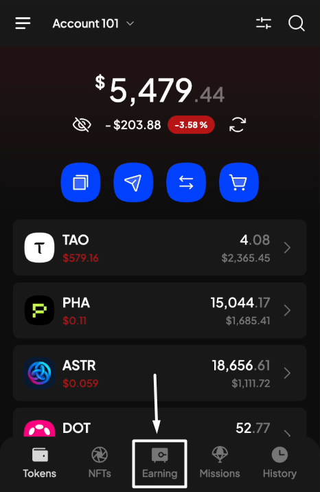
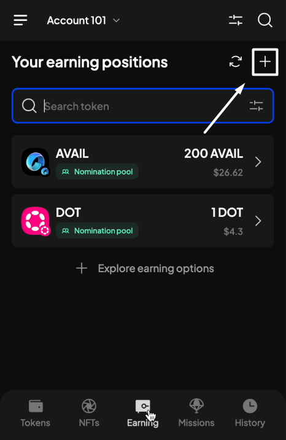
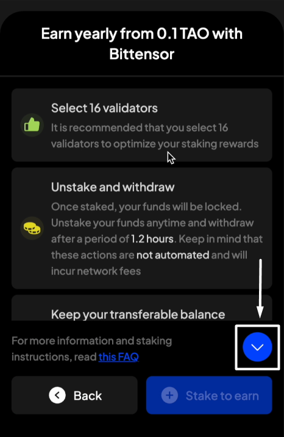
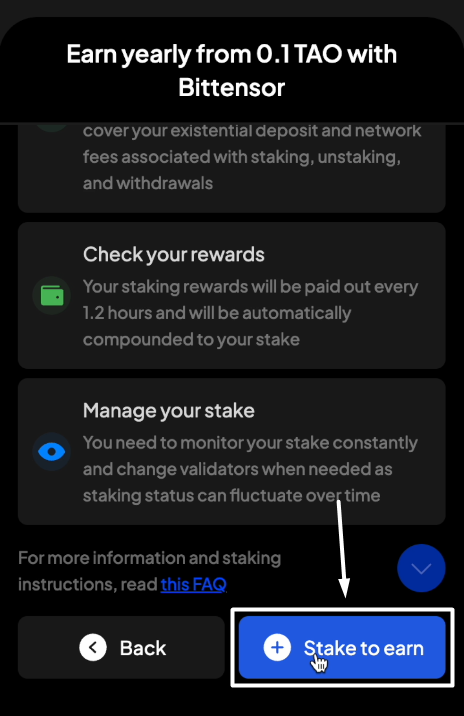
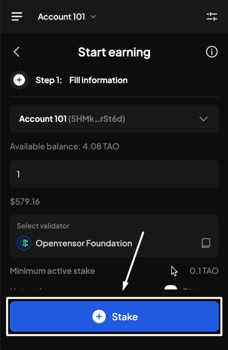

# TAO staking

### **TAO staking information & parameters**

<table><thead><tr><th width="249">Parameter</th><th>Information</th></tr></thead><tbody><tr><td>Minimum stake</td><td>0.1 TAO</td></tr><tr><td>Existential deposit (ED)</td><td>0.0000005 TAO</td></tr><tr><td>Unstaking period</td><td>0 days (once unstaked, your funds will be instantly withdrawn to your account)</td></tr><tr><td>Rewards payout</td><td>
At the end of each era ( 1 era ~ 1.2 hours). 

Rewards will be <strong>automatically compounded</strong>.
</td></tr><tr><td>Nominating mechanism</td><td>Nominator manages the list of staked validators (up to 16).</td></tr></tbody></table>

### **Start staking**

**Step 1**: Open the SubWallet extension and choose the "**Earning**" tab.&#x20;

<figure><figcaption></figcaption></figure>

**Step 2**: In the Earning options screen, choose the TAO token by searching through the list or typing the token name on the search bar.

<figure><figcaption></figcaption></figure>

 

<figure><figcaption></figcaption></figure>


If you have previously staked funds on the account, after choosing the "**Earning**" tab, you will be directed to the Your earning positions screen. From there, click the "**+**" icon at the upper right corner to get to the Earning options screen.



A pop-up will appear. Read carefully, then choose "**Stake to earn**" to proceed.

<figure><figcaption></figcaption></figure>

 

<figure><figcaption></figcaption></figure>

You will be directed to the following Start earning screen.


Make sure you have more than 0.1 TAO in your transferable balance to be able to start staking and earning TAO.


**Step 3**: Enter the required staking information.

<figure><figcaption></figcaption></figure>

A completed staking request will look like the following picture. Click "**Stake**" to proceed.

<figure><figcaption></figcaption></figure>

**Step 4**: Check the information and confirm your staking request by clicking "**Approve**".

<figure><figcaption></figcaption></figure>

**Step 5**: You have successfully staked TAO!

<figure><figcaption></figcaption></figure>

 

<figure><figcaption></figcaption></figure>

