# Start staking

**Step 1**: Open the SubWallet extension and choose the "**Earning**" tab at the bottom of the screen.&#x20;

<figure>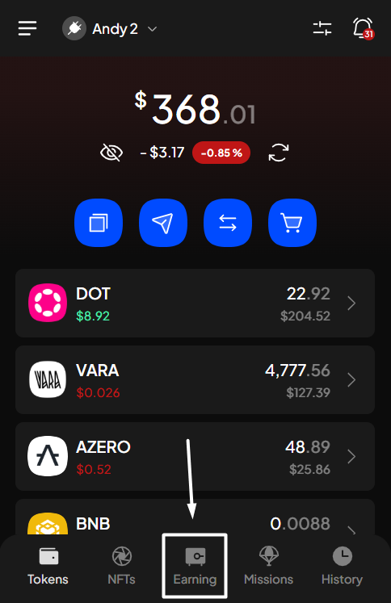<figcaption></figcaption></figure>

**Step 2**: In the Earning options screen, choose the token you want to stake by searching the list or typing the token name on the search bar.

<figure>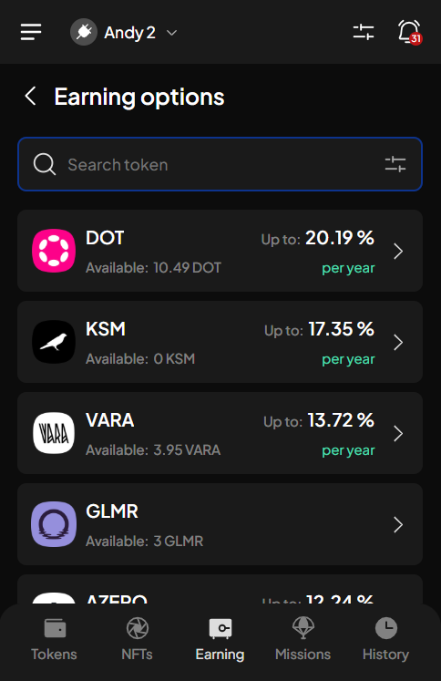<figcaption></figcaption></figure> <figure>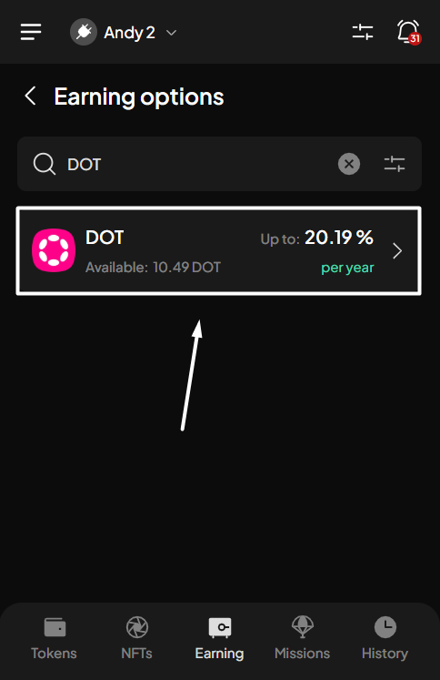<figcaption></figcaption></figure>


If you have previously staked funds on the account, after choosing the "Earning" tab, you will be directed to the Your earning positions screen. From there, click the "+" icon at the upper right corner to get to the Earning options screen.

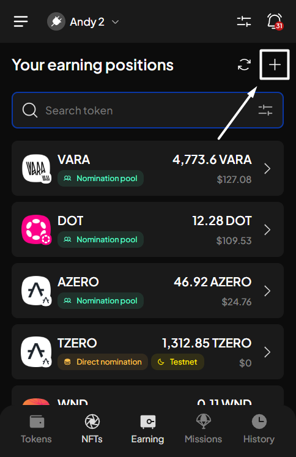


**Step 3**: In the DOT earning options screen, select one of the three "**Liquid staking"** options as your earning typ&#x65;**.**

_In this example, we want to stake DOT via Bifrost liquid staking._

<figure>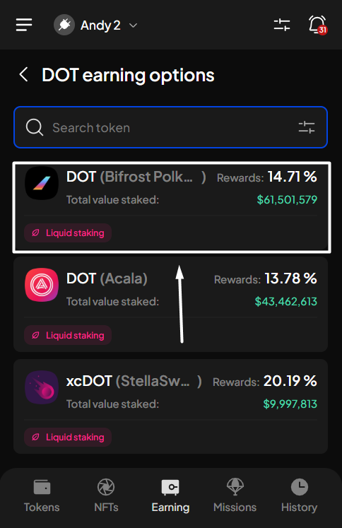<figcaption></figcaption></figure>

A pop-up will appear. Read carefully, scroll down, then choose "**Stake to earn**" to proceed.

<figure>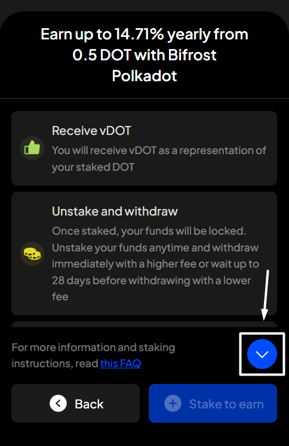<figcaption></figcaption></figure> <figure>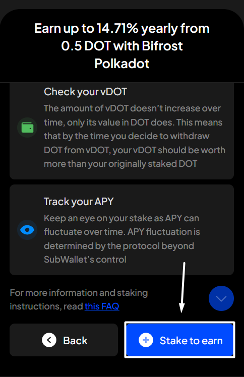<figcaption></figcaption></figure>

**Step 4**: Enter the amount you want to stake.

<figure>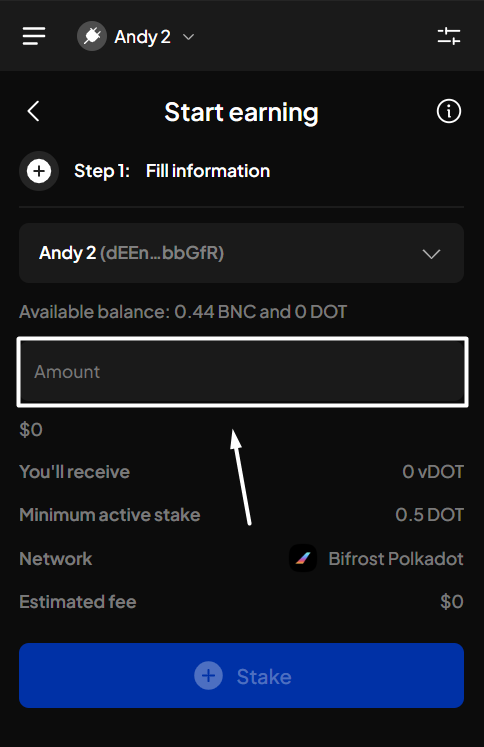<figcaption></figcaption></figure>


If you are in the "All accounts" mode, in addition to the above information, you will also need to select the staking account.


Click "**Stake**" to proceed.

<figure>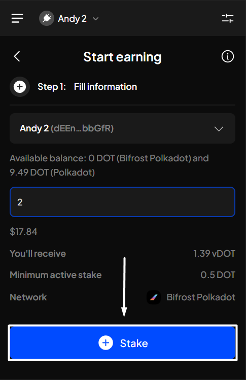<figcaption></figcaption></figure>

Choose the appropriate tab based on whether your tokens are on the required network:



**Step 5**: Check the information and confirm your minting request by clicking "**Approve**".&#x20;

<figure><figcaption></figcaption></figure>

**Step 6**: Your staking request has been submitted!

<figure><figcaption></figcaption></figure>

You can either click "**Back to home**" to return to the homepage or "**View transaction**" to see transaction details in the History tab.


If you click "**View transaction**", SubWallet will show you the latest transaction record in your transaction history, along with the extrinsic hash of the transfer.



To check the status of your staked funds, after selecting "**Back to home**", click the Earning tab as per **Step 1**. In the Your earning positions screen, scroll down, then click on your newly staked funds.

<figure><figcaption></figcaption></figure> <figure><figcaption></figcaption></figure>





You need to have more than 1.5 DOT on the Polkadot network to be able to cross-chain them to Bifrost Polkadot and pay the gas fee for staking (if you don't have BNC).


**Step 5**: A confirmation screen will appear, asking you to approve the cross-chain transaction from Polkadot to Bifrost Polkadot. Choose "**Approve**" to proceed.

<figure>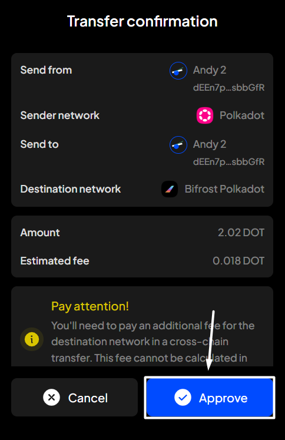<figcaption></figcaption></figure>

**Step 6**: You will be redirected to the Earning screen and then to the Mint screen. Check the information and confirm your minting request by clicking "**Approve**".&#x20;

<figure>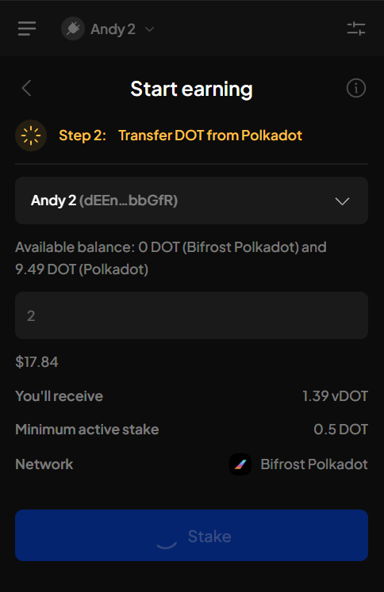<figcaption></figcaption></figure> <figure>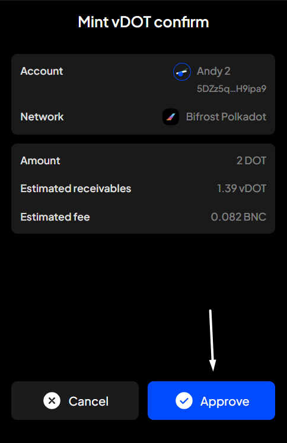<figcaption></figcaption></figure>

**Step 7**: Your staking request has been submitted!

<figure><figcaption></figcaption></figure>

You can either click "**Back to home**" to return to the homepage or "**View transaction**" to see transaction details in the History tab.


If you click "**View transaction**", SubWallet will show you the latest transaction record in your transaction history, along with the extrinsic hash of the transfer.

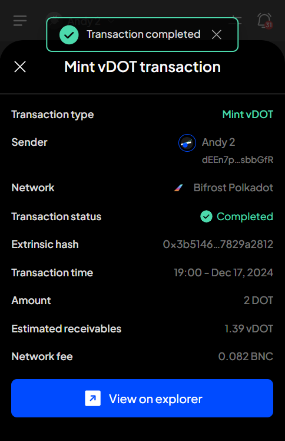


To check the status of your staked funds, after selecting "**Back to home**", click the Earning tab as per **Step 1**. In the Your earning positions screen, scroll down, then click on your newly staked funds.

<figure>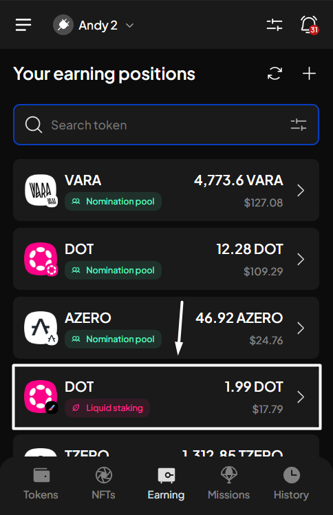<figcaption></figcaption></figure> <figure><figcaption></figcaption></figure>




