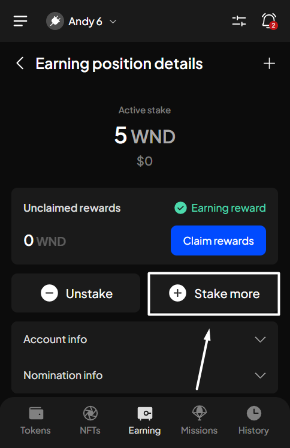
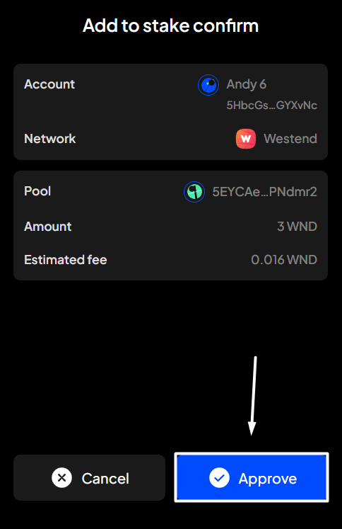

# Stake more

**Step 1**: Open the SubWallet extension and choose the "**Earning**" tab at the bottom of the screen. In the Your earning positions screen, select the funds you want to stake more.

<figure><figcaption></figcaption></figure> <figure><figcaption></figcaption></figure>

**Step 2**: Click "**Stake more**" to add more funds to your stake.

<figure><figcaption></figcaption></figure>

**Step 3**: Enter the amount you want to add to your stake. Once done, click "**Stake**".


You can't choose another pool as you add more funds to your stake. If you want to choose another pool, you must unstake and withdraw your unstaked funds beforehand.


<figure><figcaption></figcaption></figure> <figure><figcaption></figcaption></figure>


Make sure you leave enough tokens to pay gas fees for rewards claims, unstaking, or withdrawal.


**Step 4**: Check the information and confirm your request by clicking "**Approve**".&#x20;

<figure><figcaption></figcaption></figure>

**Step 5:** Your request has been submitted!

<figure><figcaption></figcaption></figure>

You can either click "**Back to home**" to return to the homepage or "**View transaction**" to see transaction details in the History tab.


If you click "**View transaction**", SubWallet will show you the latest transaction record in your transaction history along with the extrinsic hash of the transfer.&#x20;



To check the status of your staked funds, after selecting "**Back to home**", repeat the action as per Step 1. In the Your earning positions screen, scroll down, then click on your newly added staked funds.

<figure><figcaption></figcaption></figure> <figure><figcaption></figcaption></figure>

