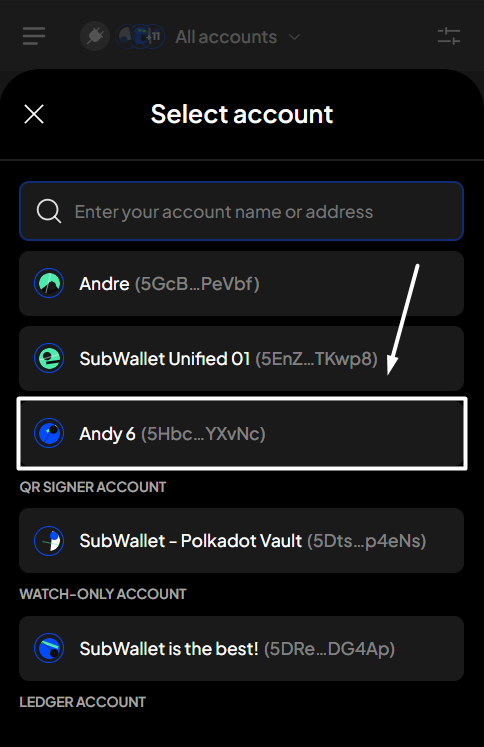

# Start staking

**Step 1**: Open the SubWallet extension and choose the "**Earning**" tab at the bottom of the screen.&#x20;

<figure><figcaption></figcaption></figure>

**Step 2**: In the Earning options screen, choose the token you want to stake by searching the list or typing the token name on the search bar.

_In this example, we want to stake WND tokens._

<figure><figcaption></figcaption></figure> <figure><figcaption></figcaption></figure>


If you have previously staked funds on the account, after choosing the "**Earning**" tab, you will be directed to the Your earning positions screen. From there, click the "**+**" icon at the upper right corner to get to the Earning options screen.



**Step 3**: In the WND earning options screen, select "**Nomination pool"** as your earning typ&#x65;**.**

<figure><figcaption></figcaption></figure>

A pop-up will appear. Read carefully, scroll down, then choose "**Stake to earn**" to proceed.

<figure><figcaption></figcaption></figure> <figure><figcaption></figcaption></figure>

You will be directed to the following Start earning screen.


Make sure you have more than the minimum amount required for staking in your transferable balance to start staking and earning.


**Step 4**: Enter the required earning information.

<figure><figcaption></figcaption></figure>


We suggest you pay close attention to the pool you are choosing. When selecting a pool, SubWallet supports you with the latest record of pool details.&#x20;

Click the three-dot icon on each pool's right side to see the details.




We can also identify destroyed/inactive pools. **We suggest that you always choose an active (open) pool to stake with**.&#x20;

To filter out the open pool(s), click the fader icon on the right-hand side of the search bar. Click the checkbox "**Open**", then click "**Apply filter**" to start filtering.&#x20;



A completed earning request will look like the following picture. Click "**Stake**" to proceed.

<figure><figcaption></figcaption></figure> <figure><figcaption></figcaption></figure>


If you are in the "**All accounts**" mode, in addition to the above information, you will also need to select the staking account.




Make sure you leave enough tokens to pay gas fees for rewards claims, unstaking, or withdrawal.


**Step 5**: Check the information and confirm your staking request by clicking "**Approve**".&#x20;

<figure><figcaption></figcaption></figure>

**Step 6:** Your staking request has been submitted!

<figure><figcaption></figcaption></figure>

You can either click "**Back to home**" to return to the homepage or "**View transaction**" to see transaction details in the History tab.


If you click "**View transaction**", SubWallet will show you the latest transaction record in your transaction history along with the extrinsic hash of the transfer.&#x20;



To check the status of your staked funds, after selecting "**Back to home**", click the Earning tab as per Step 1. In the Your earning positions screen, click on your newly staked funds.

<figure><figcaption></figcaption></figure> <figure><figcaption></figcaption></figure>

