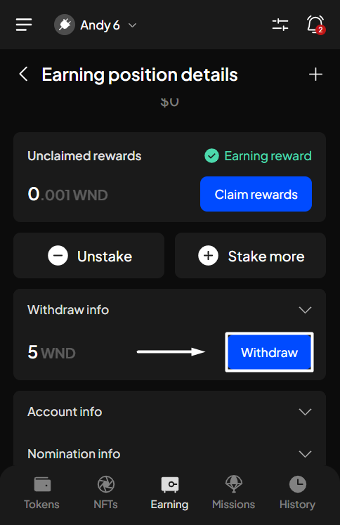
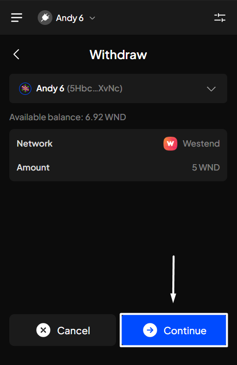
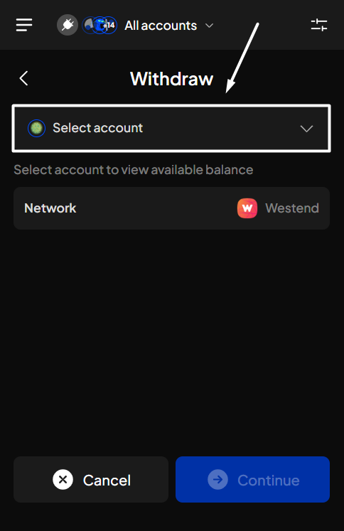
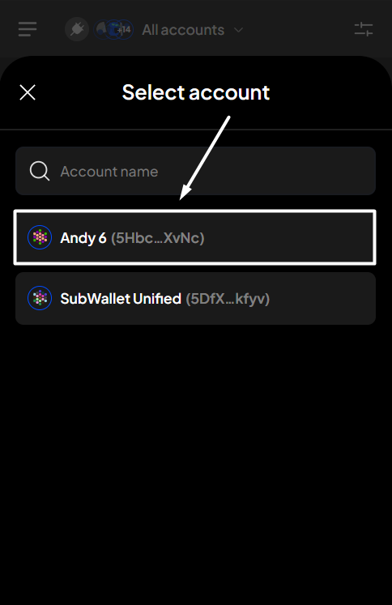
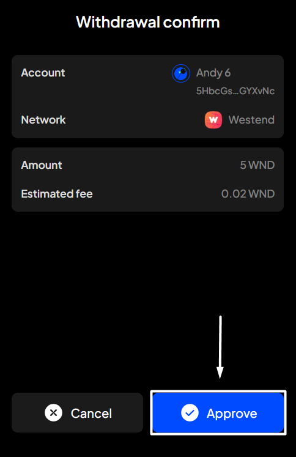
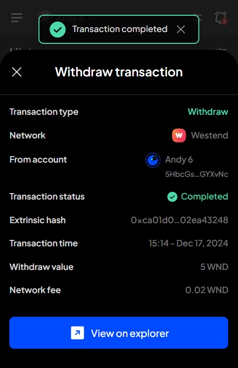

# Withdraw unstaked funds

### **Track the withdrawal time**

After successfully unstaking your tokens, you must wait for the unstaking process to finish before you can withdraw and make them transferable.


The unstaking period varies depending on each token and network you've previously staked on.


**Step 1**: Open the SubWallet extension and choose the "**Earning**" tab at the bottom of the screen. In the Your earning positions screen, select the funds for which you've previously unstaked.

<figure><figcaption></figcaption></figure> <figure><figcaption></figcaption></figure>

**Step 2**: In the Earning position details screen, click the "**Withdraw info**" section to see the countdown for the withdrawal.

<figure><figcaption></figcaption></figure> <figure><figcaption></figcaption></figure>

### Withdraw your funds


**On**ce the unstaking process ends, you need to withdraw your funds manually to make them transferable.


**Step 1**: Open the SubWallet extension and choose the "**Earning**" tab at the bottom of the screen. In the Your earning positions screen, select the funds you've previously unstaked.

<figure><figcaption></figcaption></figure> <figure><figcaption></figcaption></figure>

**Step 2**: In the Earning position details screen, click the "**Withdraw**" button under the Withdraw info section to start the withdrawal.

<figure><figcaption></figcaption></figure>

**Step 3:** Click "**Continue**" to proceed.

<figure><figcaption></figcaption></figure>


If you are in "**All accounts**" mode, you will need to select the account you want to withdraw.



**Step 4**: Check the information and confirm your request by clicking "**Approve**".&#x20;

<figure><figcaption></figcaption></figure>

**Step 5:** Your request has been submitted!

<figure><figcaption></figcaption></figure>

You can either click "**Back to home**" to return to the homepage or "**View transaction**" to see transaction details in the History tab.


If you click "**View transaction**", SubWallet will show you the latest transaction record in your transaction history along with the extrinsic hash of the transfer.&#x20;


