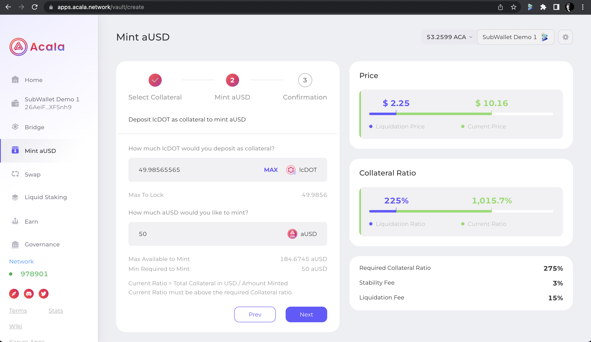

# Stake DOT in Nomination Pool with Ledger

### Connect Ledger device

#### Set up Ledeger

**Step 1:** Connect Ledger to your computer using the USB cable. Please make sure to enter your PIN code.\
Press the right button to go up, left button to go down and both buttons simultaneously to validate.

**Step 2**: Use 2 buttons of the Ledger to move back and forth and choose **Close exit control center** section by pushing both buttons at the same time.

.png>)

You would see a screen as below, press the right button:

.png>)

**Step 3**: Press both buttons simultaneously to open the dashboard.

.png>)

**Step 4:** You would see a screen as below, please use 2 buttons to navigate to Polkadot icon and again press both buttons at the same time to choose Polkadot network.\
You would see **Polkadot Ready** section.\
.png>).png>)

#### Import Ledger account to SubWallet Extension

**Step 1**: Open SubWallet Extension, then click on the round item up on the upper right corner of the wallet. You would see the Account section as below:

.png>)

Please choose **Connect Ledger device**, you would see the **Import Ledger Account** section.

**Step 2:** Click on the toggle next to **Select Network** and select a network of your choice.\
Don’t forget to fill in the name for your account and choose your account type by clicking on the toggle next to **Account type 0.**

.png>).png>)

In this example, we are connecting to **Account type 0** named **Polkadot** on **Polkadot Relay Chain**.

.png>)

Step 3: Select **Import Account** button, your Ledger is successfully connected!

### Stake DOT in Nomination Pools

Detailed instruction can be found here:



### Sign transaction with Ledger

**Step 1**: After submitting DOT to Polkadot Nomination Pool, SubWallet Extension would ask for your approval. Please click on **Sign on Ledger** button.

.png>)

**Step 2:** Please review all staking details before approving the transaction.\
Scroll to the left for each staking detail pressing the right button.

.png>).png>)

.png>).png>)

**Step 3**: Approve your transaction by pressing both buttons simultaneously in **Approve** section.

.png>)

If you see **Polkadot ready** screen as below, your DOT is successfully staked in Polkadot Nomination Pool!

You can also check out the staking details on Polkadot Dashboard or right in SubWallet **Staking** section.

