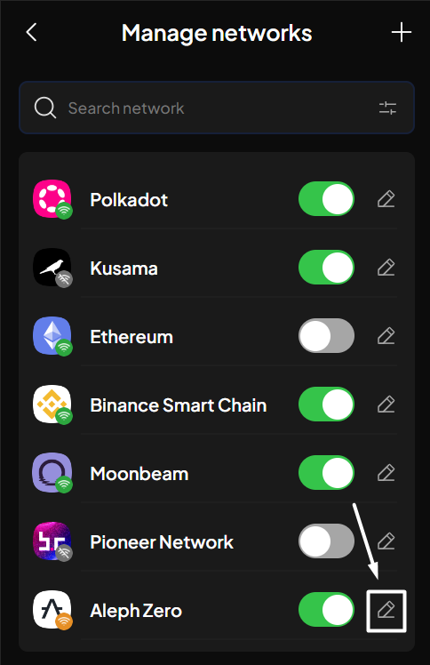
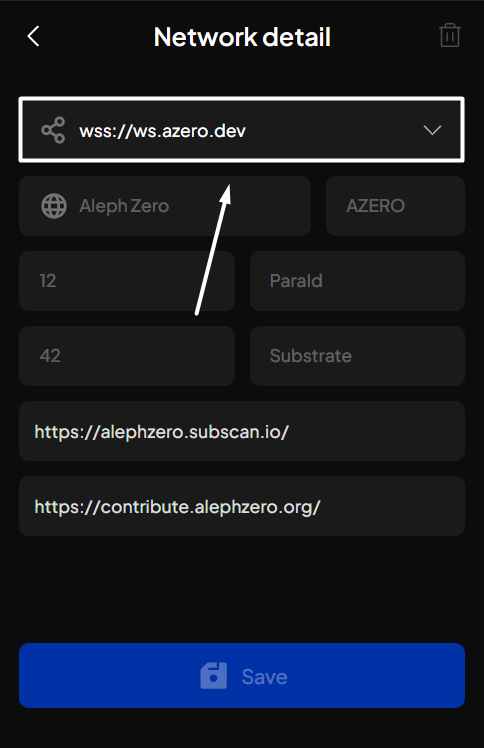
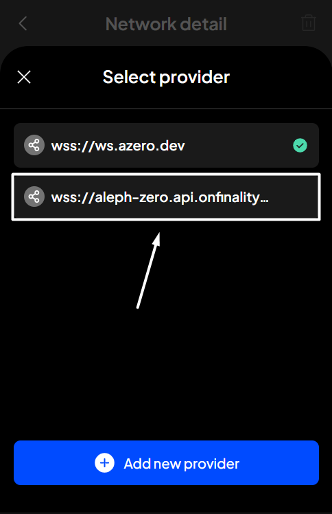
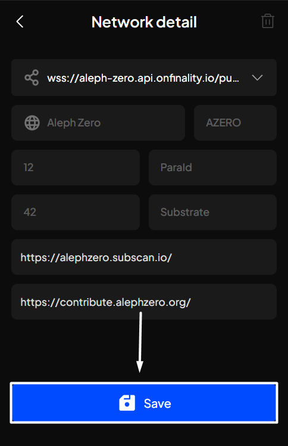
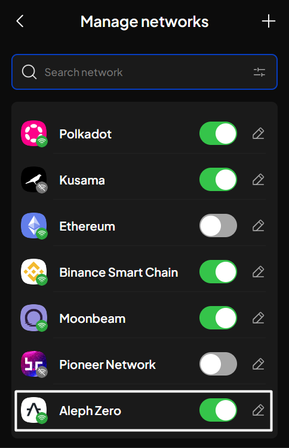

# Customize endpoint/provider

### Understand network status

The connection of a network will not always be stable. When a network experiences high traffic or the endpoint/provider becomes unstable, network congestion may occur, making users unable to make any transactions on that network.

For each network, there are 3 network statuses that can occur. At SubWallet, we differentiate these statuses by displaying them with different wifi icon colors.

<table><thead><tr><th width="165">Wifi icon color</th><th width="176" align="center">Displayed in wallet</th><th>Meaning &#x26; Action needed</th></tr></thead><tbody><tr><td>Grey</td><td align="center"></td><td>The network connection is <strong>unavailable</strong>. Please turn off the network and enable it back or change to another provider to restore network connection.</td></tr><tr><td><mark style="color:yellow;">Yellow</mark></td><td align="center"></td><td>The network connection is <strong>unstable</strong>. Please turn off the network and enable it back or change to another provider to restore network connection.</td></tr><tr><td><mark style="color:green;">Green</mark></td><td align="center"></td><td>The network connection is <strong>normal</strong>. </td></tr></tbody></table>

### Personalize your network's endpoint/provider

**Step 1**: Open the SubWallet extension and click on the  icon at the top left corner to get to the Settings section.

<figure><figcaption></figcaption></figure>

**Step 2**: In the Settings section, choose "**Manage networks**".

<figure><figcaption></figcaption></figure>

**Step 3**: Customize your provider by clicking the pencil icon next to the network for which you want to customize the provider.

_In this example, we are choosing Aleph Zero._

<figure><figcaption></figcaption></figure>

**Step 4**: In the Network detail section, click on the provider URL.


If your selected network has only one provider, consider adding another provider/endpoint to rotate when the connection becomes unstable/lagging.


<figure><figcaption></figcaption></figure>

**Step 5**: A modal will appear. Choose the provider you want to use from the list.

<figure><figcaption></figcaption></figure>


If you want to use a provider outside our list, click "**Add new provider**".

Check out this article on how to add a new provider.


**Step 6**: Click "**Save**". You have successfully changed the endpoint of your chosen network!

<figure><figcaption></figcaption></figure> <figure><figcaption></figcaption></figure>

