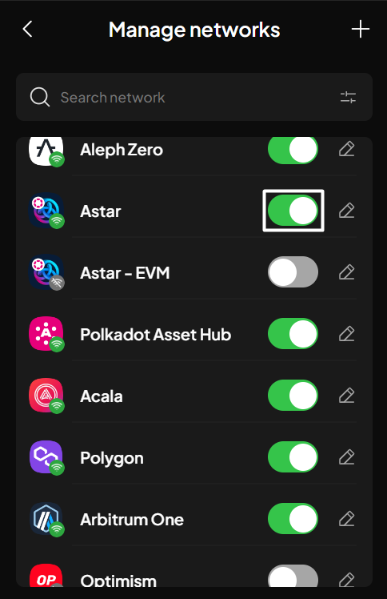

# Enable/disable networks

### Enable/disable networks from the homepage

**Step 1**: Open the SubWallet extension and click on the fader icon at the top of the screen to get to the Customize asset display screen.

<figure><figcaption></figcaption></figure>

**Step 2**: Scroll down the list or type the network name in the search bar to find the network. Enable/disable that network by clicking the corresponding toggles.

<figure><figcaption></figcaption></figure> <figure><figcaption></figcaption></figure>

**Step 3**: Once done, click the "**X**" button at the top left corner to exit the screen and return to the homepage.

### Enable/disable networks via the Settings section

**Step 1**: Open the SubWallet extension and click on the  icon at the top left corner to get to the Settings section.

<figure><figcaption></figcaption></figure>

**Step 2**: In the Settings section, choose "**Manage networks**".

<figure><figcaption></figcaption></figure>

**Step 3**: Scroll down the list or type the network name in the search bar to find the network. Enable/disable that network by clicking the corresponding toggles.

<figure><figcaption></figcaption></figure> <figure><figcaption></figcaption></figure>

**Step 4**: Once done, click the "**<**" button at the top left corner to exit the screen; then, click the "**X**" button at the top right corner of the Settings screen to return to the homepage.
