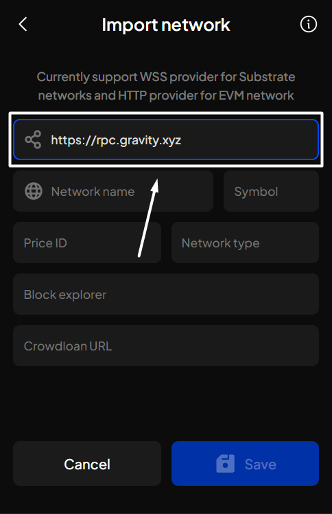
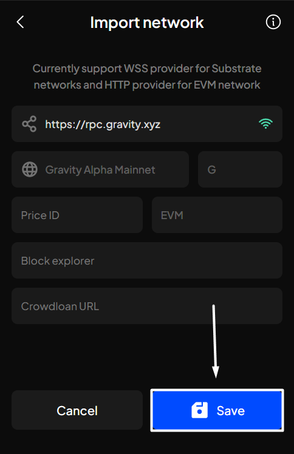
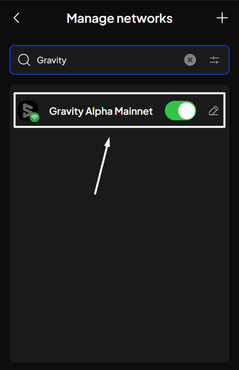

# Import custom networks


SubWallet currently supports importing Polkadot (Substrate) and Ethereum (EVM) networks.


**Step 1**: Open the SubWallet extension and click on the  icon at the top left corner to get to the Settings section.

<figure><figcaption></figcaption></figure>

**Step 2**: In the Settings section, choose "**Manage networks**".

<figure><figcaption></figcaption></figure>

**Step 3**: Click on the "**+**" button at the top right corner of the screen to import a new network.

<figure><figcaption></figcaption></figure>

**Step 4**: Enter the provider URL. Once done, SubWallet will automatically detect the network name, token name (symbol), and network type.&#x20;


If you want to input more information, such as price ID, block explorer, and crowdloan URL, you're free to do so. You can check this [article](manage-custom-networks.md) for more details.


_In this example, we are importing a network named "**Gravity Alpha Mainnet**", an EVM network with the token symbol "**G**"._

<figure><figcaption></figcaption></figure> <figure><figcaption></figcaption></figure>


SubWallet currently supports WSS providers for Substrate networks and HTTP providers for EVM networks, so make sure you're importing a network with this type of provider.


Once done, click "**Save**" to successfully import the network.

**Step 5**: Find and use your network.

Once your network has been imported, you will be redirected to the "**Manage networks**" section. If you perform a search for your newly imported network, it will be found.

<figure><figcaption></figcaption></figure>
