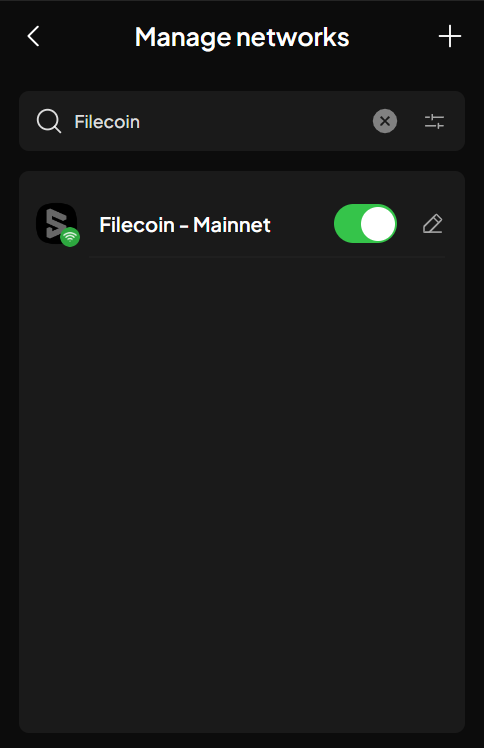
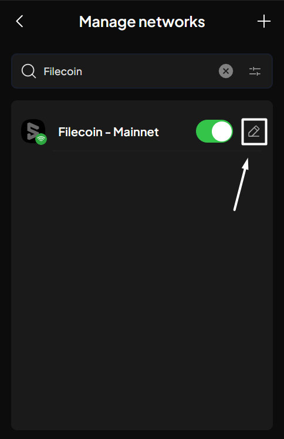
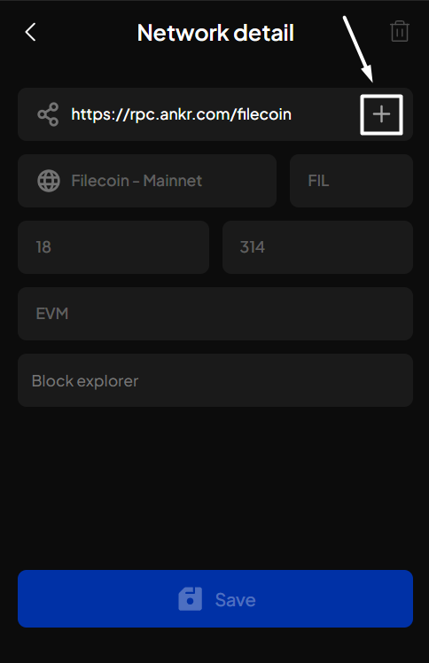
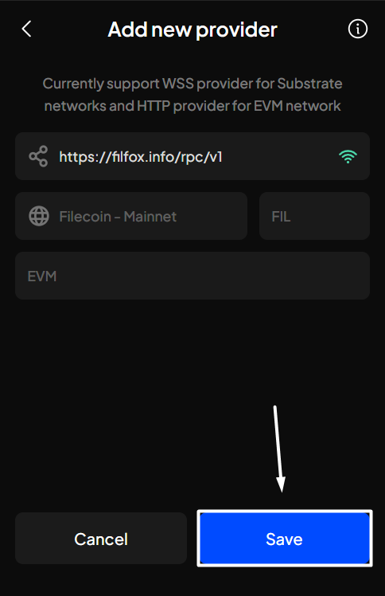
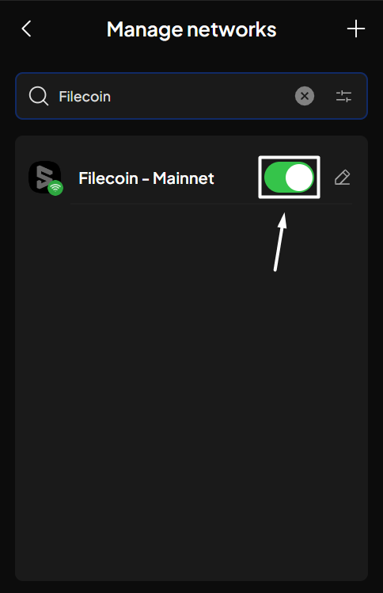
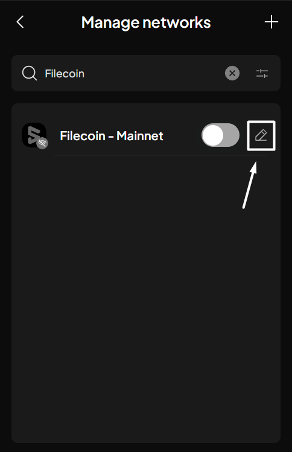
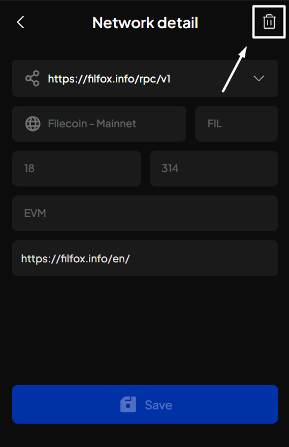
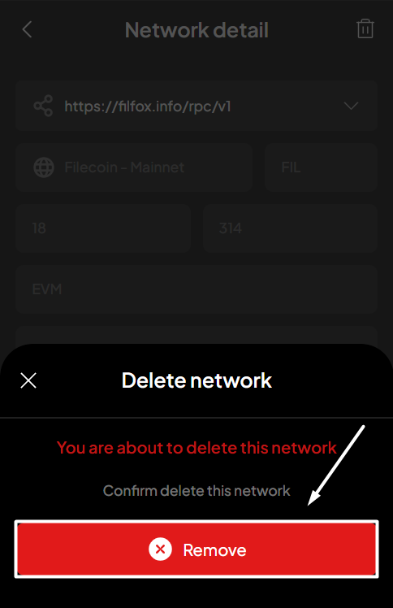
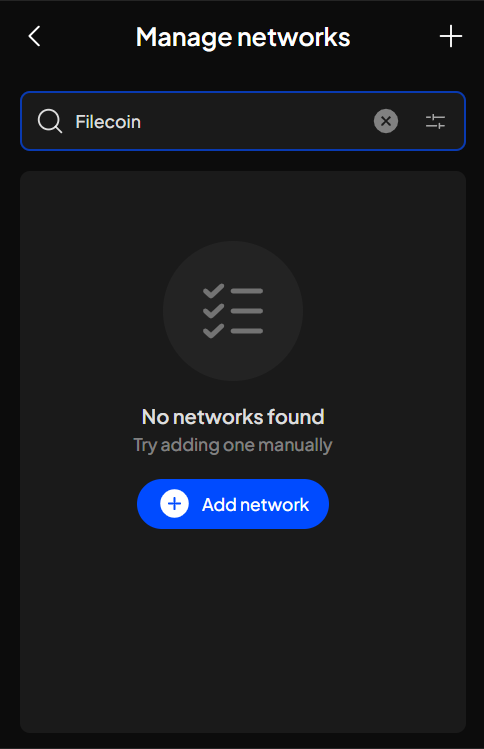

# Manage custom networks

**Step 1**: Open the SubWallet extension and click on the list item at the top left corner of the screen to get to the Settings section.

<figure><figcaption></figcaption></figure>

**Step 2**: In the Settings section, choose "**Manage networks**".

<figure><figcaption></figcaption></figure>

**Step 3**: Scroll down the network list or type the name to find your custom network.

_In this example, we will manage the "**Filecoin - Mainnet**" network - an EVM network._

<figure><figcaption></figcaption></figure>

Depending on what suits your needs, choose the appropriate tab:




Once a network is imported onto SubWallet, you can only edit its information by:

* Adding another network's provider URL
* Adding the network's block explorer


**Step 4**: Click the pencil icon to get to the Network detail screen.

<figure><figcaption></figcaption></figure>

**Step 5**: In the Network detail screen, add another provider URL or add the network's block explorer.


To add another provider URL, click on the "**+**" button at the upper right corner of the screen, then add your selected provider URL. Once done, click "**Save**".




To add the network's block explorer, enter the corresponding explorer's site in the **Block explorer** field. Once done, click "**Save**".





**Step 4**: Find the network you wish to remove and disable the toggle next to its name.

<figure><figcaption></figcaption></figure>

**Step 5**: Click the pencil icon to get to the Network detail screen.

<figure><figcaption></figcaption></figure>

**Step 6**: In the Network detail section, click the bin icon at the top right corner of the screen.

<figure><figcaption></figcaption></figure>

**Step 7**: A pop-up screen will appear. Choose "**Remove**" to confirm the removal.

<figure><figcaption></figcaption></figure>

You've successfully removed the network! It won't be found in the network list anymore.

<figure><figcaption></figcaption></figure>



