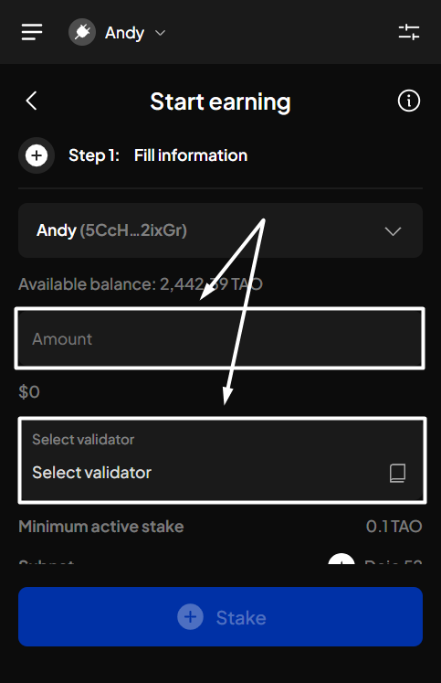
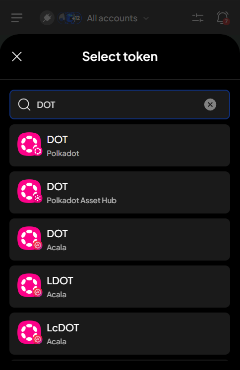
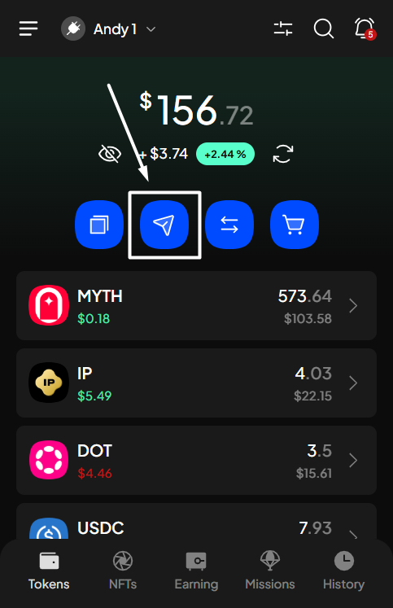
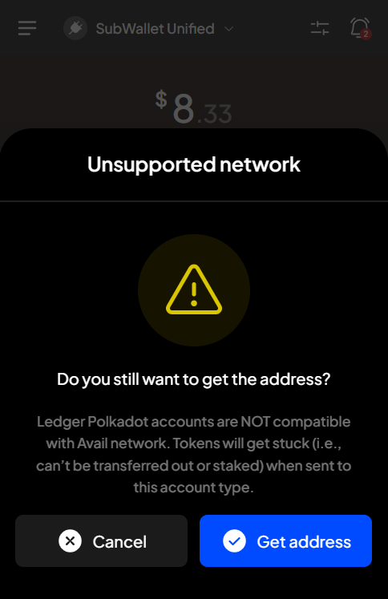
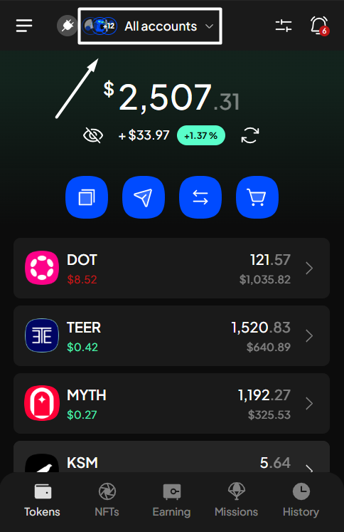
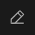
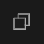
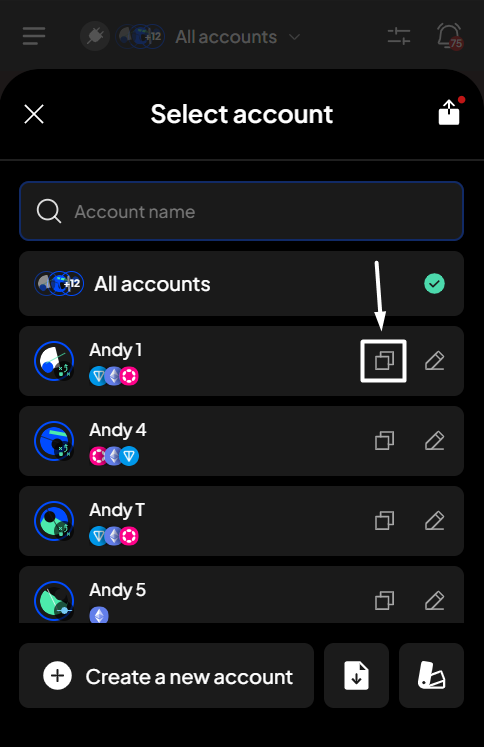
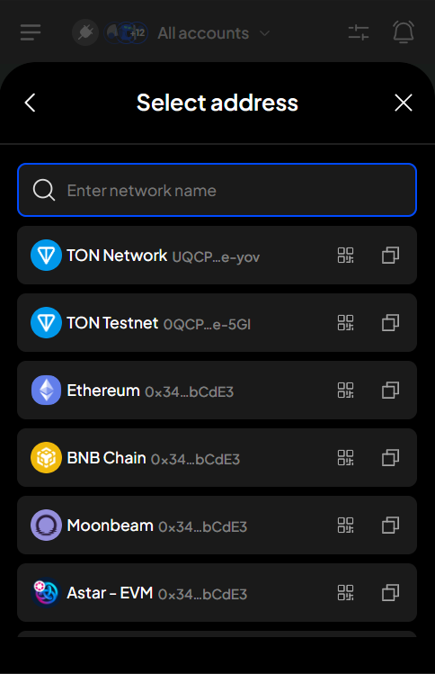

# Receive tokens & NFTs

All you need is your wallet address to share with your sender. This will allow them to send their funds to your specified address.

Choose your preferred method and follow the instructions below to get your wallet address.

### Get your address via the "Get address" button

**Step 1**: Open the SubWallet extension and click the "**Get address**" button on the homepage.

<figure><figcaption></figcaption></figure>

**Step 2**: Choose the token you want to receive by scrolling down the token list or typing the token symbol in the search bar.

_In this example, we want to get the address of the DOT token on Polkadot._

<figure><figcaption></figcaption></figure>


Notice the network logo and the network name under the token name.&#x20;



Note that we also support receiving cross-chain tokens, so be careful when choosing the token in this list.

_For example, let's say you want to receive DOT._&#x20;

SubWallet supports DOT on many networks, such as Polkadot, Acala, Hydration, etc., so please be careful when choosing the token. Otherwise, your sender might send funds to the wrong network, and you will need to take extra steps with additional fees to have it on your desired network.



**Step 3**: Select the account you want to get an address.

_In this example, we want to get address of the account named "Andy 1"._

<figure><figcaption></figcaption></figure>


You only have to go through Step 3 if you are in "**All accounts**" mode. If you are in Single-account mode, skip this step and jump to **Step 4**.


**Step 4**: Get your address.

You can share this QR code with your sender or click the "**Copy**" icon next to your address and send it to your sender.

<figure><figcaption></figcaption></figure>

As mentioned above, we want to receive DOT on Polkadot in this example, so the address should be a Polkadot address! You could double-check the address by clicking on "**View on explorer**".&#x20;


The "**View on explorer**" button will be greyed out if the network your token is on hasn't had its block explorer yet.

 (1).png>)



With Ledger accounts, when you want to get the address of tokens from a network that hasn't undergone runtime upgrade yet, you will receive the following popup:

Read it carefully, then if you still want to get the token's address in this case, hit "**Get address**".&#x20;


### Get your address via the network address


Since all tokens on the same network share the same address, you can get the address of your token just by retrieving the account address of the network it is on.


**Step 1**: Open the SubWallet extension and click on the account name to access the account selection tab.

<figure><figcaption></figcaption></figure>

**Step 2**: Click on the  icon or the  icon next to the account you want to get address.

* _If you click on the_  _icon:_

<figure><figcaption></figcaption></figure> <figure><figcaption></figcaption></figure>

* _If you click on the_  _icon:_

<figure><figcaption></figcaption></figure> <figure><figcaption></figcaption></figure>

**Step 3**: Search for your desired network by either of these methods:

* Scrolling through the list&#x20;
* Typing the network name in the search bar&#x20;
* Type the address prefix (this method can only be used if you want to get address of a Substrate or TON network)

<figure><figcaption></figcaption></figure>

_In this example, we want to get the TAO address_. As the TAO token is on the Bittensor network, type the network name in the search bar.

Once you find the desired address, click the "**Copy**" button or the QR button to get address.

<figure><figcaption></figcaption></figure>

### Change wallet address for TON-supported account


TON-support accounts are accounts that can be used to make transactions on the TON ecosystem. On SubWallet, TON-supported accounts are:

* TON solo accounts
* Unified accounts


Unlike other ecosystem platforms that offer a one-size-fits-all approach to wallets, the TON ecosystem has many wallet versions designed to meet users' different needs and preferences.

_**In short**_, with each token on the TON ecosystem, you can have multiple balances on multiple wallet addresses, as it has many wallet versions. Each wallet version will have its own balance and address.

Currently, SubWallet supports 4 wallet versions for each TON-supported account: **`v3r1`**, **`v3r2`**, **`v4`**& **`v5r1`**. To get the address of each version, please follow the instructions below:

**Step 1**: Open the SubWallet extension and click the "**Get address**" button on the homepage.

<figure><figcaption></figcaption></figure>

**Step 2**: Choose the token you want to receive by scrolling down the token list or typing the token symbol in the search bar.

_In this example, we want to get the address of the TON token on the TON Network._

<figure><figcaption></figcaption></figure> <figure><figcaption></figcaption></figure>

**Step 3**: Select the account you want to get an address.

_In this example, we want to get address of the account named "SubWallet Unified 01"._

<figure><figcaption></figcaption></figure>


You only have to go through Step 3 if you are in "**All accounts**" mode. If you are in Single-account mode, skip this step and jump to **Step 4**.


**Step 4**: A popup message will show that seed phrase of the TON address you are about to get is incompatible with TON-native wallets. To continue getting the address, choose "**Get address**".

<figure><figcaption></figcaption></figure>

**Step 5**: The address will appear. Click on the  icon to change wallet address.

<figure><figcaption></figcaption></figure>

**Step 6**: Select a wallet version and then click "**Confirm**".

<figure><figcaption></figcaption></figure> <figure><figcaption></figcaption></figure>

By default, SubWallet shows the **`v5r1`** address for each token on the TON ecosystem as it's the widely-used wallet version.

**Step 7**: Get your address.

You can share this QR code with your sender or click the "**Copy**" icon next to your address and send it to your sender.

<figure><figcaption></figcaption></figure>
