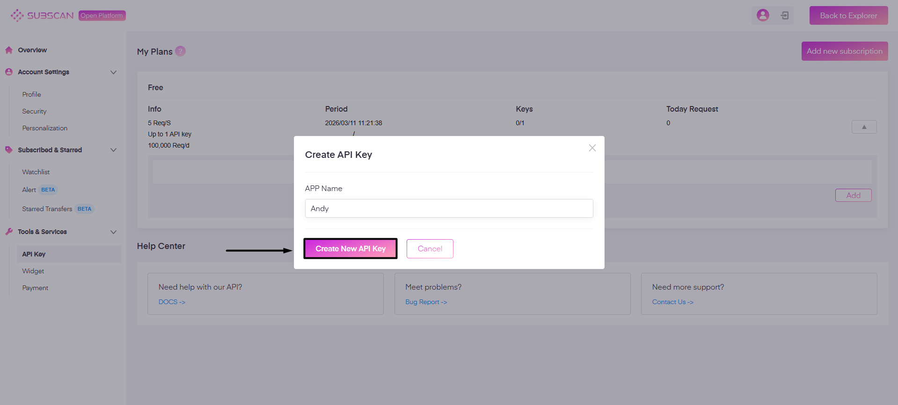
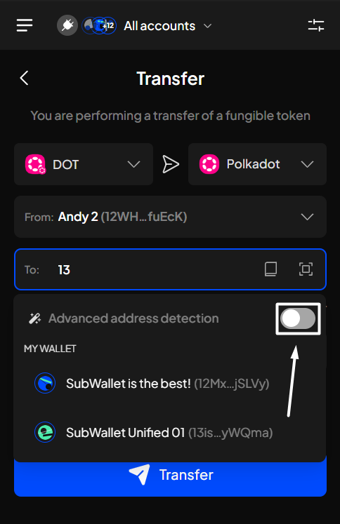
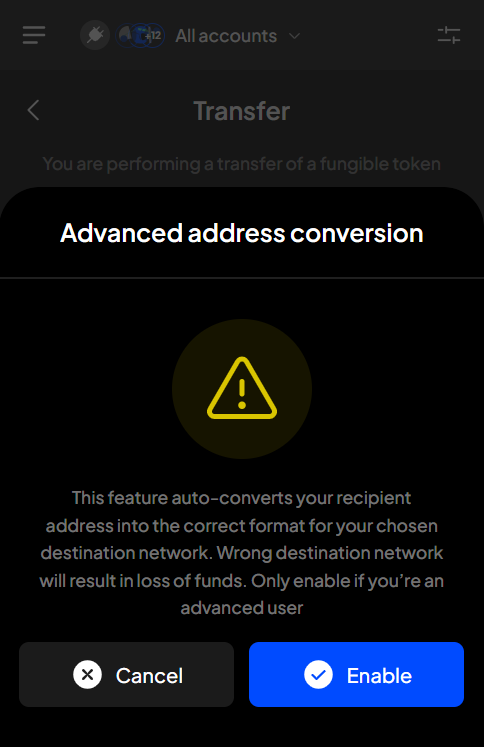
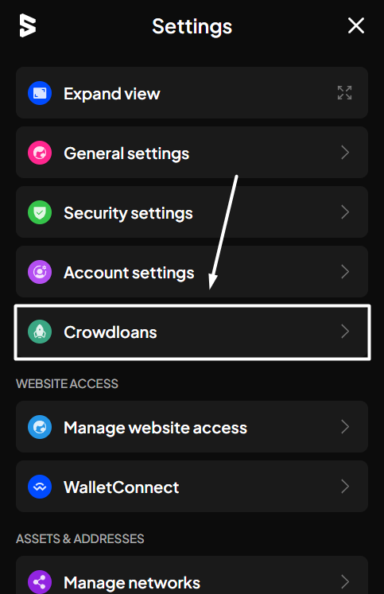
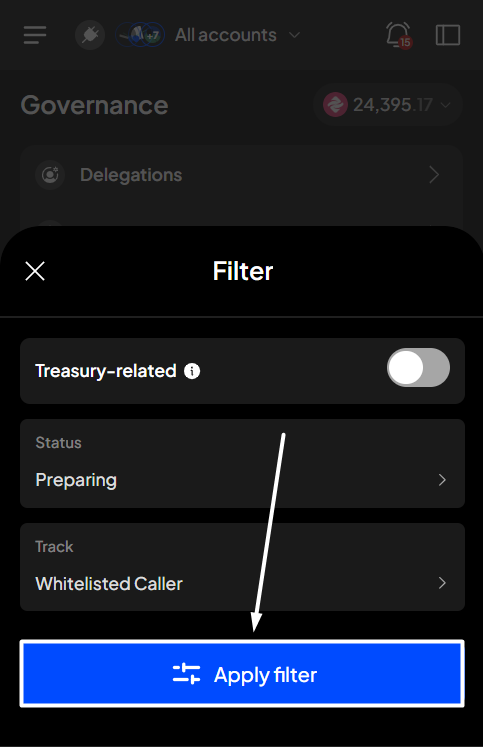
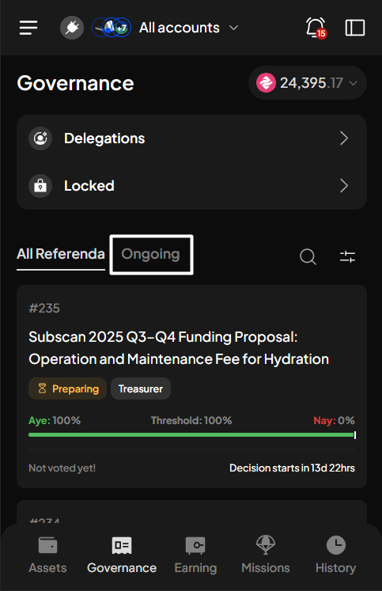
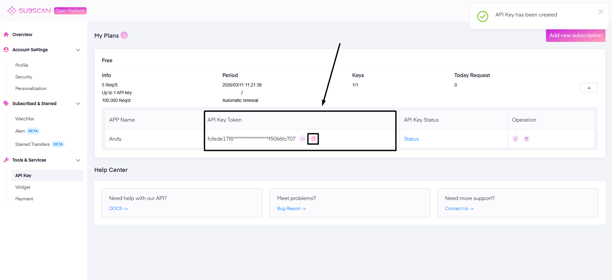
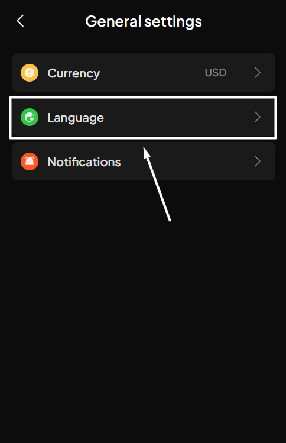
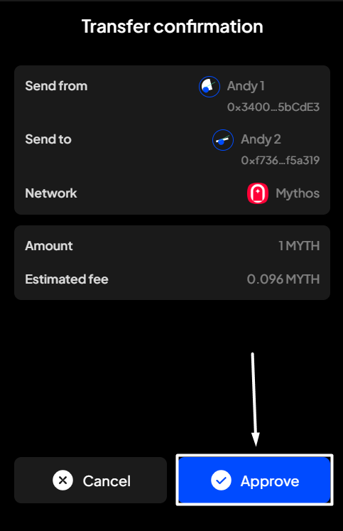

# Single-chain transfer


"**Single-chain transfer**" refers to the process of transferring tokens within the same network.


**Step 1**: Open the SubWallet extension and click the "**Send tokens**" button on the homepage.

<figure><figcaption></figcaption></figure>

You will be directed to the Transfer screen.

<figure><figcaption></figcaption></figure>


If you are in Single-account mode, make sure the account you initially chose is not watch-only.


**Step 2:** Enter the required information in the corresponding fields.

With BTC transfer

SubWallet currently supports BTC transfers for all Bitcoin address types, including transfers of BTC between them (e.g., you can transfer BTC from a Native SegWit address to a Taproot address).&#x20;

This means that even if you are in the Single-account mode, you will still need to select the sender address, as each address has its own balance.

<figure><figcaption></figcaption></figure> <figure><figcaption></figcaption></figure> <figure><figcaption></figcaption></figure>

In the "**To**" field, you can select one account from the account list or paste a valid address.

<figure><figcaption></figcaption></figure> <figure><figcaption></figcaption></figure>

If you are in the "All accounts" mode

In this case, in addition to the above information, you will also need to choose the sender's address.


From version v1.3.3 onwards, we have introduced a new feature: **Advanced address detection**.

This feature, when enabled, will allow you to enter any Substrate-based address for transactions. This means you are no longer restricted to using only the fixed addresses from your account list; for example, you can input an Acala address as the recipient address when transferring VARA tokens rather than just using the VARA address.


However, we strongly recommend not to use this feature if you aren't an expert in transactions on the Polkadot ecosystem, as transferring to the wrong address will result in loss of funds.




Customize gas fee for EVM transactions


With EVM networks, high traffic can result in slower transaction processing times. As a result, the optimal transaction fee required to incentivize miners to validate transactions may fluctuate based on changes in network usage and conditions.


From version 1.3.24, SubWallet allows you to customize the transaction fee for transactions performed on any EVM network. This means you can set the fee amount to whatever you desire rather than being limited to a fixed fee, as in previous versions.

To customize the fee, once you input the needed information, click the  in the "**Estimated fee**" field. In the Edit fee popup, you can select between 3 fee options: "**Low**", "**Medium**", and "**High**". These options are dynamic and offer suggestions based on network congestion during transactions.

Choose the option you prefer.


You can also set your custom fee by selecting the "**Custom**" tab, entering the Max & Priority fees you prefer, and then clicking "**Apply fee**".

<mark style="color:red;">Please note that the Priority fee cannot be higher than the Max fee.</mark>



Select a non-native token to pay gas fees for transactions on some Substrate (Polkadot) networks


Currently, SubWallet supports customizing payment tokens for single-chain transactions on these networks:

* **Polkadot Asset Hub** (starting from version 1.3.18)
* **Kusama Asset Hub** (starting from version 1.3.18)
* **Hydration** (starting from version 1.3.24)

Instead of requiring native tokens to cover gas fees, you now have a variety of tokens to choose from for this fee.


To customize the payment token, once you input the required information, click the  in the "**Estimated fee**" field. Select any tokens you have balances to pay the gas fee.

Once done, click "**Transfer**".

**Step 3**: Check your transaction details, then click "**Approve**" to proceed.&#x20;

<figure><figcaption></figcaption></figure>

**Step 4**: Transaction result is in!

<figure><figcaption></figcaption></figure>

You can either click "**Back to home**" to return to the homepage or "**View transaction**" to see transaction details in the History tab.


If you click "**View transaction**", SubWallet will show you the latest transaction record in your transaction history along with the extrinsic hash of the transfer.&#x20;


